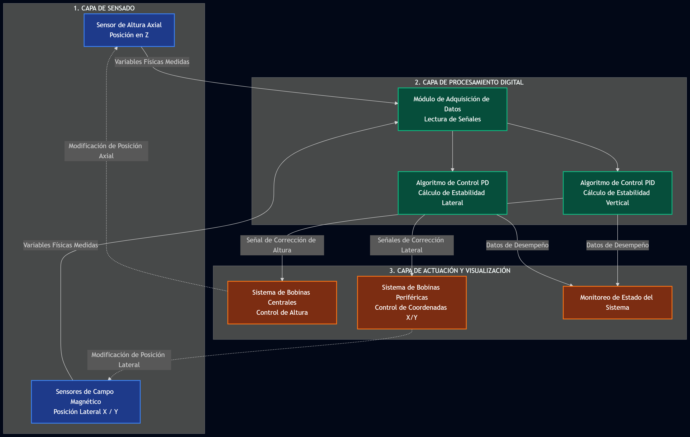
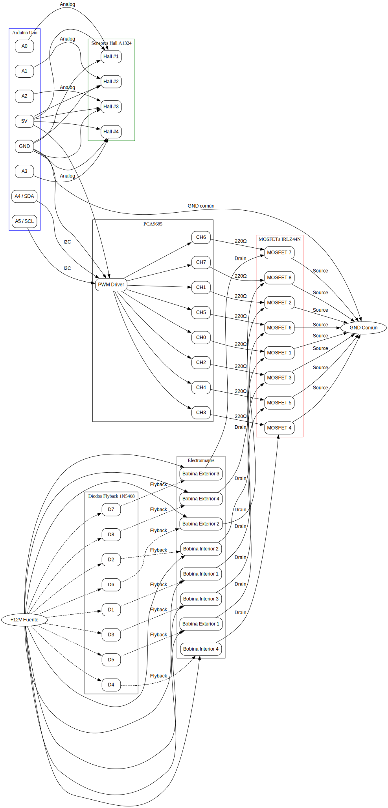

# Propuesta de Proyecto Final — Electrónica Digital 2026-1

**Grupo #:** ___  
**Integrantes:**  
1. Daniel Mateo González Sánchez  
2. Andres Felipe Polanco Olaya
3. Juan Sebastian Baquero Pinzon   
4. Juan Felipe Sanchez Poveda

**Fecha de entrega:** 03/06/26

---

> ⚠️ **Regla de oro:** Cada integrante debe poder explicar y defender cada decisión de diseño y cada línea de código. En cada entregable y en la presentación final se hará una pregunta aleatoria a cualquier miembro del grupo.

---

## 1. Descripción del Proyecto

El proyecto consiste en un sistema de levitación magnética activa controlado con Arduino. El dispositivo consistirá en una base con bobinas electromagnéticas, sensores de posición y un microcontrolador que permitirá mantener suspendido un pequeño imán de neodimio sin contacto físico directo. Eeste sistema medirá constantemente la posición del imán y ajustará la corriente de las bobinas para estabilizarlo.

El dispositivo sirve como una plataforma experimental y didáctica para estudiar electromagnetismo, sensores, control automático y estabilidad dinámica. La necesidad que satisface es poder observar de manera concreta cómo un sistema físico inestable puede estabilizarse mediante medición, realimentación y actuación electrónica. En otras palabras, permite convertir conceptos abstractos como campo magnético, fuerza electromagnética, sensores Hall y control PID en un experimento visible e interactivo.

Este sistema podría ser usado por estudiantes y docentes de física, ingeniería, electrónica o áreas afines. En un laboratorio o clase, permitiría demostrar cómo un microcontrolador puede recibir información del entorno, procesarla y actuar sobre un sistema físico real. También serviría como prototipo para experimentar con algoritmos de control, calibración de sensores, respuesta ante perturbaciones y movimiento controlado en un eje.

El dispositivo recibirá varias entradas. La primera será la lectura de sensores: un sensor de distancia medirá la altura del imán y sensores Hall detectarán desviaciones laterales del campo magnético. También recibirá entradas del usuario, como encender el sistema, seleccionar una altura objetivo o modificar parámetros básicos del control. A partir de esas entradas, el Arduino calculará la corrección necesaria.

Las salidas principales serán señales PWM enviadas a los MOSFETs que controlan la corriente en las bobinas. Esas señales producirán campos magnéticos variables, los cuales generarán movimiento o estabilización del imán. Además, el sistema podrá mostrar datos en el monitor serial: altura medida, error respecto al punto objetivo, intensidad relativa de las bobinas y estado del sistema, por ejemplo “calibrando”, “levitando”, “corrigiendo” o “inestable”.

Una sesión típica de uso sería la siguiente. Primero, el usuario conecta la fuente de alimentación y enciende el Arduino. El sistema inicia una fase de calibración: mide los sensores sin el imán o con el imán en una posición inicial conocida, y establece valores de referencia.

Después, el usuario activa el modo de levitación. Las bobinas internas comienzan a generar un campo magnético controlado y el Arduino ajusta la corriente para llevar el imán hacia una altura objetivo. En el monitor serial o pantalla, el usuario observa la altura medida y el error respecto al setpoint. Cuando el imán alcanza una posición estable, el sistema mantiene la levitación haciendo pequeñas correcciones continuas.

Si el imán se desplaza un poco hacia un lado, los sensores Hall detectan el cambio y el Arduino activa las bobinas laterales necesarias para devolverlo al centro. Visualmente, el usuario verá el imán suspendido con pequeñas oscilaciones mientras el sistema lo corrige. También podría cambiar la altura objetivo para observar cómo el imán sube o baja suavemente. Al finalizar, el usuario desactiva la levitación, reduce la corriente de las bobinas y retira el imán de forma segura.

En síntesis, vamos a construir un prototipo interactivo de control electromagnético que permite levitar, estabilizar y desplazar de forma limitada un imán mediante sensores, bobinas y Arduino. Su propósito principal es demostrar cómo un sistema inestable puede controlarse en tiempo real usando realimentación electrónica.
---

## 2. Solución Propuesta — Diagrama de Bloques



## 3. Matriz de Trazabilidad — Toolkit del Curso

**¿Qué habilidades de S1-S9 usa cada subsistema de su proyecto?**

Marquen con ✅ y describan cómo aplican cada habilidad. Si un subsistema no usa cierta habilidad, déjenlo en blanco.

## Subsistemas definidos

| Subsistema | Nombre | Descripción |
|---|---|---|
| Subsistema 1 | Sensado y entradas | Lectura del sensor de distancia, sensores Hall, botón de encendido/parada, setpoint y comandos del usuario. |
| Subsistema 2 | Control y procesamiento | Calibración, filtrado, cálculo de error, control PID vertical, corrección lateral, lógica de seguridad y máquina de estados. |
| Subsistema 3 | Actuación y visualización | Generación de PWM para MOSFETs y bobinas, visualización en OLED, monitor serial y apagado seguro. |

---

## Matriz de trazabilidad

| Habilidad del curso | Subsistema 1: Sensado y entradas | Subsistema 2: Control y procesamiento | Subsistema 3: Actuación y visualización |
|---|---|---|---|
| **S1 — E/S digital, protoboard** |  | ✅ Lógica condicional para cambiar entre estados como apagado, calibrando, levitando o inestable. | ✅ LED de diagnóstico o indicador de estado; montaje inicial de pruebas en protoboard. |
| **S2 — Timing preciso, interrupciones** | ✅ Lectura temporizada de sensores; posible interrupción para botón o evento crítico. | ✅ Lazo de control ejecutado con periodo fijo usando `millis()` o `micros()`, evitando `delay()`. | ✅ Actualización periódica de PWM, Pca9685 y Serial sin bloquear el control. |
| **S3 — Debouncing, ADC, sensores analógicos** | ✅ Lectura ADC del sensor de distancia y sensores Hall; debouncing del botón de usuario. | ✅ Conversión de lecturas crudas a altura, desviación lateral y valores calibrados. |  |
| **S4 — Comunicación UART + Python** | ✅ Entrada de comandos por Serial: iniciar, detener, calibrar o cambiar setpoint. | ✅ Parser serial no bloqueante para modificar parámetros sin detener el lazo de control. | ✅ Envío de telemetría: altura, error, PWM, estado del sistema y datos para registro en Python. |
| **S5 — PWM, H-Bridge, actuadores** |  | ✅ Cálculo de señales de mando a partir del error vertical y lateral. | ✅ Señales PWM enviadas a MOSFETs para regular la corriente en las bobinas internas y externas. |
| **S6 — Adquisición multicanal, OLED I2C** | ✅ Lectura multicanal: distancia, sensores Hall y entradas del usuario. | ✅ Organización de datos por canales, calibración y procesamiento por tiempos separados. |  |
| **S7 — Control PID** | ✅ Los sensores entregan las variables medidas: altura y desviación lateral. | ✅ PID para altura y PID para corrección lateral. | ✅ La salida del controlador se convierte en PWM para cada grupo de bobinas. |
| **S8 — Filtrado digital, oversampling, triggers** | ✅ Reducción de ruido en sensores de distancia y Hall mediante media móvil, IIR u oversampling. | ✅ Señales filtradas antes del PID para evitar correcciones debidas al ruido. | ✅ Triggers de seguridad: si el error supera un umbral, se apagan las bobinas. |
| **S9 — DAC MCP4725, FSM, generación de señales** | ✅ Setpoint variable como señal de referencia; comandos cambian el modo del sistema. | ✅ Máquina de estados finita: `OFF`, `CALIBRATING`, `READY`, `LEVITATING`, `UNSTABLE`, `FAULT`. | |

HABILIDADES VISTAS EN CLASE NECESARIAS EN LA IMPLEMENTACIÓN DEL CODIGO 

La primera es PWM y control de actuadores. Sin lab-05, no se tendría la base para entender cómo una señal digital del Arduino puede controlar potencia promedio en una carga física. En levitación esto es indispensable porque la fuerza magnética depende de la corriente de las bobinas, y esa corriente debe regularse mediante MOSFETs controlados por PWM. La práctica 5 muestra justamente la relación entre duty cycle y potencia entregada a un actuador.

La segunda es control en lazo cerrado + parser serial no bloqueante. Sin lab-07 y lab-04, sería muy difícil implementar algo como: leer altura, calcular error, corregir PWM, recibir un nuevo setpoint por Serial y seguir funcionando sin detener el lazo. La práctica 7 introduce setpoint, error y PWM en control automático, y la práctica 4 muestra por qué el sistema no debe bloquearse con delay() si se espera responder a comandos mientras opera.

HABILIDADES NO VISTAS EN CLASE NECESARIAS EN LA IMPLEMENTACIÓN DEL CODIGO

La primera es electrónica de potencia real para bobinas. Las prácticas usan LEDs, motor DC o L298N, pero aqui se requiere MOSFETs adecuados, diodos flyback, protección contra picos inductivos, disipación térmica, fuente de corriente suficiente y posiblemente medición de corriente. Una bobina no se comporta como un LED: almacena energía magnética y puede generar picos peligrosos al apagarla.

La segunda es control multivariable y estabilidad real de levitación magnética. En las prácticas se controló básicamente una variable: temperatura o velocidad. Aqui se varia la altura y existen desviaciones laterales. Además, la levitación magnética depende de gradientes de campo, retardo de sensores, saturación de bobinas, ruido, límite de corriente y acoplamientos entre ejes. Por eso conviene hacer calibración, límites de seguridad, filtrado y apagado automático si el imán se sale del rango.

> Si el proyecto completo usa menos de 4 habilidades distintas del curso, probablemente es demasiado simple. Pero no inflen la matriz: solo marquen las habilidades que REALMENTE usan.

---

## 4. Diseño Técnico

### 4.1 Diagrama Esquemático

El sistema está compuesto por un Arduino Uno que realiza la adquisición de datos de cinco sensores Hall Allegro A1324 y ejecuta el algoritmo de control PID. Para ampliar la cantidad de salidas PWM disponibles se utiliza un módulo PCA9685 conectado mediante comunicación I2C.

Las ocho bobinas electromagnéticas son accionadas mediante ocho MOSFET IRLZ44N configurados como interruptores de lado bajo (Low Side Switching). Cada bobina posee un diodo de rueda libre 1N5408 conectado en paralelo para proteger los MOSFET frente a los picos de tensión generados por la inductancia.

#### Alimentación

- Arduino Uno: 5 V
- PCA9685: 5 V
- Sensores Hall A1324: 5 V
- Bobinas electromagnéticas: Fuente externa de 12 V
- Todas las tierras (GND) se encuentran conectadas en común.

#### Conexiones principales

Arduino Uno:
- SDA (A4) → SDA del PCA9685
- SCL (A5) → SCL del PCA9685
- A0 → Sensor Hall 1
- A1 → Sensor Hall 2
- A2 → Sensor Hall 3
- A3 → Sensor Hall 4
- A4 → Sensor Hall 5 (si se usa I2C, mover este sensor a otro pin analógico disponible según la implementación final)

PCA9685:
- Canal 0 → MOSFET Bobina Interior 1
- Canal 1 → MOSFET Bobina Interior 2
- Canal 2 → MOSFET Bobina Interior 3
- Canal 3 → MOSFET Bobina Interior 4
- Canal 4 → MOSFET Bobina Exterior 1
- Canal 5 → MOSFET Bobina Exterior 2
- Canal 6 → MOSFET Bobina Exterior 3
- Canal 7 → MOSFET Bobina Exterior 4

Etapa de potencia (repetida para las 8 bobinas):
- Salida PCA9685 → Resistencia 220 Ω → Gate del IRLZ44N
- Gate → Resistencia 10 kΩ → GND (Pull-down)
- Source → GND
- Drain → Terminal negativo de la bobina
- Terminal positivo de la bobina → +12 V
- Diodo 1N5408 en paralelo con la bobina
  - Cátodo a +12 V
  - Ánodo al Drain

Capacitores recomendados:
- 100 nF entre VCC y GND cerca de cada sensor Hall.
- 470 µF entre +12 V y GND cerca del banco de bobinas.
- 100 µF entre 5 V y GND cerca del Arduino/PCA9685.

#### Esquemático del sistema



*Figura 1. Diagrama esquemático general del sistema de levitación magnética.*

El esquemático muestra las conexiones entre el Arduino Uno, el PCA9685, los sensores Hall, los MOSFETs de potencia, las bobinas electromagnéticas, los diodos de protección y las fuentes de alimentación de 5 V y 12 V.

### 4.2 Tabla de Pines

| Pin Arduino | Conectado a | Función |
|------------|-------------|----------|
| A0 | Sensor Hall A1324 #1 | Medición campo magnético eje X |
| A1 | Sensor Hall A1324 #2 | Medición campo magnético eje Y |
| A2 | Sensor Hall A1324 #3 | Medición campo magnético eje Z |
| A3 | Sensor Hall A1324 #4 | Sensor auxiliar de posición |
| A4 (SDA) | PCA9685 SDA | Comunicación I2C |
| A5 (SCL) | PCA9685 SCL | Comunicación I2C |
| 5V | PCA9685 VCC | Alimentación módulo PWM |
| 5V | Sensores A1324 | Alimentación sensores |
| GND | PCA9685, sensores y fuente externa | Referencia común |
| PCA9685 CH0 | MOSFET 1 | Bobina interior 1 |
| PCA9685 CH1 | MOSFET 2 | Bobina interior 2 |
| PCA9685 CH2 | MOSFET 3 | Bobina interior 3 |
| PCA9685 CH3 | MOSFET 4 | Bobina interior 4 |
| PCA9685 CH4 | MOSFET 5 | Bobina exterior 1 |
| PCA9685 CH5 | MOSFET 6 | Bobina exterior 2 |
| PCA9685 CH6 | MOSFET 7 | Bobina exterior 3 |
| PCA9685 CH7 | MOSFET 8 | Bobina exterior 4 |


### 4.3 Arquitectura de Software

Describan la máquina de estados (FSM) de su sistema. La FSM es la implementación concreta de S9 que ya identificaron en la matriz de trazabilidad (Sección 3). Aquí la detallan con diagrama y pseudocódigo:

```
┌─────────┐   botón   ┌─────────┐
│ ESPERA  │ ────────→ │ MIDIENDO │
└─────────┘           └─────────┘
                           │
                     timeout │
                           ↓
                      ┌─────────┐
                      │ MUESTRA │
                      └─────────┘
```

Incluyan pseudocódigo de la FSM principal y las funciones clave:

```cpp
// Pseudocódigo — FSM principal
enum Estado {ESPERA, MIDIENDO, MUESTRA, CALIBRANDO};
Estado estado = ESPERA;

void loop() {
  switch(estado) {
    case ESPERA:
      // Esperar trigger del sensor
      // Transición → MIDIENDO
      break;
    case MIDIENDO:
      // Adquirir datos de sensores
      // Si completado → MUESTRA
      break;
    case MUESTRA:
      // Mostrar en OLED + enviar CSV
      // Si botón presionado → ESPERA
      break;
  }
}
```

> ⚠️ Este pseudocódigo es solo la estructura. En el código real deben usar `millis()` o interrupciones para el timing (S2). **Nada de `delay()` en una FSM.**

---

## 5. Lista de Materiales

| Componente | Cant. | Costo unit. | Costo total | Proveedor | Disponible? | Plan B si no se consigue |
|---|---|---|---|---|---|---|
| Arduino Uno | 1 | Ya tienen | $0 | Kit | ✅ | — |
| Pca9685 | 1 | 30.000 | 30.000 | Mercadolibre | ✅ | |
| Led | 4 | 200 | 800 | Tienda 30 |✅ | |
| Allegro A1324 | 5 | | 8.000 | Mercadolibre |✅| |
| MOSFET IRLZ44N | 8 | 6.000 | 48.000 | Mercadolibre |✅ | |
| Diodo 1N5408 | 10 | | 6.000 | Mercadolibre |✅ | |
| Alambre de cobre calibre 22 | 80 m | | 88.000 | Mercadolibre|✅| |
| Iman de neodimio, pequeño | 1 | | 1.000 | Ferreteria |✅ | |

**Costo total estimado:** $190.000

> ⚠️ **Crítico:** Si un componente es indispensable y no se consigue, el proyecto está en riesgo. Definan un Plan B para cada componente crítico.

---

## 6. Cronograma — Entregables

*7 semanas de ejecución. La Semana 1 empieza el mismo día en que se aprueba la propuesta. Tres entregables obligatorios. Cada uno debe ser una demo funcionando, no un documento.*

| Entregable | Semana | ¿Qué se demuestra? | Pre-requisitos | Definición de "terminado" |
|:---:|:---:|---|---|---|
| **Entregable 1** | Semana 2 | Levitación simple del iman | Control PID (1) de las 4 bobinas interiores en serie  | Es observable la levitación del iman aunque oscile horizontalmente |
| **Entregable 2** | Semana 5 | Control del eje vertical de movimiento del iman | Entregable 1 + 4 exteriores en serie PID(2) | Correcto movimiento del iman en el eje vertical, aunque aun presente oscilaciónes en el horizontal |
| **Entregable 3 (Final)** | Semana 7 | Sistema completo funcionando + defensa | Entregable 2 modificado: un PID x bobina (8) |  Correcto movimiento del iman en el eje vertical, el sistema mitiga las oscilaciónes en el eje horizontal |

**Para cada entregable, definan:**
- ¿Qué subsistemas estarán funcionando?
- ¿Qué evidencia van a mostrar? (demo en vivo, datos, gráficas)
  
En cada entregable estarán funcionando todos los subsistemas (sensor, procesamiento y actuador), únicamente variando la escala y complejidad en la que operan.

Evidencia para el primer entregable: Demostración en vivo de la levitación del imán.

Evidencia para el segundo entregable: Demostración en vivo del control del movimiento vertical del imán.

Evidencia para el tercer entregable: Demostración en vivo del control del movimiento vertical y horizontal del imán.


- **Pre-requisitos:** ¿Qué debe estar listo ANTES de empezar este entregable?

Cada entregable depende del correcto funcionamiento del anterior, de manera que como entrega mínima definimos el segundo entregable con evidencias de haber intentado implementar los requisitos de la última. 

- **Definición de "terminado":** ¿Cómo se sabe, sin ambigüedad, que este entregable está completo?

Para el primer entregable: Operación correcta del sistema por mas de 30s 

Para el segundo: Operación correcta del sistema tras variar la altura del iman.

Para la ultima entrega: Autocompensación del sistema y correcto movimiento vertical del iman.
- ¿Qué riesgos podrían retrasar este entregable y cómo los mitigan?
  
Quema de las bobinas causada por mal manejo del voltaje. Se puede mitigar utilizando resistencias adicionales o por medio del PWM del Arduino.

Poca sensibilidad de parte de los sensores Hall. Se puede mitigar cambiando el sensor o aumentando la cantidad de sensores.

Quema del MOSFET IRLZ44N por la descarga de la bobina si no se utiliza el diodo. Se mitiga siendo cuidadoso.

> Si un entregable se retrasa, ¿afecta a los demás? Si el Entregable 1 depende de un componente que no llegó, ¿hay Plan B?

> 🔄 **Cambio de rumbo:** Si después del Entregable 1 descubren que el proyecto no es viable, pueden proponer un ajuste del alcance o un pivoteo justificado — pero DEBEN discutirlo con el profesor ANTES del Entregable 2. No se aceptan cambios de proyecto en la última semana.

---

## 7. Producto Mínimo Viable (MVP)

> 💀 **Si TODO sale mal** — no llega un componente, se enferma un integrante, se daña algo...

**¿Cuál es la demostración MÁS PEQUEÑA que prueba que aprendieron?**

*Ejemplo: "Aunque no funcione el control PID completo, al menos mostraremos el sensor midiendo temperatura con logging CSV y visualización en OLED."*

**Nuestro MVP es:**
Lograr que lo que llamamos "segunda entrega" funcione correctamente, obtener un control de la altura del iman. Consideramos este punto del proyecto viable porque solo implica configurar dos PID, uno para las bobinas internas en serie, las que producen la levitación y otro PID para el sistema en serie de bobinas externas, para el control de la altura del iman. La tercera entrega es mas complicada porque implica un PID por bobina para la autocompensación del sistema.
___

**Prueba de aceptación del MVP:** ¿Qué evidencia concreta demostraría que el MVP está completo?

*Ejemplo: "El sensor LM35 muestra temperatura en el OLED con actualización cada 500 ms, y el script Python guarda un CSV con al menos 100 filas de datos correctos."*

 En nuestro caso: El iman levita, es controlable su altura y el valor resulta comparable con el valor teorico.
___

---

## 8. Métrica de Éxito

**¿Cómo se sabe, sin ambigüedad, que el proyecto funciona?**

Definan al menos UNA métrica cuantitativa y falsable:

*Ejemplo malo:* ❌ "El sistema mide temperatura."  
*Ejemplo bueno:* ✅ "El sistema mide temperatura con error < ±1°C respecto a un termómetro de referencia, para temperaturas entre 20°C y 60°C."

**Nuestra métrica de éxito:**

Levitación sin soporte mecánico ≥30 s

Altura respecto al punto de equilibrio ±2 mm

Recuperación tras perturbación < 2s

Sin contacto físico imán–bobinas ✓

Coincidencia con predicción de simulación en equilibrio estable ✓
___

---

## 9. Plan de Validación

**¿Cómo van a probar que su dispositivo funciona correctamente?**

Para el primer entregable: apreciación de la levitación.

La validación numérica de resultados aplica desde el segundo entregable: Con base en el siguiente codigo, es posible calcular la altura que se puede alcanzar con el sistema de bobinas, se toma como valor teorico y es comparable con la altura real alcanzada por el iman. 

https://colab.research.google.com/drive/1DC9hNYvbjp36KYUwSNDwW6If_Ans_DAd?usp=sharing

---

## 10. Bitácora de Diseño

> 📓 **Obligatorio para presentar en cada entregable (no tiene nota, pero sin bitácora no hay presentación).**

La bitácora es un diario de ingeniería en Markdown que registra:

- Qué hicieron en cada sesión de trabajo
- Qué funcionó y qué falló
- Decisiones de diseño y su justificación
- Cambios respecto al plan original (y por qué)

**Formato sugerido:**

```markdown
# Bitácora — Proyecto [Nombre]

## Semana 1 — [Fecha]

**Qué hicimos:**
- Conectamos el LM35 al pin A0
- Probamos lectura básica con analogRead()

**Qué falló:**
- El sensor marcaba 10°C de más — descubrimos que era ruido de la fuente

**Qué decidimos:**
- Agregar filtro de media móvil (S8)
- Usar fuente externa en vez de USB para reducir ruido

**Plan próxima sesión:**
- Implementar filtro y verificar precisión con termómetro de referencia
```

---

## Checklist de Verificación (antes de entregar)

- [ ] ¿Cada integrante puede explicar el proyecto completo?
- [ ] ¿El diagrama de bloques muestra todos los subsistemas?
- [ ] ¿El proyecto usa al menos 4 habilidades distintas de S1-S9?
- [ ] ¿La lista de materiales incluye costo, proveedor, disponibilidad y Plan B?
- [ ] ¿El cronograma define los 3 entregables (semanas 2, 5, 7) con demos claras?
- [ ] ¿El MVP está definido? (si todo falla, ¿qué muestran?)
- [ ] ¿La métrica de éxito es cuantitativa y falsable?
- [ ] ¿El plan de validación especifica referencia y número de mediciones?
- [ ] ¿Iniciaron la bitácora de diseño?

---

> 🎯 **Recuerden:** El objetivo NO es hacer el proyecto más complejo posible, sino un proyecto **bien ejecutado, robusto y que demuestre lo que aprendieron.** Con 7 semanas, proyectos bien acotados y bien hechos brillan más que proyectos ambiciosos a medias. No importa si es un instrumento de medición, un dispositivo interactivo, o la automatización de un experimento — lo importante es que uses el toolkit S1-S9 y funcione.
