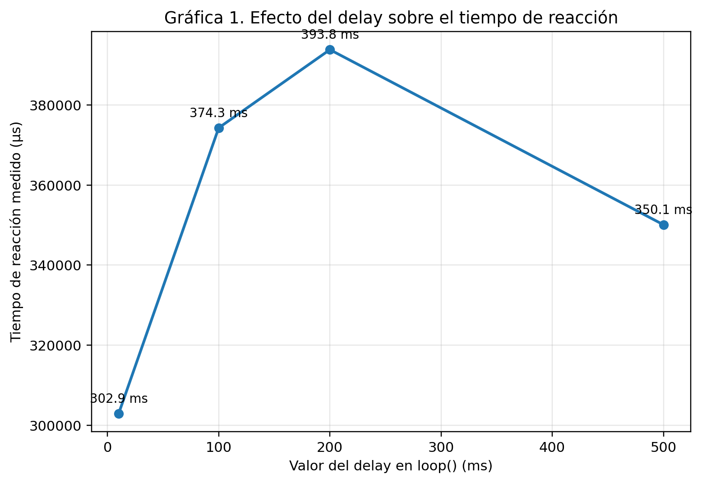
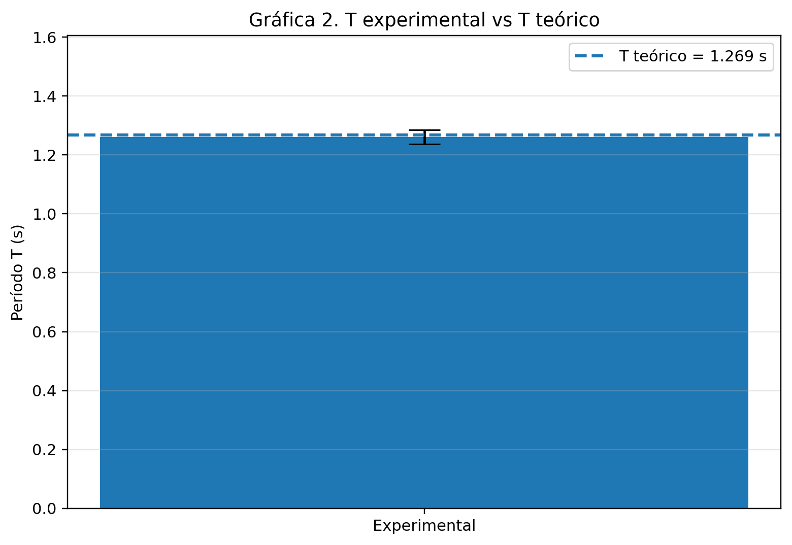
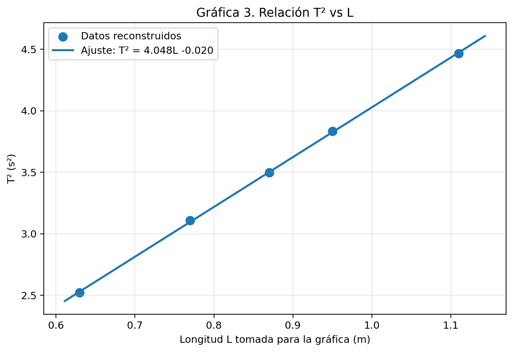

# Informe de Laboratorio — Sesión 2: Tiempo y Eventos — Mediciones Precisas con Arduino

---

**Universidad Nacional de Colombia**  
**Electrónica Digital — 2016684 — 2026-1**  
**Prof. Ricardo Amézquita Orozco**

---

| Campo | |
|-------|--|
| **Integrantes** | 1. Andres Felipe Polanco Olaya |
| | 2. Juan Felipe Sanchez Poveda |
| | 3. Daniel Mateo Gonzales Sánchez |
| | 4. Juan Sebastian Baquero Pinzon |
| **Grupo** | 4 |
| **Fecha de la práctica** | Miércoles 11 de Febrero, 2026 |
| **Fecha de entrega** | Domingo 3 de Mayo, 2026 (Informe Bloque 1) |

---

## 1. Resultados

### Parte 1: Tiempo de Reacción (Polling)

| Medición | Tiempo millis() [ms] | Tiempo micros() [μs] | Diferencia [μs] |
|----------|----------------------|----------------------|------------------|
| 1 | 194 | 194728 | -728 |
| 2 | 316 | 315668 | 332 |
| 3 | 226 | 225844 | 156 |
| 4 | 182 | 181932 | 68 |
| 5 | 247 | 247312 | -312 |
| 6 | 174 | 174404 | -404 |
| 7 | 179 | 179524 | -524 |
| 8 | 179 | 179748 | -748 |
| 9 | 387 | 387632 | -632 |
| 10 | 202 | 201632 | 368 |
| **Promedio** | 228.6 | 228842.4 | -242.4 |
| **Desv. Est.** | 70.75 | 70721.54 | 436.03 |

Los tiempos obtenidos por polling muestran una variación normal entre intentos, porque la medición incluye el tiempo de reacción humana. Aun así, las lecturas de `millis()` y `micros()` conservan una correspondencia clara. La diferencia promedio fue de -242.4 μs, un valor menor que 1 ms, por lo que es compatible con la resolución limitada de `millis()`.

### Parte 2: Tiempo de Reacción (Interrupciones) + Bouncing

| Medición | Tiempo de reacción [μs] | contadorISR | Bouncing (sí/no) |
|----------|-------------------------|-------------|-------------------|
| 1 | 270488 | 1 | No |
| 2 | 152500 | 1 | No |
| 3 | 181976 | 1 | No |
| 4 | 165588 | 2 | Sí |
| 5 | 177316 | 2 | Sí |
| 6 | 185736 | 1 | No |
| 7 | 361892 | 1 | No |
| 8 | 186724 | 1 | No |
| 9 | 43820 | 2 | Sí |
| 10 | 279932 | 2 | Sí |
| **Promedio** | 200597.2 | No aplica | No aplica |

En esta parte, cuatro de las diez pulsaciones presentaron bouncing. Esto indica que el botón no siempre genera una única transición limpia, sino que puede producir varias señales muy cercanas entre sí. El valor máximo de `contadorISR` fue 2, de modo que el rebote observado fue moderado, pero suficiente para alterar un conteo si no se aplica alguna estrategia de filtrado.

### Parte 2: Experimento del Delay

| Valor del delay [ms] | Tiempo de reacción medido [μs] | Observaciones |
|-----------------------|-------------------------------|---------------|
| 10 (original) | 302928 | Tiempo base de referencia |
| 100 | 374272 | Aumentó frente al valor base |
| 200 | 393792 | Fue el mayor valor registrado |
| 500 | 350088 | Disminuyó respecto al delay de 200 ms |

Los resultados no muestran una relación lineal entre el valor de `delay()` y el tiempo de reacción medido. El tiempo aumenta entre 10 ms y 200 ms, pero luego disminuye cuando el delay se lleva a 500 ms. Esto sugiere que el delay no fue el único factor que influyó en la medición. La variabilidad propia del tiempo de reacción humana, el rebote del botón y pequeñas diferencias entre intentos también afectan los datos. En una interrupción bien implementada, el evento se captura cuando ocurre, aunque el programa principal esté ejecutando otras instrucciones.

### Parte 3: Período del Péndulo (Sensor IR)

**Longitud de cuerda L = 0.4 m**

| Medición | T medido [μs] | T medido [s] |
|----------|---------------|--------------|
| 1 | 1260960 | 1.261 |
| 2 | 1227440 | 1.227 |
| 3 | 1277440 | 1.277 |
| 4 | 1250240 | 1.250 |
| 5 | 1288160 | 1.288 |
| **Promedio** | 1260848.0 | 1.261 |
| **Desv. Est.** | 23716.4 | 0.024 |

$T_{teórico} = 2\pi\sqrt{L/g}$ = 1.269 s

Error porcentual: 0.62 %

Los datos del péndulo presentan una buena concordancia con el modelo teórico del péndulo simple. La diferencia entre el valor experimental promedio y el valor calculado es pequeña, lo que indica que el sensor IR permitió medir el período con una precisión adecuada para esta práctica.

### Reto 3: Datos reconstruidos para T² vs L

Como las longitudes no quedaron registradas en la hoja de datos, se tomaron cinco bloques de mediciones de período y se estimó una longitud asociada para cada bloque. Esta reconstrucción permite revisar si los datos son coherentes con la relación esperada entre $T^2$ y $L$. Por esa razón, la gráfica debe leerse como una verificación de coherencia del conjunto de datos y no como una medición independiente de la gravedad.

| Bloque | Longitud tomada L (m) | T promedio (s) | Desv. Est. T (s) | T² (s²) |
|--------|------------------------|----------------|------------------|---------|
| 1 | 0.63 | 1.588 | 0.097 | 2.521 |
| 2 | 0.77 | 1.763 | 0.045 | 3.108 |
| 3 | 0.87 | 1.870 | 0.038 | 3.498 |
| 4 | 0.95 | 1.958 | 0.022 | 3.835 |
| 5 | 1.11 | 2.113 | 0.094 | 4.465 |

---

## 2. Visualización

### Gráfica 1: Efecto del Delay sobre el Tiempo de Reacción (Interrupciones)

**Eje X:** Valor del delay en `loop()` (ms)  
**Eje Y:** Tiempo de reacción medido (μs)



**Interpretación:**  
La Gráfica 1 muestra que el tiempo de reacción no cambia de forma proporcional al valor del delay. El mayor tiempo se observó con un delay de 200 ms, mientras que con 500 ms el valor disminuyó. Esto indica que la medición no depende únicamente del delay del programa principal. En una interrupción, el evento se registra en el momento en que ocurre, por lo que el `delay()` no debería impedir la captura de la señal. La variación observada se explica mejor por factores experimentales, como la reacción humana y el rebote del botón.

### Gráfica 2: T experimental vs T teórico (Péndulo)

Representar el valor medido de T, promedio más desviación estándar, junto con el valor teórico $T = 2\pi\sqrt{L/g}$ para la longitud utilizada.



El período experimental promedio fue de 1.261 s, con una desviación estándar de 0.024 s. El valor teórico para una longitud de 0.4 m fue de 1.269 s. La cercanía entre ambos valores confirma que el montaje con sensor IR fue adecuado para estimar el período del péndulo. La diferencia restante puede deberse a pequeñas variaciones en la longitud efectiva, al ángulo inicial de oscilación, a la alineación del sensor o al redondeo de las mediciones.

### Gráfica 3: T² vs L

**Eje X:** Longitud L (m)  
**Eje Y:** Período al cuadrado T² (s²)



**Ecuación de ajuste lineal:** T² = 4.048 · L -0.020

**Pendiente experimental:** 4.048 s²/m

**Pendiente teórica ($4\pi^2/g$):** 4.024 s²/m

**Valor de $g$ obtenido:** 9.753 m/s²

La Gráfica 3 presenta una tendencia lineal clara entre $T^2$ y $L$, que es el comportamiento esperado para un péndulo simple. La pendiente experimental fue muy cercana a la pendiente teórica, y el valor de gravedad obtenido fue de 9.753 m/s². Como las longitudes fueron reconstruidas a partir de los tiempos, este resultado confirma principalmente la coherencia interna del procesamiento. Para convertirlo en una determinación experimental completa, las longitudes deberían medirse directamente con regla o cinta métrica.

---

## 3. Análisis

**Pregunta 1:** ¿Cuál es la diferencia promedio entre las mediciones de `millis()` y `micros()` en la Tabla 1? ¿Es consistente con la resolución de 1 ms de `millis()`?

La diferencia promedio fue de -242.4 μs, calculada como `millis() × 1000 − micros()`. Este valor es menor que 1 ms, por lo que sí es consistente con la resolución de `millis()`. La función `millis()` solo registra cambios en pasos de milisegundos, mientras que `micros()` permite observar diferencias más finas. Por eso es normal que aparezcan diferencias de algunos cientos de microsegundos entre ambas mediciones.

**Pregunta 2:** ¿Qué porcentaje de las pulsaciones en la Tabla 2 presentaron bouncing (`contadorISR > 1`)? ¿Cuál fue el valor máximo de `contadorISR` observado?

El 40 % de las pulsaciones presentó bouncing, ya que 4 de las 10 mediciones tuvieron `contadorISR > 1`. El valor máximo observado fue 2. Esto muestra que el rebote del botón estuvo presente, aunque no de manera extrema. Aun así, es suficiente para justificar el uso de una estrategia de debouncing, especialmente si se necesita contar eventos de forma confiable.

**Pregunta 3:** Analiza los resultados de la Tabla 3: ¿el delay afectó el tiempo de reacción reportado? Explica por qué o por qué no, en términos del mecanismo de la ISR.

Los datos muestran cambios en el tiempo de reacción al modificar el delay, pero no una tendencia lineal ni estable. El tiempo aumentó entre 10 ms y 200 ms, pero luego disminuyó con 500 ms. Por eso no se puede concluir que el delay afecte directamente la captura del evento. En una ISR, la interrupción detiene momentáneamente el flujo normal del programa y atiende el evento cuando ocurre. Por esta razón, el delay del `loop()` no debería impedir que la señal sea registrada. Lo más razonable es interpretar que la variación se debe a factores de la medición, no a una dependencia directa entre delay y tiempo de reacción.

---

## 4. Código Documentado

### lab-02-parte3-pendulo.ino (TODOs completados)

```cpp
// ============================================================================
// Lab 02 - Parte 3: Medición de Período de Péndulo con Sensor IR
// Curso: Electrónica Digital 2026-1 | Universidad Nacional de Colombia
// Sesión 2: Tiempo y Eventos — Mediciones Precisas con Arduino
// ============================================================================
//
// El programa mide el período de un péndulo usando un sensor IR conectado al pin 2.
// Cada paso del péndulo frente al sensor genera una interrupción. Como el sensor
// está ubicado cerca de la posición de equilibrio, dos detecciones consecutivas
// corresponden a medio período. Por eso el tiempo medido se multiplica por dos.

const int pinSensorIR = 2;

volatile unsigned int contadorDetecciones = 0;
volatile unsigned long tiempoPrimeraDeteccion = 0;
volatile unsigned long tiempoSegundaDeteccion = 0;
volatile bool medicionLista = false;

int numMedicion = 0;

void setup() {
  pinMode(pinSensorIR, INPUT);

  Serial.begin(9600);
  Serial.println("============================================");
  Serial.println("  Lab 02 - Parte 3: Periodo Pendulo");
  Serial.println("============================================");
  Serial.println();

  attachInterrupt(digitalPinToInterrupt(pinSensorIR), isrSensorIR, FALLING);

  Serial.println("#   T(us)        T(ms)      T(s)");
  Serial.println("--------------------------------------");
}

void loop() {
  if (medicionLista == true) {
    float medio_T = tiempoSegundaDeteccion - tiempoPrimeraDeteccion;
    float T = 2 * medio_T;
    float T_seg = T / 1000000.0;
    float T_ms = T / 1000.0;

    numMedicion++;

    Serial.print(numMedicion);
    Serial.print("   ");
    Serial.print(T);
    Serial.print("        ");
    Serial.print(T_ms, 3);
    Serial.print("      ");
    Serial.println(T_seg, 6);

    contadorDetecciones = 0;
    medicionLista = false;
  }
}

void isrSensorIR() {
  static unsigned long ultimoTiempo = 0;
  unsigned long ahora = micros();

  // Se ignoran detecciones demasiado cercanas para evitar registros repetidos
  // producidos por el mismo paso del péndulo frente al sensor.
  if (ahora - ultimoTiempo < 200000) {
    return;
  }

  ultimoTiempo = ahora;
  contadorDetecciones++;

  if (contadorDetecciones == 1) {
    tiempoPrimeraDeteccion = ahora;
  }

  if (contadorDetecciones == 2) {
    tiempoSegundaDeteccion = ahora;
    medicionLista = true;
  }
}
```

---

## 5. Dificultades Encontradas y Soluciones Aplicadas

### Dificultad 1: Rebote del botón en las mediciones con interrupciones

**Síntoma observado:**  
En algunas pulsaciones el valor de `contadorISR` fue mayor que 1.

**Causa identificada:**  
El botón mecánico no siempre genera una transición única. Al presionarlo, los contactos pueden abrirse y cerrarse varias veces en un intervalo muy corto.

**Solución aplicada:**  
Se identificaron las pulsaciones con bouncing y se analizó su frecuencia dentro del conjunto de datos. Esto permitió reconocer que el fenómeno sí estaba presente y que debe considerarse en diseños donde el conteo exacto sea importante.

**Lección aprendida:**  
Una interrupción permite capturar eventos rápidamente, pero no elimina por sí sola el problema físico del rebote. Para obtener conteos confiables se necesita aplicar debouncing por software o por hardware.

### Dificultad 2: Conversión de unidades en el período del péndulo

**Síntoma observado:**  
Los valores del período requerían ser expresados de forma coherente en microsegundos y segundos para poder compararlos con el modelo teórico.

**Causa identificada:**  
La medición del Arduino se obtiene en microsegundos, mientras que la fórmula del período teórico entrega el resultado en segundos.

**Solución aplicada:**  
Se convirtió el período experimental a segundos dividiendo entre 1,000,000. También se revisó la coherencia de los datos del reto para que las unidades fueran compatibles con el modelo físico.

**Lección aprendida:**  
La precisión del análisis no depende solo de medir bien, sino también de mantener la coherencia entre unidades. Una conversión incorrecta puede cambiar completamente la interpretación del resultado.

---

## 6. Pregunta Abierta

**Pregunta:** Propón un experimento de física que podrías automatizar usando interrupciones y un sensor (IR, ultrasonido, u otro). Describe: qué mediría, qué sensor usaría, qué tipo de interrupción (RISING/FALLING/CHANGE), y qué ventaja tendría sobre una medición manual.

Un experimento posible sería medir la velocidad de un carrito en un riel usando dos sensores IR separados por una distancia conocida. Cada sensor detectaría el paso del carrito y el Arduino registraría el tiempo exacto de cada evento mediante interrupciones. Se podría usar la interrupción en modo `FALLING`, si la salida del sensor baja cuando el carrito interrumpe el haz.

Con la distancia entre sensores y la diferencia de tiempo entre las dos detecciones, se calcularía la velocidad mediante la expresión $v = d/\Delta t$. La ventaja frente a una medición manual es que el sistema reduce el error humano al iniciar o detener un cronómetro. Además, permite medir intervalos muy cortos con mayor precisión, lo cual es importante cuando el objeto se mueve rápidamente.
