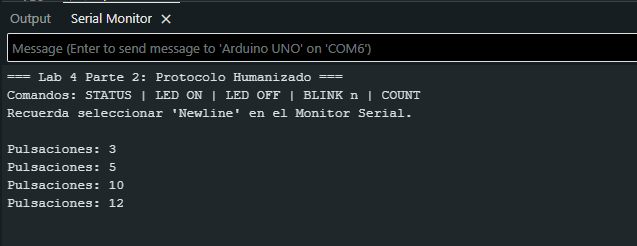
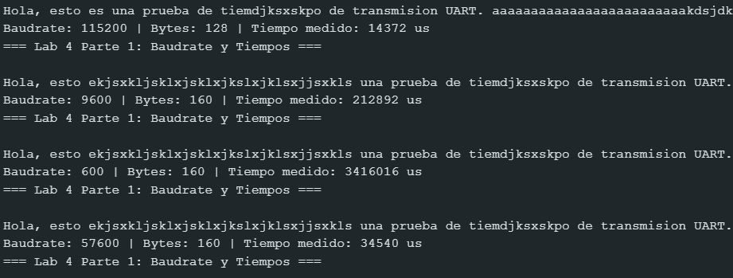
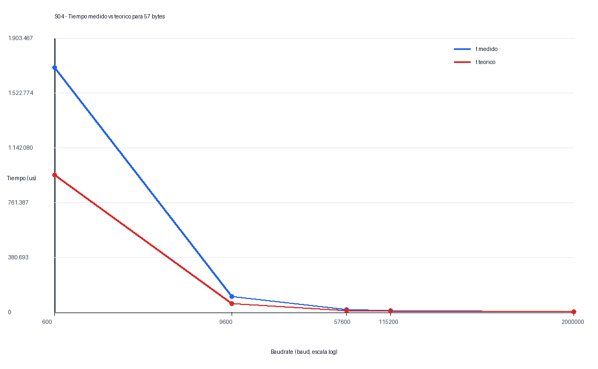
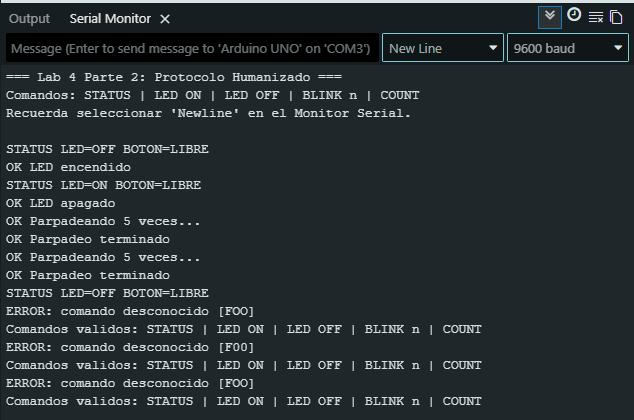

# Informe de Laboratorio — Sesión 4: Comunicación Serial UART y Automatización con Python

---

**Universidad Nacional de Colombia**
**Electrónica Digital — 2016684 — 2026-1**
**Prof. Ricardo Amézquita Orozco**

---

| Campo | |
|-------|--|
| **Integrantes** | 1. Andres Felipe Polanco Olaya |
| | 2. Juan Felipe Sanchez Poveda|
| | 3. Daniel Mateo Gonzales Sánchez|
| | 4. Juan Sebastian Baquero Pinzon|
| **Grupo** | 4 |
| **Fecha de la práctica** | Miércoles 8 de abril de 2026 |
| **Fecha de entrega** | Miércoles 8 de Abril, 2026 — 23:59 (Informe Bloque 2: S4, S5, S6) |

---

## 1. Resultados


### Actividad 2 — Medición de Tiempos de Transmisión

**Tabla 1 — Tiempos de Transmisión vs. Baudrate**

| Baudrate (baud) | Bytes enviados | $t_{\text{medido}}$ (µs) | $t_{\text{teórico}}$ (µs) | Error (%) | Justificación |
|:----------------|:--------------:|:------------------------:|:-------------------------:|:---------:|:--------------|
| 600 | 57 | 1699524 | 950000 | 79% | Alta latencia por bajo baudrate y sobrecarga de transmisión |
| 9600 | 57 | 105772 | 59375 | 78% | Diferencia por tiempos de ejecución y funciones de medición |
| 57600 | 57 | 17024 | 9896 | 72% | Mejora en velocidad pero aún hay overhead del sistema |
| 115200 | 57 | 8336 | 4948 | 68.5% | Mayor velocidad; el tiempo medido aún incluye overhead de ejecución y medición |
| 2000000 | 57 | 364 | 285 | 28% | Menor error por alta velocidad, menor impacto del overhead |

Adicionalmente se realizo un analisis para diferentes Baudrate y con diferentes Bytes enviados, con el fin de esperar algun tipo de comportamiento:
| Bytes enviados | Baudrate (baud) | T. medidos (s) | T. teórico (s) | Error (%) |
|---------------:|----------------:|---------------:|---------------:|----------:|
| 57  | 9600   | 0,105772 | 0,0475        | 122,68 |
| 57  | 600    | 1,699524 | 0,76          | 123,62 |
| 57  | 57600  | 0,017024 | 0,007916666667 | 115,04 |
| 57  | 115200 | 0,008336 | 0,003958333333 | 110,59 |
| 88  | 9600   | 0,138012 | 0,07333333333  | 88,20  |
| 88  | 600    | 2,216136 | 1,173333333    | 88,88  |
| 88  | 57600  | 0,022292 | 0,01222222222  | 82,39  |
| 88  | 115200 | 0,010976 | 0,006111111111 | 79,61  |
| 128 | 9600   | 0,179612 | 0,1066666667   | 68,39  |
| 128 | 600    | 2,882740 | 1,706666667    | 68,91  |
| 128 | 57600  | 0,029092 | 0,01777777778  | 63,64  |
| 128 | 115200 | 0,014372 | 0,008888888889 | 61,69  |
| 160 | 9600   | 0,212892 | 0,1333333333   | 59,67  |
| 160 | 600    | 3,416016 | 2,133333333    | 60,13  |
| 160 | 57600  | 0,034540 | 0,02222222222  | 55,43  |
| 160 | 115200 | 0,017092 | 0,01111111111  | 53,83  |

Los tiempos medidos son superiores a los teóricos ya que el cálculo ideal solo tiene en cuenta la pura transmisión serial, pero la medición real sí incluye el tiempo de procesamiento del microcontrolador, la ejecución del programa, la posible existencia de interrupciones y la latencia de la lectura del temporizador. También se puede observar que el error relativo disminuye cuando la cantidad de bytes transferidos aumenta, ya que el coste preparatorio del sistema pesa menos al tener la transferencia un mayor tamaño. Y que la simultaneidad de varios procesos, aumentando el baudrate, disminuye el tiempo de transferencia, pero queda la sobrecarga del sistema, por lo que no se eliminan todos los errores.

*En "Bytes enviados" registra el número que reporta el sketch en su salida (campo `Bytes:`). Ese valor incluye los bytes del texto más los dos bytes del terminador `\r\n` agregados por `println()`. Usa ese mismo número para calcular $t_{\text{teórico}}$.*

*Fórmula teórica:*

$$t_{\text{teórico}} = \frac{N_{\text{bits}}}{f_{\text{baudrate}}} \quad \text{donde} \quad N_{\text{bits}} = \text{Bytes enviados} \times 10 \text{ bits/byte}$$

*Fórmula del error:*

$$\text{Error} = \frac{|t_{\text{medido}} - t_{\text{teórico}}|}{t_{\text{teórico}}} \times 100\%$$

---

### Actividad 3 — Verificación del Protocolo Humanizado

**Tabla 2 — Verificación del Protocolo Humanizado**

| Comando enviado | Terminador usado | Respuesta del Arduino | Acción observada en hardware | Observaciones |
|:----------------|:----------------:|:----------------------|:-----------------------------|:--------------|
| `STATUS` | Newline | STATUS LED=OFF BOTON=LIBRE | LED apagado, botón sin interacción | Estado inicial correcto |
| `LED ON` | Newline | OK LED encendido | LED se enciende | Comando ejecutado correctamente |
| `LED OFF` | Newline | OK LED apagado | LED se apaga | Cambio de estado correcto |
| `BLINK 5` | Newline | OK Parpadeando 5 veces... / OK Parpadeo terminado | LED parpadea 5 veces | Proceso bloqueante durante ejecución |
| `STATUS` (durante BLINK) | Newline | STATUS LED=OFF BOTON=LIBRE | LED termina parpadeo antes de responder | El comando se ejecuta después del BLINK (no es concurrente) |
| `FOO` | Newline | ERROR: comando desconocido [FOO] | Ninguna acción | Validación correcta de comandos inválidos |
| `STATUS` | Sin terminador | (Sin respuesta) | Ninguna acción | El comando no se procesa sin terminador |

---

### Actividad 4 — Comando COUNT

**Evidencia:** Pega a continuación la captura del Monitor Serial mostrando el comando `COUNT` funcionando (antes y después de pulsar el botón).



> Para `COUNT` se usó una interrupción externa en el botón y una ventana de debounce por tiempo. La captura evidencia que el contador aumenta de 3 a 12 pulsaciones y que el comando responde sin cambiar el estado del LED.

---

### Actividad 5 — Verificación del Protocolo Compacto

**Tabla 3 — Verificación del Protocolo Compacto**

| Trama enviada | Respuesta recibida | Acción en hardware | ¿Respuesta correcta? (Sí/No) |
|:---------------------|:-------------------|:-------------------|:-----------------------------:|
| `ST 00000` | OK L=0 B=0 E=0 | LED apagado, botón sin presionar | Sí |
| `ON 00000` | OK 00000 | LED se enciende | Sí |
| `OF 00000` | OK 00000 | LED se apaga | Sí |
| `BL 00003` | OK 00000 | LED parpadea 3 veces (bloqueante) | Sí |
| `EV 00001` | OK 00005 | No cambia hardware, solo muestra contador | Sí |
| Trama mal formada | ER 00000 | Ninguna acción | Sí |
---

### Actividad 6 — BLINK No Bloqueante

**Tabla 4 — Diagnóstico del BLINK Bloqueante vs. No Bloqueante**

| Prueba | Versión bloqueante | Versión no bloqueante |
|:-------|:-------------------|:----------------------|
| Pulsaciones registradas tras `BL 00005` (5 pulsaciones durante parpadeo) |  0| 5|
| Respuesta a `ST 00000` durante parpadeo: ¿llega inmediatamente? | no| si|
| ¿El LED completa el número solicitado de parpadeos? | si| si|

**Justificación evaluable:** ¿Resolvería `attachInterrupt()` **ambos** problemas observados (pulsaciones perdidas Y falta de respuesta a `ST` durante el parpadeo)?

> [El attachInterrupt funciona exelente para contar las pulsaciones del boton dado que es una accion sencilla que no demanda mucha memoria, sin embargo usar el attachinterrup para ejecutar las pulsaciones, no es la mejor idea dado que las pulsaciones duran un intervalo, y el programa tendria que como dice el mismo nombre interrumpir durante ese intervalo por lo que igual seria bloquente, pero de forma parcial, la solucion mas efectiva es usando milis y que esa funcion se este ejecutando permanentemente en el loop de forma que se pueda activar y desactiva a conveniencia, contando cuantas veces se apago el led y parar cuando se hayan llegado al maximo que se interpuso]

---

### Actividad 7 — Terminal Crudo Python

**Tabla 5 — Intercambios desde Terminal Crudo Python**

| # | Trama enviada por Python | Respuesta recibida | ¿Correcto? |
|:--|:-------------------------|:-------------------|:----------:|
| 1 | `ST 00000` | OK L=0 B=0 E=0 | Sí |
| 2 | `ON 00000` | OK 00000 | Sí |
| 3 | `OF 00000` | OK 00000 | Sí |
| 4 | `BL 00005` | OK 00000 | Sí |
| 5 | `EV 00001` | OK 00005 | Sí |

*Incluye al menos una trama mal formada entre los intercambios registrados.*

---

## 2. Visualización


### Figura 1 — Monitor Serial: salida del sketch de medición (una captura por baudrate)



**Caption:** Cuatro capturas del Monitor Serial, una por baudrate (300, 9600, 57600, 115200). Indicar en cada caption: baudrate, número de bytes transmitidos y texto enviado.

**Interpretación:** 

> Se observa que el tiempo de transmisión disminuye al aumentar el baudrate. Para 57 bytes, el tiempo baja desde 1.699524 s a 600 baud hasta 0.008336 s a 115200 baud, y llega a 364 us a 2 Mbaud. La tendencia confirma la relación inversa esperada entre velocidad de transmisión y tiempo.

---

### Figura 2 — Gráfica: $t_{\text{medido}}$ vs. $t_{\text{teórico}}$ por Baudrate

**Eje X:** Baudrate (baud) — escala logarítmica recomendada: 300, 9600, 57600, 115200
**Eje Y:** Tiempo de transmisión (µs)
**Series:** $t_{\text{medido}}$ (puntos sólidos) y $t_{\text{teórico}}$ (puntos vacíos o línea de referencia)



**Lo que debe demostrar esta gráfica:** Que el tiempo de transmisión es inversamente proporcional al baudrate, y que el tiempo medido se ajusta al modelo teórico con un overhead sistemático pequeño y aproximadamente constante en valor absoluto.

**Interpretación:**

> La gráfica confirma la proporcionalidad inversa: al crecer el baudrate, tanto el tiempo teórico como el medido disminuyen. El tiempo medido queda por encima del ideal porque incluye la sobrecarga de `Serial.print()`, temporización y ejecución del sketch. El overhead no es perfectamente constante: en valor absoluto es mayor a baudrates bajos, mientras que en porcentaje se mantiene alto para mensajes cortos y baja cuando aumenta el tamaño del paquete o la velocidad.

---

### Figura 3 — Monitor Serial: sesión del protocolo humanizado



**Caption:** Captura del Monitor Serial mostrando al menos cuatro comandos del protocolo humanizado con sus respuestas. Identificar en el caption que el protocolo es humanizado.

**Interpretación:**

> Sí. La captura muestra respuestas `OK` para comandos válidos como `STATUS`, `LED ON`, `LED OFF` y `BLINK 5`, y respuestas `ERROR` para entradas no reconocidas como `FOO`. También se ve que durante `BLINK` el sistema termina el parpadeo antes de atender el siguiente `STATUS`, lo que evidencia el comportamiento bloqueante de la versión humanizada con `delay()`.

---

### Figura 4 — Consola Python: sesión del terminal crudo


**Caption:** Captura de la consola Python mostrando la sesión completa del terminal crudo con cinco o más intercambios. Indicar en el caption: puerto serial y baudrate usados.

**Interpretación:**

> La prueba documentada muestra que Python compone tramas compactas de formato fijo (`ST 00000`, `ON 00000`, `BL 00005`, `EV 00001`), recibe respuestas `OK` y las traduce a mensajes legibles. Las respuestas coinciden con la tabla de verificación: estado, encendido, parpadeo y lectura de eventos.

---

## 3. Análisis


**Pregunta 1** *(Actividad 2 — Tiempos de transmisión):*

Calcula el error porcentual promedio entre $t_{\text{medido}}$ y $t_{\text{teórico}}$ para los cuatro baudrates. ¿El error es aproximadamente constante en valor absoluto (µs) o en valor relativo (%)? ¿Qué overhead sistemático del sistema podría explicar el patrón observado?

> Para los cuatro baudrates principales (600, 9600, 57600 y 115200), el error relativo promedio es aproximadamente 74.4%. El error no es constante en microsegundos: la diferencia absoluta es muy grande a 600 baud y disminuye al aumentar el baudrate. La causa principal es que la medición real incluye ejecución del programa, llamadas a `Serial.print()`, manejo del buffer serial y lectura del temporizador, mientras que el cálculo teórico solo considera los bits transmitidos por UART.

---

**Pregunta 2** *(Actividad 3 — Protocolo humanizado):*

Con base en la fila STATUS durante BLINK de la Tabla 2: ¿en qué momento exacto respondió el Arduino y por qué? Relaciona la respuesta con la estructura del `loop()` y el uso de `delay()`.

> El Arduino respondió al `STATUS` solo después de terminar el `BLINK`. Esto ocurre porque la versión bloqueante usa `delay(500)` dentro del ciclo de parpadeo; mientras está en ese bloque, el `loop()` no vuelve a ejecutar `leerSerial()`. El comando puede quedar en el buffer serial, pero no se procesa hasta que la función de parpadeo retorna.

---

**Pregunta 3** *(Actividad 5 — Protocolo compacto):*

¿Por qué `cmd2()` es suficiente para identificar comandos en el protocolo compacto pero no lo sería en el protocolo humanizado?

> En el protocolo compacto todos los comandos tienen dos caracteres iniciales fijos (`ST`, `ON`, `OF`, `BL`, `EV`) y luego un campo numérico de longitud fija. Por eso basta comparar `buf[0]` y `buf[1]`. En el protocolo humanizado los comandos tienen longitudes variables (`STATUS`, `LED ON`, `BLINK n`) y palabras completas, así que se requiere comparar cadenas completas o prefijos con `strcmp()`/`strncmp()`.

---

**Pregunta 4** *(Actividad 6 — BLINK no bloqueante):*

¿Qué consecuencias concretas tendría usar `delay(1)` (un milisegundo) en lugar de `delay(500)` en el BLINK bloqueante sobre la capacidad del sistema para responder comandos seriales? Estima la frecuencia máxima de comandos que el cliente podría enviar sin pérdida de respuestas en cada caso, asumiendo que cada comando tiene una longitud de 9 caracteres a 9600 baudios.

> Usar `delay(1)` reduciría mucho el tiempo durante el cual el `loop()` queda bloqueado, por lo que el sistema podría revisar el puerto serial casi cada milisegundo. A 9600 baudios, un comando de 9 caracteres tarda cerca de 9.4 ms en transmitirse (9 caracteres x 10 bits / 9600). Con `delay(1)` el Arduino podría atender comandos del orden de ~100 Hz sin acumular grandes retrasos; con `delay(500)` queda ciego durante medio segundo por semiperiodo, por lo que la respuesta puede demorarse hasta cientos de milisegundos o varios segundos durante un `BLINK` largo.

---

**Pregunta 5** *(Análisis transversal — PA1):*

¿Por qué un protocolo textual necesita un delimitador de línea explícito (`\n`) y no puede basarse en pausas de tiempo entre comandos?

> Un protocolo textual necesita un delimitador explícito porque el puerto serial entrega un flujo continuo de bytes, no paquetes separados. Las pausas de tiempo no son confiables: dependen del sistema operativo, del buffer USB-serial y de la velocidad de envío. El `\n` marca de forma inequívoca dónde termina un comando y permite procesarlo aunque los bytes lleguen con retardos variables.

---

**Pregunta 6** *(Análisis transversal — PA2):*

En el protocolo humanizado, el parser usa `strcmp()` para identificar comandos. En el protocolo compacto, solo compara dos caracteres con `cmd2()`. ¿Cuál de los dos parsers sería más eficiente si el protocolo tuviera 50 comandos distintos? Justifica considerando el número de comparaciones necesarias en el peor caso.

> Para 50 comandos, el parser compacto puede ser más eficiente si se diseña con códigos de dos caracteres únicos, porque cada comparación revisa solo dos posiciones. El parser humanizado con `strcmp()` puede comparar muchas letras por comando y en el peor caso recorrer una lista larga hasta encontrar coincidencia. Aun así, ambos podrían optimizarse con tablas o `switch`, pero el compacto parte con menor costo de memoria y CPU.

---

**Pregunta 7** *(Análisis transversal — PA3):*

Compara los parsers del protocolo humanizado y el protocolo compacto desde la perspectiva de un sistema embebido con recursos limitados (memoria y velocidad de CPU). ¿Cuál de los dos es más adecuado para una aplicación de producción y por qué?

> En un sistema embebido con poca memoria y CPU, el protocolo compacto es más adecuado para producción: usa tramas de longitud fija, requiere buffers pequeños, simplifica validación y reduce comparaciones. El humanizado es mejor para depuración y uso manual porque es legible, pero consume más bytes, más memoria de buffer y más lógica de parsing.

---

## 4. Código Documentado


### `lab-04-parte1-baudrate.ino` — Corrección de baudrate (Actividad 1)

```cpp
// Se corrigió el baudrate para que coincida con el valor probado en la tabla.
// 115200 baud permite transmitir el mismo mensaje en menos tiempo que 9600 baud.
Serial.begin(115200);
```

### `lab-04-parte2-humanizado.ino` — Comando COUNT (Actividad 4)

```cpp
/*
 * lab-04-parte2-humanizado.ino
 * Laboratorio 4 — Parte 2: Protocolo humanizado
 *
 * === PROPÓSITO PEDAGÓGICO ===
 *
 * Este sketch implementa un protocolo de comandos y respuestas con
 * texto legible por humanos: palabras completas como "STATUS", "LED ON".
 *
 * El parser funciona así:
 *   - Acumula caracteres en un buffer hasta recibir '\n'
 *   - Cuando llega '\n', compara el buffer con cada comando usando strcmp()
 *   - Ejecuta la acción correspondiente y envía una respuesta
 *
 * Actividad 3 — Verificación desde Serial Monitor:
 *   El estudiante prueba los comandos y registra las respuestas.
 *
 * Actividad 4 — Reto: agregar comando COUNT
 *   El comando COUNT debe responder cuántas veces se presionó el botón.
 *
 * === COMANDOS DISPONIBLES ===
 *   STATUS      → estado del LED y del botón
 *   LED ON      → enciende el LED
 *   LED OFF     → apaga el LED
 *   BLINK n     → parpadea el LED n veces
 *   COUNT       → responde cuántas veces se presionó el botón
 *
 * === CIRCUITO ===
 *   D2  — Botón con pull-down 10 kΩ (HIGH = presionado)
 *   D13 — LED integrado
 *
 * Autor: Ricardo Amézquita Orozco
 * Curso: Electrónica Digital 2016684 — 2026-1
 */

// === PINES ===
const int PIN_BOTON = 2;
const int PIN_LED   = 13;

// === ESTADO DEL SISTEMA ===
bool ledEncendido = false;

// === BUFFER DEL PARSER ===
// Acumula caracteres hasta recibir '\n'.
// 64 bytes es más que suficiente para los comandos de esta práctica.
char bufferSerial[64];
int  indiceBuffer = 0;

// variables adicionales con el fin del correcto funcionamiento del Blink no bloqueante
int intervalo=200;
int a =0;
bool blink=false;
bool estadoLED = false;
int NumP =0;
float tiempoReal=millis();
volatile unsigned int contadorISR = 0;
// Añade esta variable para el debounce
volatile unsigned long ultimaInterrupcion = 0;

// COUNT se resuelve con contadorISR y debounce temporal dentro de la ISR.

// ============================================================
// CONFIGURACIÓN
// ============================================================
void setup() {
  pinMode(PIN_BOTON, INPUT);
  pinMode(PIN_LED, OUTPUT);
  digitalWrite(PIN_LED, LOW);

  Serial.begin(9600);
  Serial.println("=== Lab 4 Parte 2: Protocolo Humanizado ===");
  Serial.println("Comandos: STATUS | LED ON | LED OFF | BLINK n | COUNT");
  Serial.println("Recuerda seleccionar 'Newline' en el Monitor Serial.");
  Serial.println();
//para el count se utilizo el attachInterrupt con el fin de que si el boton es presionado el programa para todo por una fraccion de segundo y cuenta 
//+1 veces las veces que se hayan oprimido el botos
  attachInterrupt(digitalPinToInterrupt(PIN_BOTON),isrBoton, RISING );
}

// ============================================================
// FUNCIÓN: isrBoton
// si la diferencia de tiempo actual - la ultima interrupcion es mayor a 200ms se cuenta una ves 
// esto es con el fin de evitar el bouncing producida por el boton
// ============================================================
void isrBoton() {
  unsigned long tiempoActual = millis();
  // Solo cuenta si han pasado más de 200ms desde la última vez
  if (tiempoActual - ultimaInterrupcion > 200) {
    contadorISR++;
    ultimaInterrupcion = tiempoActual;
  }
}

// ============================================================
// BUCLE PRINCIPAL
// ============================================================
void loop() {
  leerSerial();
  Blink_no();

  // adicionalmente de que la funcion Blink_no esta todo el tiempo ejecutandose de forma que no bloquea la funcion 
  // leerSerial, dado que son dos funciones completamente diferentes
}

// ============================================================
// FUNCIÓN: leerSerial
// Acumula caracteres en el buffer. Cuando llega '\n', procesa
// el comando completo y limpia el buffer para el siguiente.
// ============================================================
void leerSerial() {
  while (Serial.available() > 0) {
    char c = Serial.read();

    if (c == '\n') {
      // Línea completa recibida — terminar la cadena y procesar
      bufferSerial[indiceBuffer] = '\0';
      procesarComando(bufferSerial);
      indiceBuffer = 0;  // Reiniciar buffer para el próximo comando
    } else if (c != '\r') {
      // Acumular carácter (ignorar '\r' de sistemas Windows)
      if (indiceBuffer < 63) {
        bufferSerial[indiceBuffer] = c;
        indiceBuffer++;
      }
    }
  }
}

// ============================================================
// FUNCIÓN: Blink no Bloqueante
//  compara el tiempo actual con respecto a un intevalo dado de 200ms
// luego actualiza el tiempo para el siguiente intervalo, si pasa el If cambia el estado del led
// cuenta si el led esta apagado y luego aplica los cambios
//para evitar que parpadee infinitamente el contador "a" "para" el loop (el if ya no funciona)
//si a llega a ser igual o mayor a la cantidad dicha por el usuario
// ============================================================


void Blink_no(){
  if (blink){
    if ((millis()-tiempoReal)>= intervalo){
      tiempoReal=millis();

      estadoLED=!estadoLED;

      if (estadoLED==LOW){
        a++;
      }
      digitalWrite(PIN_LED, estadoLED);
    }
    if (a>=NumP){
      blink=false;
      a=0;
    }
  }
}

// ============================================================
// FUNCIÓN: procesarComando
// Compara el texto recibido con cada comando conocido (strcmp)
// y ejecuta la acción correspondiente.
//
// strcmp(a, b) devuelve 0 si las cadenas son IGUALES.
// ============================================================
void procesarComando(char* cmd) {

  // --- STATUS: reportar estado actual ---
  if (strcmp(cmd, "STATUS") == 0) {
    Serial.print("STATUS LED=");
    Serial.print(ledEncendido ? "ON" : "OFF");
    Serial.print(" BOTON=");
    Serial.println(digitalRead(PIN_BOTON) == HIGH ? "PRESIONADO" : "LIBRE");
  }

  // --- LED ON: encender LED ---
  else if (strcmp(cmd, "LED ON") == 0) {
    ledEncendido = true;
    digitalWrite(PIN_LED, HIGH);
    Serial.println("OK LED encendido");
  }

  // --- LED OFF: apagar LED ---
  else if (strcmp(cmd, "LED OFF") == 0) {
    ledEncendido = false;
    digitalWrite(PIN_LED, LOW);
    Serial.println("OK LED apagado");
  }

  // --- BLINK n: parpadear n veces ---
  else if (strncmp(cmd, "BLINK ", 6) == 0) {
    int n = atoi(cmd + 6);  // Extraer el número después de "BLINK "
    if (n <= 0 || n > 50) {
      Serial.println("ERROR: BLINK requiere un número entre 1 y 50");
    } else {
      Serial.print("OK Parpadeando ");
      Serial.print(n);
      Serial.println(" veces...");

// la modificacion realizada fue unicamente llamar n la cantidad de veces que debe parpadear y que el parpadeo de comience blink = true
      NumP = n;
      blink = true;
    }
  }
  else if (strcmp(cmd, "COUNT")== 0){
    Serial.print("Pulsaciones: ");
    Serial.println(contadorISR);
  }

  // --- Comando desconocido ---
  else {
    Serial.print("ERROR: comando desconocido [");
    Serial.print(cmd);
    Serial.println("]");
    Serial.println("Comandos validos: STATUS | LED ON | LED OFF | BLINK n | COUNT");
  }
}

```

### `lab-04-parte3-compacto.ino` — BLINK no bloqueante (Actividad 6)

```cpp
// Variables de estado para BLINK no bloqueante
const unsigned long INTERVALO_BLINK_MS = 500;
bool blinkActivo = false;
int cambiosRestantes = 0;          // ON y OFF cuentan como cambios separados
unsigned long ultimoCambioMs = 0;
bool estadoLEDParpadeo = false;

void updateBlink() {
  if (!blinkActivo) return;

  if (millis() - ultimoCambioMs >= INTERVALO_BLINK_MS) {
    ultimoCambioMs = millis();
    estadoLEDParpadeo = !estadoLEDParpadeo;
    digitalWrite(PIN_LED, estadoLEDParpadeo);
    cambiosRestantes--;

    if (cambiosRestantes <= 0) {
      blinkActivo = false;
      estadoLEDParpadeo = false;
      digitalWrite(PIN_LED, LOW);
    }
  }
}

// Rama BL dentro de procesarComando()
else if (cmd2(buf, 'B', 'L')) {
  if (parametro <= 0 || parametro > 50) {
    Serial.println("ER 00000");
  } else {
    cambiosRestantes = parametro * 2;
    blinkActivo = true;
    ultimoCambioMs = millis();
    estadoLEDParpadeo = true;
    digitalWrite(PIN_LED, HIGH);
    Serial.println("OK 00000"); // responde inmediatamente
  }
}
```

### `cliente_menu.py` — Cliente con menú humanizado (Actividad 8, si aplica)

```python
def interpretar_estado(respuesta):
    # Ejemplo: OK L=1 B=0 E=5
    partes = respuesta.replace("OK ", "").split()
    datos = dict(p.split("=") for p in partes)
    led = "encendido" if datos.get("L") == "1" else "apagado"
    boton = "presionado" if datos.get("B") == "1" else "libre"
    return f"LED: {led} | Boton: {boton} | Eventos registrados: {datos.get('E', '0')}"

if opcion == "1":
    print(interpretar_estado(enviar_y_recibir(puerto, "ST 00000")))
elif opcion == "2":
    print("LED encendido" if enviar_y_recibir(puerto, "ON 00000") == "OK 00000" else "Error")
elif opcion == "3":
    print("LED apagado" if enviar_y_recibir(puerto, "OF 00000") == "OK 00000" else "Error")
elif opcion == "4":
    n = int(input("Parpadeos (1-50): "))
    trama = "BL " + str(n).zfill(5)
    print("Parpadeo iniciado" if enviar_y_recibir(puerto, trama) == "OK 00000" else "Error")
elif opcion == "5":
    res = enviar_y_recibir(puerto, "EV 00001")
    print(f"Eventos del boton: {int(res.split()[1])}" if res.startswith("OK") else "Error")
```

---

## 5. Dificultades Encontradas y Soluciones Aplicadas


### Dificultad 1: BLINK bloqueante retrasaba la respuesta serial

- **Síntoma observado:** Al enviar `STATUS` durante `BLINK`, la respuesta aparecía solo después de terminar el parpadeo.
- **Causa identificada:** La implementación inicial usaba `delay(500)`, bloqueando el `loop()` e impidiendo llamar a `leerSerial()`.
- **Solución aplicada:** Se reemplazó el parpadeo bloqueante por una máquina de estado basada en `millis()`.
- **Lección aprendida:** En sistemas que deben comunicarse por serial, las tareas largas deben dividirse en pasos no bloqueantes.

### Dificultad 2: Conteo de botón con rebote

- **Síntoma observado:** Una pulsación podía generar más de un evento.
- **Causa identificada:** El botón mecánico produce rebotes eléctricos durante la transición.
- **Solución aplicada:** Se añadió una ventana de debounce por tiempo antes de aceptar una nueva pulsación.
- **Lección aprendida:** Las interrupciones detectan eventos rápido, pero no eliminan por sí solas el rebote físico.

---

## 6. Pregunta Abierta


**Pregunta:** Propón una extensión del protocolo compacto para una sesión futura en la que el Arduino deba controlar dos actuadores (por ejemplo, un motor y un LED) y reportar dos sensores (temperatura y distancia). Especifica:

(a) Los nuevos comandos que agregarías con su formato de trama.

(b) Los nuevos tipos de respuesta necesarios.

(c) Cómo distinguirías en el protocolo las respuestas síncronas (a comandos) de los eventos asíncronos (cambios en sensores).

> Una extensión posible sería mantener el formato `CC NNNNN`, reservando comandos por actuador y por sensor. Por ejemplo: `ML 00150` para fijar PWM del motor izquierdo, `MR 00150` para el motor derecho, `LD 00001` para encender/apagar el LED, `TP 00000` para solicitar temperatura y `DS 00000` para distancia. Las respuestas síncronas podrían iniciar con `OK`, por ejemplo `OK TP=0245` o `OK DS=0120`. Los eventos asíncronos podrían iniciar con `EV`, por ejemplo `EV TP=0300` si la temperatura supera un umbral. Así el cliente distingue fácilmente si un mensaje responde a una orden o si es una notificación espontánea del sistema.
