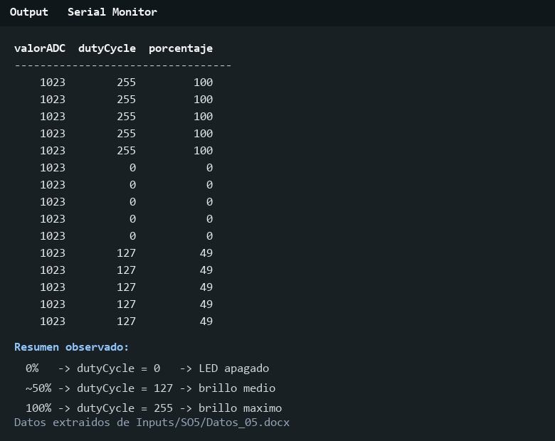
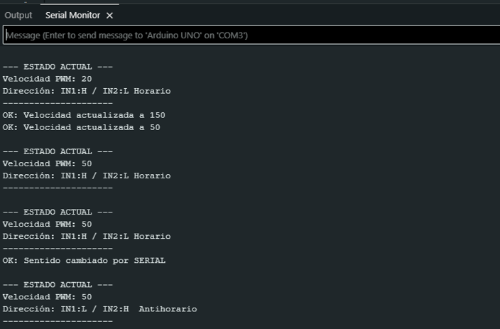
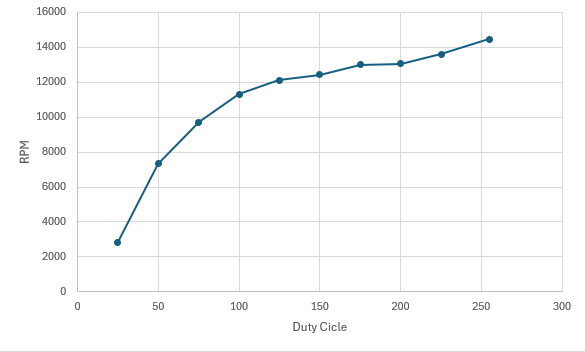

# Informe de Laboratorio — Sesión 5: Control PWM y Actuadores

---

**Universidad Nacional de Colombia**
**Electrónica Digital — 2016684 — 2026-1**
**Prof. Ricardo Amézquita Orozco**

---

| Campo | |
|-------|--|
| **Integrantes** | 1. Andres Felipe Polanco Olaya |
| | 2. Juan Felipe Sanchez Poveda|
| | 3. Daniel Mateo Gonzales Sánchez|
| | 4. Juan Sebastian Baquero Pinzon|
| **Grupo** | 4 |
| **Fecha de la práctica** | |
| **Fecha de entrega** | |

---

## 1. Resultados


### Actividad 1 — PWM con LED: Captura Serial Monitor


Datos extraidos directamente del Serial Monitor:
| valorADC | dutyCycle | porcentaje |
|-----------|------------|-------------|
| 1023 | 255 | 100 |
| 1023 | 255 | 100 |
| 1023 | 255 | 100 |
| 1023 | 255 | 100 |
| 1023 | 255 | 100 |
| 1023 | 255 | 100 |
| 1023 | 255 | 100 |
| 1023 | 255 | 100 |
| 1023 | 255 | 100 |
| 1023 | 255 | 100 |
| 1023 | 0 | 0 |
| 1023 | 0 | 0 |
| 1023 | 0 | 0 |
| 1023 | 0 | 0 |
| 1023 | 0 | 0 |
| 1023 | 0 | 0 |
| 1023 | 0 | 0 |
| 1023 | 0 | 0 |
| 1023 | 0 | 0 |
| 1023 | 0 | 0 |
| 1023 | 127 | 49 |
| 1023 | 127 | 49 |
| 1023 | 127 | 49 |
| 1023 | 127 | 49 |
| 1023 | 127 | 49 |
| 1023 | 127 | 49 |
| 1023 | 127 | 49 |
| 1023 | 127 | 49 |
| 1023 | 127 | 49 |
| 1023 | 127 | 49 |

**Figura 1 — Serial Monitor (Actividad 1)**


Adjuntar captura de pantalla del Serial Monitor mostrando **al menos 10 filas** de las tres columnas correspondientes a distintas posiciones del potenciómetro.

**Caption obligatorio:** Indicar el valor de duty cycle al 0 %, al ~50 % y al 100 %.



> **Descripción:** Se observan tres condiciones representativas: duty cycle 0 para 0 % de brillo, duty cycle 127 para aproximadamente 49 % y duty cycle 255 para 100 %. Esto confirma que la salida PWM se escala linealmente en la variable `dutyCycle`, aunque el valor ADC registrado en esta evidencia permanece en 1023.

---

### Actividad 2 — Control UART: Tabla del Protocolo Diseñado

**Tabla 1 — Protocolo UART Diseñado por el Grupo**

| Código | Descripción | Parámetro | Respuesta del Arduino |
|:------:|:------------|:---------:|:---------------------|
| STATUS | Consulta el estado actual del sistema | Ninguno | Muestra velocidad PWM y dirección actual |
| SENTIDO | Cambia el sentido de giro del motor | Ninguno | `OK: Sentido cambiado por SERIAL` |
| VEL=XXX | Ajusta la velocidad PWM del motor | 0–255 | `OK: Velocidad actualizada a XXX` |
| RPM | Calcula y reporta las RPM del motor | Ninguno | Valor estimado de RPM por Serial |


---

### Actividad 3 — Control UART: Captura Serial Monitor

**Figura 2 — Serial Monitor (Actividad 3): Intercambios UART**

Adjuntar captura de pantalla del Serial Monitor mostrando **al menos tres intercambios comando→respuesta**, incluyendo un comando de velocidad, uno de dirección y uno de estado.

**Caption obligatorio:** se utilizo el codigo STATUS, VEL=150, VEL=50, SENTIDO 




> **Descripción:** Los comando enviados funcionan tal y como se esperan el status no es bloqueante,indicar la velocidad funciona y es medible, el cambio de sentido funciona pero es necesario tener precaucion para no dañar el motor, preferible usar velocidades bajas

---

### Actividad 4 — Encoder: Tabla Duty Cycle vs RPM

**Tabla 2 — Caracterización Duty Cycle vs RPM**


| Duty Cycle (0–255) | RPM medidas |
|:-------------------:|:-----------:|
| 0 |0 |
| 25 | 2830|
| 50 | 7340|
| 75 | 9712|
| 100 | 11295|
| 125 | 12097|
| 150 | 12412|
| 175 | 12982|
| 200 | 13050|
| 225 | 13600|
| 255 | 14455|
| **Duty cycle mínimo de arranque:** | 25|

---

## 2. Visualización


### Figura 3 — Curva Duty Cycle vs RPM (Actividad 4)

**Eje X:** Duty Cycle (0–255)
**Eje Y:** RPM medidas

**Requisitos de la gráfica:**
- Marcar claramente la **zona muerta** (RPM = 0 para duty cycle bajo).
- Marcar el punto de **duty cycle mínimo de arranque**.
- Marcar **dos puntos representativos de la zona lineal** para calcular la pendiente (RPM por unidad de duty cycle). Etiquetar ambos puntos con sus coordenadas.
- Indicar si la zona lineal es aproximadamente proporcional o presenta saturación.



> **Interpretación:** La curva muestra una zona muerta en duty cycle 0, donde el motor no gira. El primer arranque medido ocurre en duty cycle 25, con 2830 RPM. Entre 25 y 100 el crecimiento es fuerte y aproximadamente proporcional; usando los puntos (25, 2830) y (100, 11295), la pendiente estimada es de 112.9 RPM por unidad de duty cycle. A partir de 125-200 la curva se aplana y aparece saturación, por lo que un control proporcional simple funcionaría mejor en la zona media que en los extremos.

---

## 3. Análisis


### Preguntas de Análisis — Actividad 1

**Pregunta A1.1:** ¿Cuántos niveles de brillo distintos puede producir `analogWrite()`?

> `analogWrite()` en Arduino Uno usa PWM de 8 bits, por lo que puede generar 256 niveles distintos de duty cycle, desde 0 hasta 255.

**Pregunta A1.2:** ¿Qué ocurre con el brillo cuando el duty cycle es 0? ¿Y cuando es 255?

> Con duty cycle 0 la salida permanece en bajo y el LED queda apagado. Con duty cycle 255 la salida permanece prácticamente siempre en alto y el LED queda con brillo máximo.

**Pregunta A1.3:** ¿La frecuencia medida con el osciloscopio coincide con los ~490 Hz documentados para el Timer 1?

> No se encontró en `Inputs` una medición de osciloscopio para confirmar la frecuencia. Teóricamente, en pines asociados al Timer 1 como D9/D10, la frecuencia PWM típica es cercana a 490 Hz, salvo que se modifiquen los registros del temporizador.

**Pregunta A1.4:** La función `analogWrite()` genera una señal de frecuencia fija (~490 Hz en D9) con duty cycle variable. ¿Por qué el LED responde con brillo proporcional al duty cycle en lugar de parpadear a 490 Hz? ¿A partir de qué frecuencia mínima aproximada deja de percibirse el parpadeo en el ojo humano?

> El LED no se percibe parpadeando porque 490 Hz está por encima de la frecuencia de fusión del parpadeo del ojo humano. Normalmente, por encima de ~50-60 Hz el ojo integra la luz y percibe brillo promedio, que aumenta con el duty cycle.

---

### Pregunta de Análisis — Actividad 2

**Pregunta A2.1:** ¿Qué limitación tiene el método de control con velocidad hardcodeada? ¿Qué se debe hacer cada vez que se quiere cambiar la velocidad?

> La velocidad hardcodeada obliga a cambiar el código y recompilar cada vez que se quiere modificar el valor PWM. En cambio, el control por UART permite enviar `VEL=XXX` durante la ejecución y ajustar el experimento sin detener la adquisición ni cargar de nuevo el sketch.

---

### Pregunta de Análisis — Actividad 3

**Pregunta A3.1:** En el protocolo UART, el parser identifica los comandos comparando `buf[0]` y `buf[1]` directamente en lugar de usar `strcmp()`. ¿Qué condición del formato `CC N\n` hace que esta estrategia sea suficiente? ¿Seguiría siendo válida si el protocolo usara comandos de longitud variable (como en la Parte 2 de S4)?

> La estrategia de comparar `buf[0]` y `buf[1]` funciona cuando el protocolo tiene comandos de longitud fija o prefijos únicos. Si se usaran comandos humanizados de longitud variable, dos letras no bastarían para distinguir órdenes como `STATUS`, `STOP` o `SENTIDO`; allí conviene `strcmp()` o un parser por tokens.

---

### Preguntas de Análisis — Actividad 4

**Pregunta A4.1:** Con base en la Tabla 2: ¿a qué duty cycle arranca el motor por primera vez? ¿Qué porcentaje de la escala total (0–255) representa esa zona muerta?

> El motor arranca por primera vez en duty cycle 25. Esa zona muerta representa 25/255 = 9.8% de la escala PWM total.

**Pregunta A4.2:** La curva duty cycle vs RPM muestra una zona muerta en valores bajos de duty cycle. ¿Qué fenómeno físico del motor DC explica esa zona? ¿Cómo afectaría la existencia de esa zona a un sistema de control PID que intentara regular la velocidad del motor?

> La zona muerta se explica por fricción estática, inercia del rotor y el torque mínimo necesario para vencer pérdidas mecánicas y eléctricas. En un PID, esa no linealidad puede causar error permanente o acumulación excesiva de la integral si el controlador pide valores dentro de la zona donde el motor aún no se mueve.

---

### Preguntas de Análisis Transversal

**Pregunta T.1:** **Compare el enfoque de control de la Actividad 2 (velocidad hardcodeada) con el de la Actividad 3 (control por comandos UART).** ¿Qué ventaja concreta ofrece el segundo enfoque en el contexto de un experimento físico donde se necesita ajustar parámetros sin interrumpir la adquisición de datos? ¿Qué componente del sistema fue el que eliminó la restricción de recompilar? ¿Qué cambió arquitectónicamente entre los dos enfoques?

> El enfoque por UART separa la lógica de control de los parámetros ajustables. La restricción de recompilar desaparece porque el parser serial recibe comandos en tiempo real y actualiza variables internas como velocidad o sentido. Arquitectónicamente se pasó de un programa con parámetros fijos a un sistema interactivo con capa de comunicación.

**Pregunta T.2:** **Con base en la gráfica de la Actividad 4:** ¿La relación RPM vs duty cycle en la zona lineal es aproximadamente proporcional? Estime la pendiente (RPM por unidad de duty cycle) usando dos puntos de la zona lineal y determine si el ajuste es adecuado para un control proporcional simple.

> En la zona baja-media la relación puede aproximarse como proporcional, especialmente entre duty 25 y 100 con pendiente cercana a 112.9 RPM/duty. Sin embargo, la saturación por encima de 125 reduce la pendiente efectiva, así que un control proporcional simple debe calibrarse para la zona de operación y no asumir linealidad en todo el rango.

---

## 4. Código Documentado


### Actividad 2 — Motor DC: control de velocidad y dirección

```cpp
// === DEFINICIÓN DE PINES ===
const int ENA = 9;   // Pin PWM para controlar velocidad del motor
const int IN1 = 7;   // Pin de dirección 1
const int IN2 = 8;   // Pin de dirección 2
const int Botton = 3; // Botón para cambiar sentido de giro

// === VARIABLES GLOBALES ===
bool est_btn = false;       // Guarda el sentido actual del motor
int last_btn_state = HIGH;  // Detecta cambios de estado del botón
int velocidadActual = 0;    // Valor PWM de velocidad (0-255)

void setup() {

  // Configuración de pines como entrada/salida
  pinMode(ENA, OUTPUT);
  pinMode(IN1, OUTPUT);
  pinMode(IN2, OUTPUT);
  pinMode(Botton, INPUT_PULLUP); // Botón con resistencia pull-up interna

  Serial.begin(9600);

  // Motor inicialmente detenido
  analogWrite(ENA, 0);
  actualizarMotores();
}

void loop() {

  leerSerial();

  // Lectura del botón para cambiar dirección manualmente
  int current_btn_state = digitalRead(Botton);

  if (current_btn_state == LOW && last_btn_state == HIGH) {
    est_btn = !est_btn;
    actualizarMotores();
    delay(50); // Pequeño debounce
  }

  last_btn_state = current_btn_state;
}

// === PROCESAMIENTO DE COMANDOS ===
void procesarComando(char* cmd) {

  // Cambia sentido de giro
  if (strcmp(cmd, "SENTIDO") == 0) {
    est_btn = !est_btn;
    actualizarMotores();
  }

  // Ajusta velocidad usando PWM
  else if (strncmp(cmd, "VEL=", 4) == 0) {

    int nuevaVel = atoi(&cmd[4]);

    if (nuevaVel >= 0 && nuevaVel <= 255) {
      velocidadActual = nuevaVel;

      // analogWrite genera una señal PWM para controlar velocidad
      analogWrite(ENA, velocidadActual);
    }
  }
}

// Configura dirección del motor usando IN1 e IN2
void actualizarMotores() {

  if (est_btn) {
    digitalWrite(IN1, HIGH);
    digitalWrite(IN2, LOW);
  } else {
    digitalWrite(IN1, LOW);
    digitalWrite(IN2, HIGH);
  }
}

// Lectura básica de comandos por Serial
void leerSerial() {

  static char buffer[20];
  static int index = 0;

  while (Serial.available() > 0) {

    char c = Serial.read();

    if (c == '\n' || c == '\r') {

      buffer[index] = '\0';

      if (index > 0) {
        procesarComando(buffer);
      }

      index = 0;

    } else if (index < 19) {
      buffer[index++] = c;
    }
  }
}
```

### Actividad 3 — Control UART: parser y protocolo

```cpp
// === PROCESAMIENTO DE COMANDOS ===
void procesarComando(char* cmd) {
  
  // Identificación de comandos recibidos por UART usando strcmp()
  if (strcmp(cmd, "STATUS") == 0) {

    // Respuesta enviada por Serial con el estado actual
    Serial.println("\n--- ESTADO ACTUAL ---");
    Serial.print("Velocidad PWM: ");
    Serial.println(velocidadActual);

    Serial.print("Dirección: ");
    Serial.println(est_btn ? "IN1:H / IN2:L Horario"
                           : "IN1:L / IN2:H Antihorario");

    Serial.println("---------------------");
  }

  // Identificación del comando SENTIDO
  else if (strcmp(cmd, "SENTIDO") == 0) {

    est_btn = !est_btn;

    actualizarMotores();

    // Confirmación enviada por UART
    Serial.println("OK: Sentido cambiado por SERIAL");
  }

  // Identificación parcial del comando VEL=
  else if (strncmp(cmd, "VEL=", 4) == 0) {

    // Extracción del parámetro numérico con atoi()
    int nuevaVel = atoi(&cmd[4]);

    if (nuevaVel >= 0 && nuevaVel <= 255) {

      velocidadActual = nuevaVel;

      analogWrite(ENA, velocidadActual);

      // Confirmación del valor recibido
      Serial.print("OK: Velocidad actualizada a ");
      Serial.println(velocidadActual);

    } else {

      Serial.println("ERROR: Rango inválido (Usa 0-255)");
    }
  }

  // Identificación del comando RPM
  else if (strcmp(cmd, "RPM") == 0) {

    cont_rpm();

    // Confirmación enviada por Serial
    Serial.println("OK: Lectura RPM completada");
  }
}

// === LECTURA SERIAL NO BLOQUEANTE ===
void leerSerial() {

  // Buffer donde se almacenan temporalmente los caracteres recibidos
  static char buffer[20];

  static int index = 0;

  // Lectura UART no bloqueante usando Serial.available()
  while (Serial.available() > 0) {

    char c = Serial.read();

    // Detecta fin de línea y finaliza el string
    if (c == '\n' || c == '\r') {

      buffer[index] = '\0';

      if (index > 0) {

        // Envía el comando completo al parser
        procesarComando(buffer);
      }

      index = 0;

    } else if (index < 19) {

      // Acumulación progresiva de caracteres en el buffer
      buffer[index++] = c;
    }
  }
}
```

### Actividad 4 — Encoder óptico: contador de pulsos y cálculo de RPM

```cpp
// === DEFINICIÓN DE PINES ===
const int ENA = 9;   // Salida PWM para velocidad
const int IN1 = 7;   // Sentido 1
const int IN2 = 8;   // Sentido 2
const int Botton = 3; // Botón físico para cambio manual de sentido
const int rpm= 2;

// === VARIABLES GLOBALES ===
bool est_btn = false;       // Estado de dirección
int last_btn_state = HIGH;  // Para detectar presión del botón
int velocidadActual = 0;    // Velocidad controlada solo por Serial (0-255)
volatile int contarPul = 0;

void setup() {
  pinMode(ENA, OUTPUT);
  pinMode(IN1, OUTPUT);
  pinMode(IN2, OUTPUT);
  pinMode(Botton, INPUT_PULLUP); // Resistencia interna activa

  Serial.begin(9600);
  Serial.println("--- Sistema Listo (Control Serial) ---");
  Serial.println("Comandos: STATUS, SENTIDO, VEL=XXX (0-255)");
  
  // Iniciar con el motor detenido
  analogWrite(ENA, 0);
  actualizarMotores();
  attachInterrupt(digitalPinToInterrupt(2),contarPulso, FALLING );
}
void contarPulso() {
  contarPul++;
}

//inicialmente se hizo el procedimiento con este codigo el cual cuenta cuantas veces pasa el pulso en 2 segundos usando un delay, y calculando las RPM como se debe
void cont_rpm_ini(){
  int ini=contarPul;
  delay(2000);
  int seg = contarPul;
  int delta =seg - ini;
   
  int rpm = (delta/8)*30;
  Serial.println(rpm);
}

//segundamente se utilizo usando millis()
void cont_rpm() {

  // Guarda tiempo inicial usando millis()
  unsigned long tiempoInicial = millis();

  // Guarda cantidad inicial de pulsos
  int ini = contarPul;

  // Espera no bloqueante de 2 segundos
  while (millis() - tiempoInicial < 2000) {
    // El programa sigue ejecutándose aquí
  }

  // Pulsos después de 2 segundos
  int seg = contarPul;

  int delta = seg - ini;

  // Cálculo de RPM
  int rpm = (delta / 8.0) * 30;

  Serial.println(rpm);
}


void loop() {
  leerSerial(); // Escucha si hay nuevos comandos
  

  // 1. Detección del botón físico (siempre activo para emergencias o pruebas)
  int current_btn_state = digitalRead(Botton);
  if (current_btn_state == LOW && last_btn_state == HIGH) {
    est_btn = !est_btn;
    actualizarMotores();
    delay(50); // Debounce
    Serial.println("EVENTO: Cambio de sentido por BOTON");
  }
  last_btn_state = current_btn_state;
}

// === PROCESAMIENTO DE COMANDOS ===
void procesarComando(char* cmd) {
  
  // Comando: STATUS (Muestra datos actuales)
  if (strcmp(cmd, "STATUS") == 0) {
    Serial.println("\n--- ESTADO ACTUAL ---");
    Serial.print("Velocidad PWM: "); Serial.println(velocidadActual);
    Serial.print("Dirección: "); Serial.println(est_btn ? "IN1:H / IN2:L Horario" : "IN1:L / IN2:H  Antihorario");
    Serial.println("---------------------");
  }

  // Comando: SENTIDO (Alterna giro)
  else if (strcmp(cmd, "SENTIDO") == 0) {
    est_btn = !est_btn;
    actualizarMotores();
    Serial.println("OK: Sentido cambiado por SERIAL");
  }

  // Comando: VEL=XXX (Ajusta velocidad de 0 a 255)
  else if (strncmp(cmd, "VEL=", 4) == 0) {
    int nuevaVel = atoi(&cmd[4]); // Extrae el número después de "VEL="
    
    if (nuevaVel >= 0 && nuevaVel <= 255) {
      velocidadActual = nuevaVel;
      analogWrite(ENA, velocidadActual);
      Serial.print("OK: Velocidad actualizada a ");
      Serial.println(velocidadActual);
    } else {
      Serial.println("ERROR: Rango inválido (Usa 0-255)");
    }
  }

  else if (strcmp(cmd, "RPM") == 0) {
    cont_rpm();

  }
}

// Función para escribir en los pines de dirección
void actualizarMotores() {
  if (est_btn) {
    digitalWrite(IN1, HIGH);
    digitalWrite(IN2, LOW);
  } else {
    digitalWrite(IN1, LOW);
    digitalWrite(IN2, HIGH);
  }
}

// Función básica para leer el puerto serial (Debes tenerla o usar esta)
void leerSerial() {
  static char buffer[20];
  static int index = 0;

  while (Serial.available() > 0) {
    char c = Serial.read();
    if (c == '\n' || c == '\r') {
      buffer[index] = '\0';
      if (index > 0) {
        procesarComando(buffer);
      }
      index = 0;
    } else if (index < 19) {
      buffer[index++] = c;
    }
  }
}
```

---

## 5. Dificultades Encontradas y Soluciones Aplicadas


### Dificultad 1: Zona muerta del motor

- **Síntoma observado:** Con duty cycle bajo el motor no giraba aunque existiera señal PWM.
- **Causa identificada:** El torque inicial no era suficiente para vencer la fricción estática y la inercia del eje.
- **Solución aplicada:** Se caracterizó el arranque y se identificó duty cycle 25 como primer valor efectivo.
- **Lección aprendida:** En actuadores reales no siempre existe una respuesta lineal desde cero.

### Dificultad 2: Seguridad al cambiar sentido

- **Síntoma observado:** Cambiar sentido a velocidades altas podía exigir demasiado al motor y al puente H.
- **Causa identificada:** La inversión rápida de polaridad produce transitorios de corriente.
- **Solución aplicada:** Se recomendó probar cambios de sentido con velocidades bajas y controlar el valor PWM por UART.
- **Lección aprendida:** El control de potencia debe considerar límites eléctricos y mecánicos del montaje.

---

## 6. Pregunta Abierta


**Pregunta:** La curva de caracterización de la Actividad 4 fue obtenida sin carga mecánica en el eje del motor. Proponga cómo cambiaría la curva si se aplica una carga de fricción constante al eje (por ejemplo, frenando el disco encoder con un dedo levemente). ¿En qué dirección se desplazaría la zona muerta? ¿Cómo podría usarse esa diferencia para estimar el torque de fricción del sistema, conociendo las especificaciones del motor?

> Si se aplica una carga de fricción constante, la curva se desplazaría hacia la derecha: el duty cycle mínimo de arranque aumentaría y, para un mismo PWM, las RPM serían menores. Esa diferencia puede usarse para estimar el torque de fricción comparando la velocidad sin carga y con carga, junto con la curva torque-velocidad del motor. Si se conoce el torque de parada y la velocidad sin carga del motor, la caída de RPM permite aproximar qué fracción del torque disponible se está usando para vencer la fricción.
