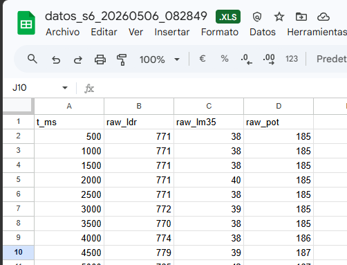
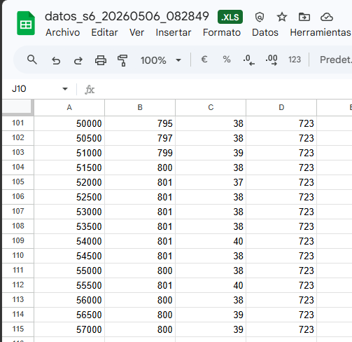
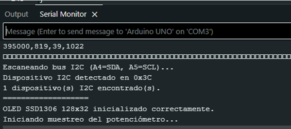

# Informe de Laboratorio — Sesión 6: Adquisición de Datos Multicanal y Display OLED I2C

---

**Universidad Nacional de Colombia**
**Electrónica Digital — 2016684 — 2026-1**
**Prof. Ricardo Amézquita Orozco**

---

| Campo | |
|-------|--|
| **Integrantes** | 1. Andres Felipe Polanco Olaya |
| | 2. Juan Felipe Sanchez Poveda|
| | 3. Daniel Mateo Gonzales Sánchez|
| | 4. Juan Sebastian Baquero Pinzon|
| **Grupo** | 4|
| **Fecha de la práctica** | |
| **Fecha de entrega** | **Miércoles 8 de abril de 2026, 23:59** |

---

## 1. Resultados

### Actividad 1 — Adquisición multicanal con captura Python y hoja electrónica

**Figura 1 — Primeras y últimas 5 líneas del archivo CSV generado**

Adjuntar captura de pantalla del archivo `.csv` abierto en Excel/Sheets mostrando el encabezado, las primeras 5 filas y las últimas 5 filas. Indicar el conteo total de filas y el tiempo de captura.





> **Descripción:** _(Indicar cuántas filas se capturaron, confirmar la presencia del encabezado `t_ms,raw_ldr,raw_lm35,raw_pot`, y describir si los timestamps son crecientes y aproximadamente a 500 ms de separación.)_

---

**Tabla 1 — Estadísticas por canal**

| Canal | Promedio | Mínimo | Máximo |
|:------|:--------:|:------:|:------:|
| LDR (`raw_ldr`) |803.53 | 766| 992|
| LM35 (`raw_lm35`) | 39.66| 36| 47|
| Potenciómetro (`raw_pot`) |524.97 | 0|1020 |

_Los valores deben calcularse con fórmulas de la hoja electrónica (`=PROMEDIO()`, `=MIN()`, `=MAX()`), no copiarse manualmente._

---

**Pregunta de análisis A1.1:** A partir de los valores de la Tabla 1, calcule la temperatura ambiente aproximada usando la fórmula `tempC = rawLM35 × 5.0 / 1023.0 / 0.01`. ¿El resultado es coherente con la temperatura esperada (~20–25 °C)?

> [Respuesta del estudiante aquí]

**Pregunta de análisis A1.2:** Calcule la cadencia real de muestreo como el promedio de las diferencias entre timestamps consecutivos (`t_ms`) en el archivo CSV. Compare con el valor nominal de 500 ms y explique cualquier diferencia observada.

> [Respuesta del estudiante aquí]

---

### Actividad 2 — Display OLED I2C: Scanner y vista de un sensor

**Figura 2 — Serial Monitor mostrando la salida del I2C Scanner**

Adjuntar captura de pantalla del Serial Monitor donde se vea el mensaje de detección del dispositivo I2C con su dirección.



---

**Tabla 2 — Verificación del sistema I2C**

| Elemento verificado | Resultado |
|:-----------------------------------------|:----------|
| Dirección I2C detectada por el Scanner | 1 dispositivo  I2C encontrado|
| Texto mostrado en el OLED (transcribir) | Pot: XXX|
| ¿El valor cambia al girar el potenciómetro? | Sí  |

---

**Pregunta de análisis A2.1:** ¿Por qué no es posible conectar un sensor analógico a A4 o A5 mientras el bus I2C está activo?

> [Respuesta del estudiante aquí]

---

### Actividad 3 — Integración con cuatro pantallas conmutables ⭐

**Figura 3 — OLED mostrando la Pantalla 0 (General, 3 líneas)**

Foto del montaje con el OLED mostrando la vista general. Etiquetar cada valor indicando canal y unidad.

```
[Insertar Figura 3 aquí]
```

---

**Figura 4 — OLED mostrando una pantalla de detalle (Pantalla 1, 2 o 3, 4 líneas)**

Foto del montaje con el OLED mostrando una de las pantallas de detalle. Etiquetar las cuatro líneas (valor actual, mínimo, máximo, promedio) e indicar a qué canal corresponde.

```
[Insertar Figura 4 aquí]
```

---

**Figura 5 — Serial Monitor mostrando CSV continuo durante conmutación de pantallas**

Captura del Serial Monitor mostrando el CSV emitiéndose sin interrupción mientras se presiona el botón para cambiar de pantalla. Verificar que no hay gaps ni líneas incompletas.

```
[Insertar Figura 5 aquí]
```

---

**Pregunta de análisis A3.1:** El ATmega328P tiene 2048 bytes de SRAM. El buffer del display OLED ocupa 512 bytes. Estime el consumo de SRAM de las variables globales del sketch (arrays de estadísticas, contadores, flags). ¿Cuánta SRAM queda disponible para stack y variables locales?

> [Respuesta del estudiante aquí]

**Pregunta de análisis A3.2:** Durante la conmutación de pantallas, el CSV continúa emitiéndose sin interrupción. Identifique qué mecanismos del código garantizan que la emisión CSV, la actualización del OLED y la lectura del botón son tareas independientes que no se bloquean mutuamente.

> [Respuesta del estudiante aquí]

**Pregunta de análisis A3.3:** El debouncing del botón usa una ventana de 50 ms con `millis()`. ¿Por qué no es viable usar `delay(50)` para este propósito en un sistema que debe muestrear sensores cada 500 ms y actualizar el OLED? Proponga un valor de ventana de debouncing inadecuado para este sistema y justifique su respuesta.

> [Respuesta del estudiante aquí]

---

## 2. Visualización

### Figura 6 — Gráfica de dispersión: `raw_ldr` vs `t_ms`

**Eje X:** `t_ms` (tiempo en ms)
**Eje Y:** `raw_ldr` (valor ADC 0–1023)

**Requisitos de la gráfica:**
- Generada a partir del archivo CSV de la Actividad 1.
- Debe mostrar claramente los picos y valles correspondientes a los momentos en que el LDR fue cubierto y descubierto durante la captura.
- Señalar con anotaciones al menos dos puntos: un valle (LDR cubierto) y un pico (LDR descubierto).

```
[Insertar Figura 6 aquí]
```

> **Interpretación:** _(Describir la forma de la curva. ¿Se distinguen claramente los eventos de estimulación del LDR? ¿Qué valor aproximado de raw_ldr corresponde al ambiente iluminado y cuál al LDR cubierto?)_

---

## 3. Análisis Transversal

**Pregunta T.1:** En el formato CSV de este laboratorio, el timestamp `t_ms` es el valor de `millis()` en el momento del muestreo, no el tiempo real de reloj (hora del día). ¿Qué información se pierde con este enfoque? ¿Cómo podría modificarse el script Python de la Actividad 1 para que cada línea del archivo incluya un timestamp de tiempo real además del `t_ms` del Arduino?

> [Respuesta del estudiante aquí]

**Pregunta T.2:** Compare la cadencia de muestreo medida en la Actividad 1 con la observada durante la Actividad 3. ¿Agregar el manejo del OLED y el botón afecta la regularidad del intervalo de muestreo? Justifique su respuesta con datos de las capturas de Serial Monitor.

> [Respuesta del estudiante aquí]

---

## 4. Código Documentado

### Actividad 3 — Integración con cuatro pantallas conmutables

```cpp
// Pegar aquí el código COMPLETO de la Actividad 3.
// Comentar:
//   - Estructura de variables globales (pantalla, arrays de estadísticas, flags)
//   - Lógica de muestreo periódico con millis() y emisión CSV
//   - Conversión a unidades físicas para cada canal
//   - Detección de flanco del botón con debouncing (50 ms)
//   - Selección de pantalla y formato de display para cada vista
//   - Llamada única a display.display() por ciclo de muestreo
```

---

## 5. Dificultades Encontradas y Soluciones Aplicadas

### Dificultad 1: [Descripción breve del problema]

- **Síntoma observado:** _(¿Qué ocurrió exactamente?)_
- **Causa identificada:** _(¿Por qué ocurrió?)_
- **Solución aplicada:** _(¿Cómo lo resolvieron?)_
- **Lección aprendida:** _(¿Qué cambiarían la próxima vez?)_

### Dificultad 2 (si aplica): [Descripción breve del problema]

- **Síntoma observado:**
- **Causa identificada:**
- **Solución aplicada:**
- **Lección aprendida:**

---

## 6. Pregunta Abierta

**Pregunta:** El sistema de la Actividad 3 mantiene estadísticas acumuladas (mínimo, máximo, promedio) desde el inicio de la operación. Proponga una modificación para que las estadísticas se calculen sobre una ventana deslizante de las últimas N muestras en lugar del total acumulado. ¿Qué estructura de datos utilizaría? ¿Qué restricciones impone la SRAM de 2 KB del Arduino Uno sobre el tamaño máximo de N? Considere que cada muestra consiste en tres valores raw de 10 bits.

> [Respuesta del estudiante aquí]