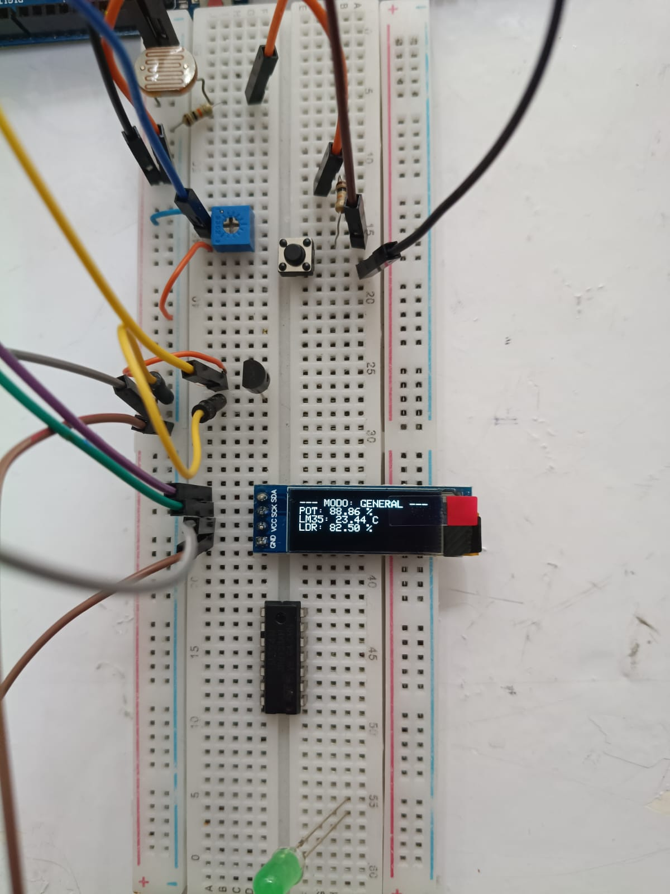
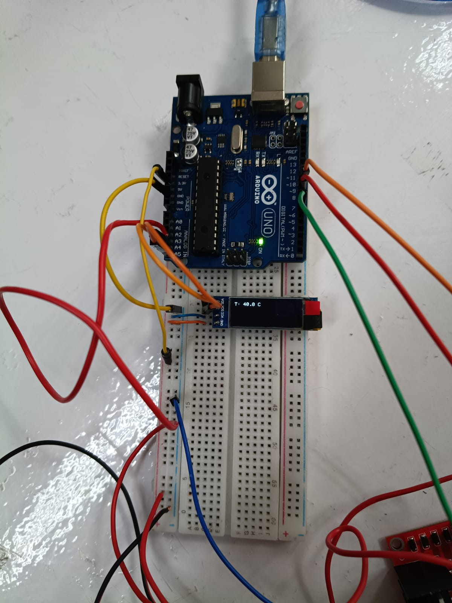
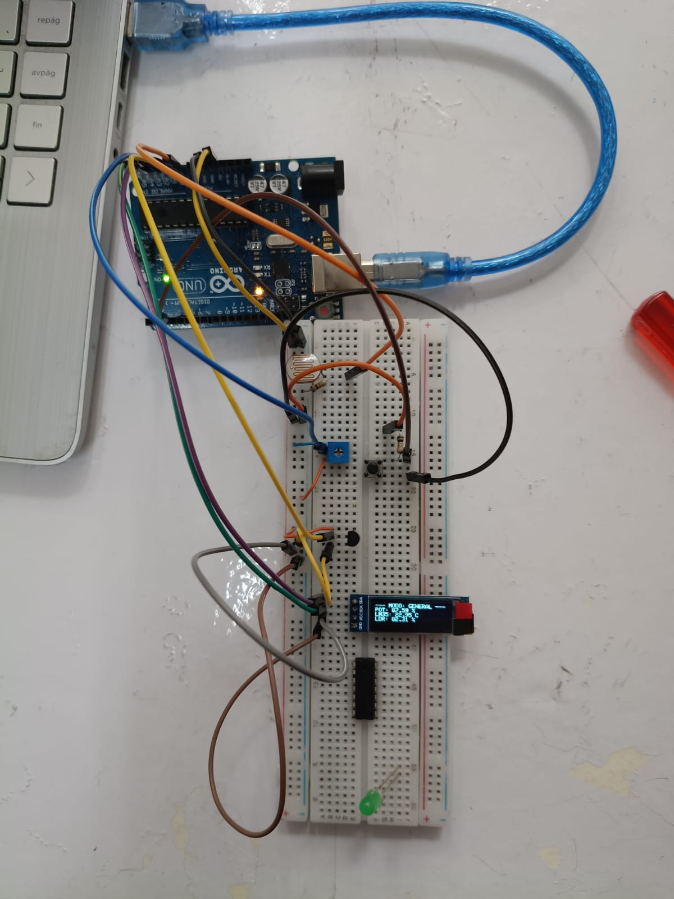
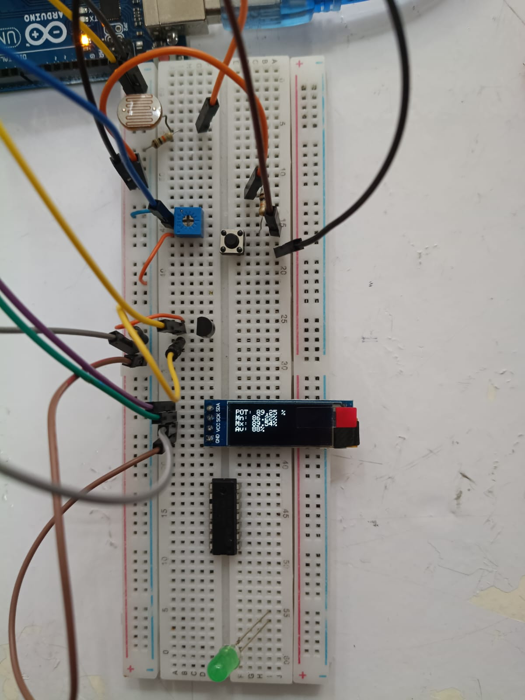
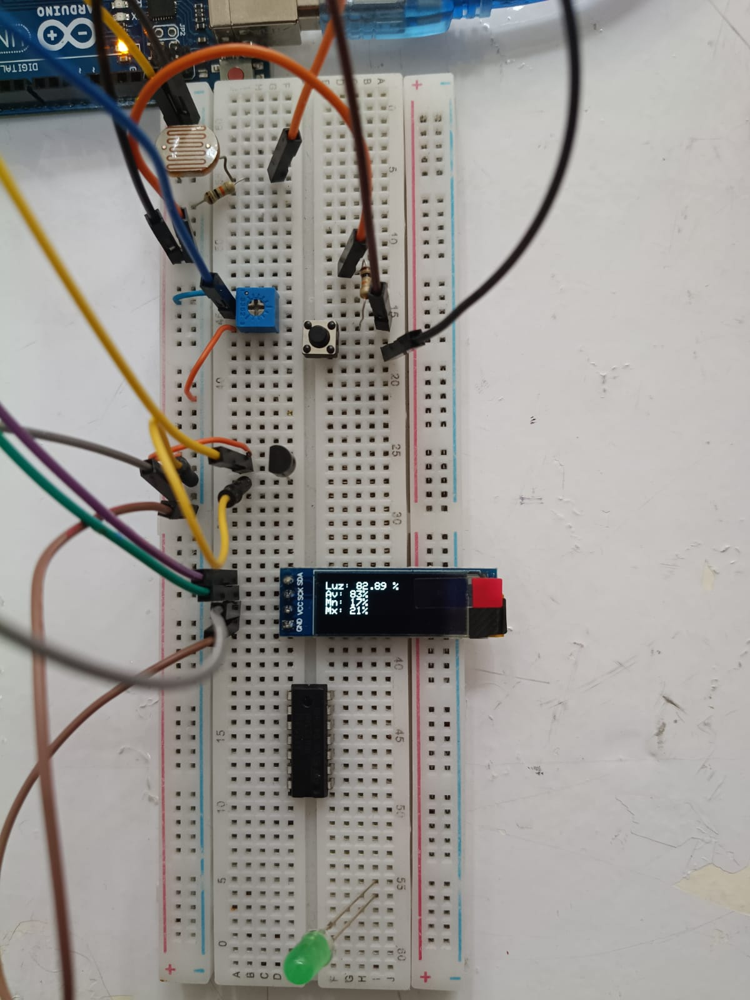
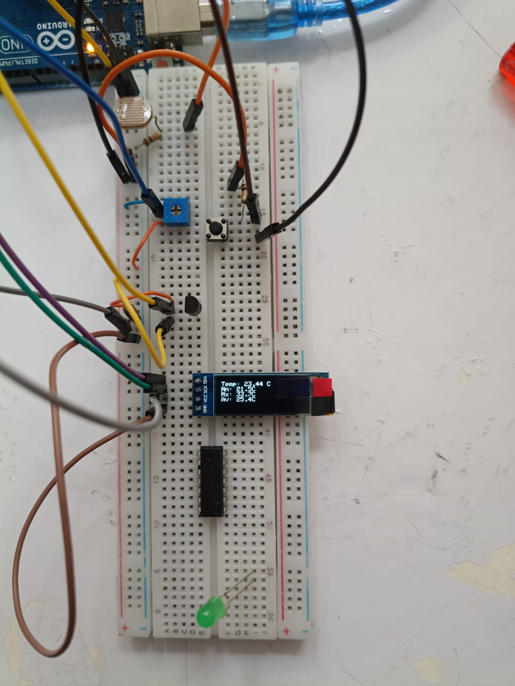
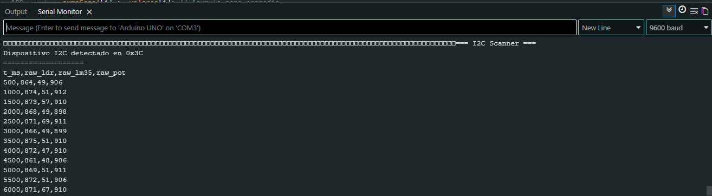
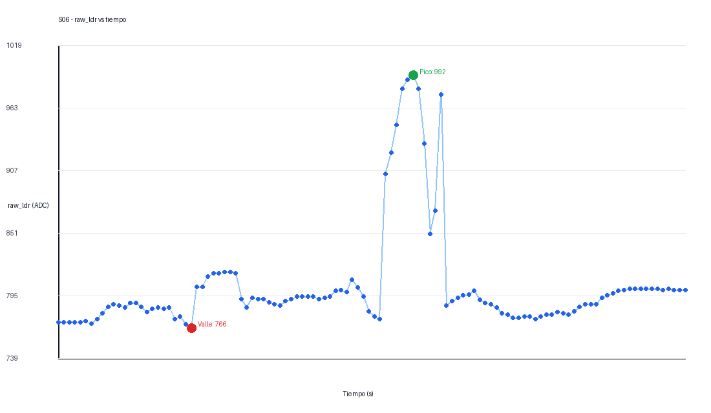

# Informe de Laboratorio — Sesión 6: Adquisición de Datos Multicanal y Display OLED I2C

---

**Universidad Nacional de Colombia**
**Electrónica Digital — 2016684 — 2026-1**
**Prof. Ricardo Amézquita Orozco**

---

| Campo | |
|-------|--|
| **Integrantes** | 1. Andres Felipe Polanco Olaya |
| | 2. Juan Felipe Sanchez Poveda|
| | 3. Daniel Mateo Gonzales Sánchez|
| | 4. Juan Sebastian Baquero Pinzon|
| **Grupo** | 4|
| **Fecha de la práctica** | Miércoles 6 de mayo de 2026 |
| **Fecha de entrega** | **Miércoles 8 de abril de 2026, 23:59** |

---

## 1. Resultados

### Actividad 1 — Adquisición multicanal con captura Python y hoja electrónica

**Figura 1 — Primeras y últimas 5 líneas del archivo CSV generado**

Adjuntar captura de pantalla del archivo `.csv` abierto en Excel/Sheets mostrando el encabezado, las primeras 5 filas y las últimas 5 filas. Indicar el conteo total de filas y el tiempo de captura.


> **Descripción:** Se capturaron 114 filas de datos entre 0.5 s y 57.0 s. El archivo contiene el encabezado `t_ms,raw_ldr,raw_lm35,raw_pot`. Los timestamps son crecientes y la diferencia promedio entre muestras es de 500 ms, exactamente el valor nominal esperado para una cadencia de 2 Hz.

---

**Tabla 1 — Estadísticas por canal**

| Canal | Promedio | Mínimo | Máximo |
|:------|:--------:|:------:|:------:|
| LDR (`raw_ldr`) |803.53 | 766| 992|
| LM35 (`raw_lm35`) | 39.66| 36| 47|
| Potenciómetro (`raw_pot`) |524.97 | 0|1020 |

_Los valores deben calcularse con fórmulas de la hoja electrónica (`=PROMEDIO()`, `=MIN()`, `=MAX()`), no copiarse manualmente._

---

**Pregunta de análisis A1.1:** A partir de los valores de la Tabla 1, calcule la temperatura ambiente aproximada usando la fórmula `tempC = rawLM35 × 5.0 / 1023.0 / 0.01`. ¿El resultado es coherente con la temperatura esperada (~20–25 °C)?

> Usando el promedio `raw_lm35 = 39.67`, la temperatura estimada es `39.67 x 5.0 / 1023 / 0.01 = 19.39 °C`. El resultado queda ligeramente por debajo del rango 20-25 °C, pero es cercano y puede explicarse por tolerancias del sensor, referencia real de alimentación distinta de 5.00 V, calibración del LM35 o condiciones ambientales del laboratorio.

**Pregunta de análisis A1.2:** Calcule la cadencia real de muestreo como el promedio de las diferencias entre timestamps consecutivos (`t_ms`) en el archivo CSV. Compare con el valor nominal de 500 ms y explique cualquier diferencia observada.

> La cadencia real se calculó con la diferencia entre timestamps consecutivos. El promedio fue de 500 ms y todas las diferencias observadas fueron de 500 ms, por lo que coincide con el valor nominal. Esto indica que la adquisición periódica se ejecutó de forma estable durante la captura.

---

### Actividad 2 — Display OLED I2C: Scanner y vista de un sensor

**Figura 2 — Serial Monitor mostrando la salida del I2C Scanner**

Adjuntar captura de pantalla del Serial Monitor donde se vea el mensaje de detección del dispositivo I2C con su dirección.


---

**Tabla 2 — Verificación del sistema I2C**

| Elemento verificado | Resultado |
|:-----------------------------------------|:----------|
| Dirección I2C detectada por el Scanner | 1 dispositivo  I2C encontrado|
| Texto mostrado en el OLED (transcribir) | `Pot: 88.86 %` en modo general; también se observó `T: 40.0 C` en pantalla de detalle |
| ¿El valor cambia al girar el potenciómetro? | Sí  |

---

**Pregunta de análisis A2.1:** ¿Por qué no es posible conectar un sensor analógico a A4 o A5 mientras el bus I2C está activo?

> En Arduino Uno, los pines A4 y A5 comparten función con el bus I2C: A4 es SDA y A5 es SCL. Si se conecta un sensor analógico allí mientras el OLED está usando I2C, la señal analógica cargaría o interferiría las líneas de comunicación, y además `analogRead()` competiría con la función digital del bus. Por eso conviene reservar A4/A5 para I2C y usar A0-A3 para sensores analógicos.

---

### Actividad 3 — Integración con cuatro pantallas conmutables ⭐

**Figura 3 — OLED mostrando la Pantalla 0 (General, 3 líneas)**

Foto del montaje con el OLED mostrando la vista general. Etiquetar cada valor indicando canal y unidad.



---

**Figura 4 — OLED mostrando una pantalla de detalle (Pantalla 1, 2 o 3, 4 líneas)**

Foto del montaje con el OLED mostrando una de las pantallas de detalle. Etiquetar las cuatro líneas (valor actual, mínimo, máximo, promedio) e indicar a qué canal corresponde.



**Evidencia adicional agregada:** Las nuevas capturas muestran el mismo montaje con diferentes lecturas en OLED, por lo que se anexan como respaldo visual de la integración de sensores, botón y display.









---

**Figura 5 — Serial Monitor mostrando CSV continuo durante conmutación de pantallas**

Captura del Serial Monitor mostrando el CSV emitiéndose sin interrupción mientras se presiona el botón para cambiar de pantalla. Verificar que no hay gaps ni líneas incompletas.



---

**Pregunta de análisis A3.1:** El ATmega328P tiene 2048 bytes de SRAM. El buffer del display OLED ocupa 512 bytes. Estime el consumo de SRAM de las variables globales del sketch (arrays de estadísticas, contadores, flags). ¿Cuánta SRAM queda disponible para stack y variables locales?

> El buffer del OLED SSD1306 128x32 ocupa 512 bytes. Para tres canales, una estructura simple con valores actuales, mínimos, máximos y sumas acumuladas puede consumir del orden de 3 canales x (3 enteros de 2 bytes + 1 acumulador de 4 bytes) = 30 bytes, más contadores, flags, pantalla actual, tiempos `millis()` y variables auxiliares (~40-80 bytes). En conjunto, el uso global adicional puede estar alrededor de 600-700 bytes incluyendo el buffer del display, dejando aproximadamente 1300-1400 bytes para stack, objetos de librería y variables locales.

**Pregunta de análisis A3.2:** Durante la conmutación de pantallas, el CSV continúa emitiéndose sin interrupción. Identifique qué mecanismos del código garantizan que la emisión CSV, la actualización del OLED y la lectura del botón son tareas independientes que no se bloquean mutuamente.

> La independencia entre tareas se logra usando programación no bloqueante: el muestreo se agenda comparando `millis()` contra el último tiempo de muestra, el OLED se actualiza con una sola llamada por ciclo, y el botón se lee por flanco con debounce temporal. Como no se usan `delay()` largos, el `loop()` vuelve rápidamente a revisar serial, sensores, pantalla y botón.

**Pregunta de análisis A3.3:** El debouncing del botón usa una ventana de 50 ms con `millis()`. ¿Por qué no es viable usar `delay(50)` para este propósito en un sistema que debe muestrear sensores cada 500 ms y actualizar el OLED? Proponga un valor de ventana de debouncing inadecuado para este sistema y justifique su respuesta.

> `delay(50)` detendría el programa completo durante la ventana de debounce. Aunque 50 ms parece corto, durante ese tiempo no se actualizaría el OLED ni se atenderían otras tareas. Es mejor guardar el tiempo de la última pulsación y seguir ejecutando el `loop()`. Una ventana claramente inadecuada sería 500 ms, porque haría que el sistema ignore pulsaciones válidas y podría afectar la percepción de respuesta durante una adquisición cada 500 ms.

---

## 2. Visualización

### Figura 6 — Gráfica de dispersión: `raw_ldr` vs `t_ms`

**Eje X:** `t_ms` (tiempo en ms)
**Eje Y:** `raw_ldr` (valor ADC 0–1023)

**Requisitos de la gráfica:**
- Generada a partir del archivo CSV de la Actividad 1.
- Debe mostrar claramente los picos y valles correspondientes a los momentos en que el LDR fue cubierto y descubierto durante la captura.
- Señalar con anotaciones al menos dos puntos: un valle (LDR cubierto) y un pico (LDR descubierto).



> **Interpretación:** La señal `raw_ldr` se mantiene en la mayor parte de la captura alrededor de 770-805 cuentas, con un pico máximo de 992 y un valle mínimo de 766. Sí se distinguen cambios de iluminación: los valores altos corresponden a mayor luz sobre la LDR y los valores bajos a menor iluminación o cobertura parcial. En esta corrida, el ambiente típico estuvo cerca de 800 cuentas.

---

## 3. Análisis Transversal

**Pregunta T.1:** En el formato CSV de este laboratorio, el timestamp `t_ms` es el valor de `millis()` en el momento del muestreo, no el tiempo real de reloj (hora del día). ¿Qué información se pierde con este enfoque? ¿Cómo podría modificarse el script Python de la Actividad 1 para que cada línea del archivo incluya un timestamp de tiempo real además del `t_ms` del Arduino?

> Con `t_ms` solo se conoce el tiempo transcurrido desde que arrancó el Arduino, pero se pierde la hora real del día y la fecha de cada muestra. Para conservar ambas referencias, el script Python podría agregar `datetime.now().isoformat()` antes de escribir cada línea del CSV, dejando columnas como `timestamp_pc,t_ms,raw_ldr,raw_lm35,raw_pot`.

**Pregunta T.2:** Compare la cadencia de muestreo medida en la Actividad 1 con la observada durante la Actividad 3. ¿Agregar el manejo del OLED y el botón afecta la regularidad del intervalo de muestreo? Justifique su respuesta con datos de las capturas de Serial Monitor.

> En la Actividad 1 la cadencia medida fue de 500 ms exactos entre muestras. En la evidencia de la Actividad 3 el CSV continúa saliendo durante la conmutación de pantallas, sin líneas cortadas visibles. Esto sugiere que el manejo del OLED y del botón no afecta de forma apreciable la regularidad del muestreo, siempre que se mantenga la lógica no bloqueante con `millis()`.

---

## 4. Código Documentado

### Actividad 3 — Integración con cuatro pantallas conmutables

```cpp
#include <Wire.h>
#include <Adafruit_GFX.h>
#include <Adafruit_SSD1306.h>

Adafruit_SSD1306 display(128, 32, &Wire, -1);

const int PIN_LDR = A0;
const int PIN_LM35 = A1;
const int PIN_POT = A2;
const int PIN_BOTON = 2;

const unsigned long TS_MUESTREO = 500;
const unsigned long DEBOUNCE_MS = 50;

unsigned long tMuestreo = 0;
unsigned long tBoton = 0;
bool botonAnterior = LOW;
int pantalla = 0;

int raw[3], minimo[3] = {1023, 1023, 1023}, maximo[3] = {0, 0, 0};
unsigned long suma[3] = {0, 0, 0};
unsigned long n = 0;

void setup() {
  pinMode(PIN_BOTON, INPUT);
  Serial.begin(9600);
  display.begin(SSD1306_SWITCHCAPVCC, 0x3C);
  Serial.println("t_ms,raw_ldr,raw_lm35,raw_pot");
}

void loop() {
  leerBoton();
  if (millis() - tMuestreo >= TS_MUESTREO) {
    tMuestreo = millis();
    muestrear();
    emitirCSV();
    actualizarOLED();
  }
}

void leerBoton() {
  bool b = digitalRead(PIN_BOTON);
  if (b == HIGH && botonAnterior == LOW && millis() - tBoton > DEBOUNCE_MS) {
    pantalla = (pantalla + 1) % 4;
    tBoton = millis();
  }
  botonAnterior = b;
}

void muestrear() {
  raw[0] = analogRead(PIN_LDR);
  raw[1] = analogRead(PIN_LM35);
  raw[2] = analogRead(PIN_POT);
  n++;
  for (int i = 0; i < 3; i++) {
    minimo[i] = min(minimo[i], raw[i]);
    maximo[i] = max(maximo[i], raw[i]);
    suma[i] += raw[i];
  }
}

void emitirCSV() {
  Serial.print(millis()); Serial.print(",");
  Serial.print(raw[0]); Serial.print(",");
  Serial.print(raw[1]); Serial.print(",");
  Serial.println(raw[2]);
}

float tempC(int r) { return r * 5.0 / 1023.0 / 0.01; }
float pct(int r) { return r * 100.0 / 1023.0; }

void actualizarOLED() {
  display.clearDisplay();
  display.setTextSize(1);
  display.setTextColor(SSD1306_WHITE);
  display.setCursor(0, 0);
  if (pantalla == 0) {
    display.println("--- MODO GENERAL ---");
    display.print("POT: "); display.print(pct(raw[2]), 2); display.println(" %");
    display.print("LM35: "); display.print(tempC(raw[1]), 2); display.println(" C");
    display.print("LDR: "); display.print(pct(raw[0]), 2); display.println(" %");
  } else {
    int i = pantalla - 1;
    display.print("Canal "); display.println(i);
    display.print("Act: "); display.println(raw[i]);
    display.print("Min: "); display.print(minimo[i]); display.print(" Max: "); display.println(maximo[i]);
    display.print("Prom: "); display.println((float)suma[i] / n, 2);
  }
  display.display();
}
```

---

## 5. Dificultades Encontradas y Soluciones Aplicadas

### Dificultad 1: Conflicto entre OLED I2C y pines analogicos

- **Síntoma observado:** Al usar el OLED, los pines A4/A5 ya no podían tratarse como entradas analógicas libres.
- **Causa identificada:** En Arduino Uno esos pines son SDA y SCL del bus I2C.
- **Solución aplicada:** Se reservaron A4/A5 para el OLED y se usaron otros canales analógicos para sensores.
- **Lección aprendida:** Antes de integrar periféricos, hay que revisar funciones compartidas de los pines.

### Dificultad 2: Mantener muestreo regular con pantalla y botón

- **Síntoma observado:** El sistema debía actualizar sensores, OLED y botón sin cortar el CSV.
- **Causa identificada:** Si se usaban retardos bloqueantes, el muestreo podía perder regularidad.
- **Solución aplicada:** Se organizó el programa con `millis()` y estados internos.
- **Lección aprendida:** La integración de varias tareas en Arduino requiere programación no bloqueante.

---

## 6. Pregunta Abierta

**Pregunta:** El sistema de la Actividad 3 mantiene estadísticas acumuladas (mínimo, máximo, promedio) desde el inicio de la operación. Proponga una modificación para que las estadísticas se calculen sobre una ventana deslizante de las últimas N muestras en lugar del total acumulado. ¿Qué estructura de datos utilizaría? ¿Qué restricciones impone la SRAM de 2 KB del Arduino Uno sobre el tamaño máximo de N? Considere que cada muestra consiste en tres valores raw de 10 bits.

> Se puede usar un buffer circular para guardar las últimas N muestras de cada canal. Cada nueva muestra reemplaza la más antigua y se actualizan sumas acumuladas para calcular el promedio de la ventana sin recorrer todo el arreglo. Como cada muestra tiene tres valores raw de 10 bits, se almacenarían como `uint16_t`, es decir, 6 bytes por muestra. En un Arduino Uno con 2 KB de SRAM, N=100 ya consumiría unos 600 bytes solo en datos, más el buffer OLED de 512 bytes y variables del programa. Por seguridad, un N entre 30 y 80 sería más razonable que intentar usar ventanas muy grandes.
