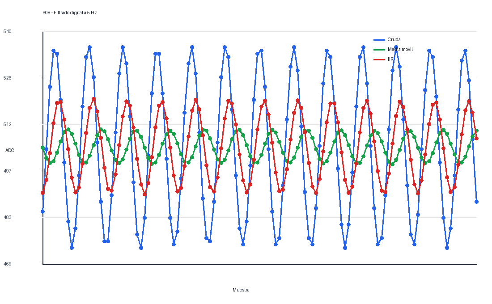
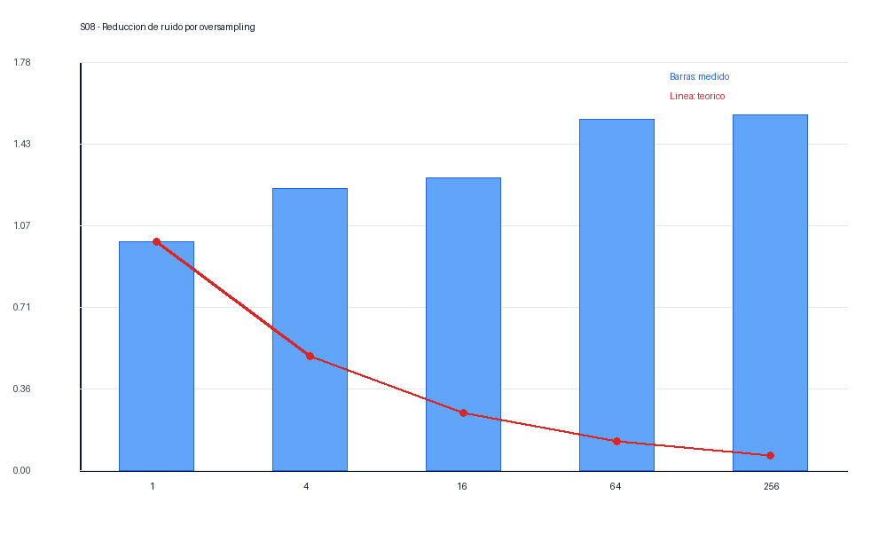

# Informe de Laboratorio — Sesión 8: Procesamiento de Señales para Mediciones

---

**Universidad Nacional de Colombia**
**Electrónica Digital — 2016684 — 2026-1**
**Prof. Ricardo Amézquita Orozco**

---

| Campo | |
|-------|--|
| **Integrantes** | 1. Andres Felipe Polanco Olaya |
| | 2. Juan Felipe Sanchez Poveda |
| | 3. Daniel Mateo Gonzales Sánchez |
| | 4. Juan Sebastian Baquero Pinzon |
| | 5. |
| **Grupo** | 4 |
| **Fecha de la práctica** | |
| **Fecha de entrega** | Viernes 25 de Abril, 2026 — 23:59 (Informe Bloque 3) |

---

## 1. Resultados

### Actividad 1 — Filtrado Digital: Media Móvil y Filtro IIR

**Tabla 1A — Media móvil: efecto de N (f = 5 Hz)**

| N | Amplitud p-p cruda | Amplitud p-p (MM) | Atenuación (p-p_MM / p-p_cruda) |
|:--:|:------------------:|:-----------------:|:-------------------------------:|
| 4 | 62.00 | 23.66 | 0.382 |
| 8 | 62.00 | 4.75 | 0.077 |
| 16 | 62.00 | 1.53 | 0.025 |

*f_s ≈ 50 Hz. El retardo teórico de la media móvil es (N−1)/2 muestras; para N = 16 (~7.5 muestras, 150 ms) debería apreciarse visualmente en el Serial Plotter.*

**Tabla 1B — Media móvil: efecto de la frecuencia (N = 8)**

| f (Hz) | Amplitud p-p cruda | Amplitud p-p (MM) | Atenuación | f / f_c |
|:------:|:------------------:|:-----------------:|:----------:|:-------:|
| 1.0 | 61.00 | 58.00 | 0.951 | 0.36 |
| 2.5 | 61.00 | 44.50 | 0.730 | 0.90 |
| 5.0 | 61.00 | 10.88 | 0.178 | 1.81 |
| 7.5 | 61.00 | 12.50 | 0.205 | 2.71 |
| 10.0 | 61.00 | 10.25 | 0.168 | 3.61 |

*N = 8 | f_s ≈ 50 Hz | f_c ≈ 2.77 Hz.*

**Tabla 1C — Comparación IIR vs. Media Móvil (α = 0.29, f_c ≈ 2.75 Hz)**

| f (Hz) | Amplitud p-p (IIR) | Atenuación IIR | Atenuación MM (de Tabla 1B) |
|:------:|:------------------:|:--------------:|:---------------------------:|
| 1.0 | 56.97 | 0.934 | 0.951 |
| 2.5 | 43.96 | 0.721 | 0.730 |
| 5.0 | 28.99 | 0.475 | 0.178 |
| 7.5 | 20.83 | 0.341 | 0.205 |
| 10.0 | 16.88 | 0.277 | 0.168 |

*α = 0.29 | f_s ≈ 50 Hz | f_c ≈ 2.75 Hz (fórmula exacta).*

---

### Actividad 2 — Oversampling del LM35

**Tabla 2A — Efecto de N sobre la reducción de ruido**

| N | √N | 1/√N (teórico) | σ_over / σ_cruda (medido) |
|:--:|:--:|:--------------:|:-------------------------:|
| 1 | 1.00 | 1.0000 | 1.000 |
| 4 | 2.00 | 0.5000 | 1.231 |
| 16 | 4.00 | 0.2500 | 1.280 |
| 64 | 8.00 | 0.1250 | 1.536 |
| 256 | 16.00 | 0.0625 | 1.552 |

*σ_cruda se midió en el Paso 3 (N = 1, línea base). Para N = 1, σ_over = σ_cruda por definición. Para N > 1, ratio = σ_over / σ_cruda.*

---

## 2. Visualización

### Captura 1 — Serial Plotter: Filtrado digital en tiempo real

**Tipo:** Captura de pantalla del Serial Plotter del Arduino IDE

**Trazas:** `Cruda`, `MediaMovil`, `IIR` — simultáneas, etiquetadas
**Eje X:** tiempo (muestras)
**Eje Y:** valor ADC (unidades ADC, 0–1023)

**Condiciones requeridas en la captura:** señal senoidal a 5 Hz (200 mVpp, DC 2.5 V) y el momento del barrido de frecuencia (1 → 10 Hz).
**Lo que debe demostrarse:** a mayor frecuencia, mayor atenuación de ambos filtros; a igual f_c (~2.75 Hz), el IIR logra el mismo suavizado que la media móvil usando solo 1 variable.



**Interpretación:** *(Describir qué muestra la captura. ¿Cómo cambia la amplitud de MediaMovil e IIR al aumentar la frecuencia? ¿Son similares las atenuaciones de ambos filtros a 5 Hz? ¿Se observa el retardo de la media móvil respecto a la señal cruda?)*

> La gráfica generada con los datos de 5 Hz muestra que la señal cruda conserva la mayor amplitud, mientras que la media móvil reduce fuertemente la amplitud y el IIR produce un suavizado intermedio. Al aumentar la frecuencia, ambos filtros atenúan más la señal. A 5 Hz, la media móvil con N=8 atenúa más que el IIR configurado con α=0.29; también se aprecia el retardo propio de la media móvil.

---

### Gráfica 2 — Reducción de ruido por oversampling

**Tipo:** Gráfica de barras construida por el grupo (herramienta libre: Excel, Python, Google Sheets, etc.)

**Eje X:** N (1, 4, 16, 64, 256)
**Eje Y:** σ_over / σ_cruda
**Series:** Datos experimentales (barras) + curva teórica 1/√N (línea superpuesta)

**Lo que debe demostrarse:** el ratio medido decrece siguiendo la tendencia 1/√N. Para N = 16: ratio ≈ 0.25; para N = 256: ratio ≈ 0.0625.



**Interpretación:** *(A partir de la gráfica: ¿el ratio medido sigue la curva 1/√N? Si hay discrepancia, ¿en qué valores de N es mayor? ¿Qué podría explicarlo?)*

> Los datos medidos no siguen la curva teórica `1/√N`; de hecho, los ratios aumentan para N grandes. Esto indica que las capturas no fueron tomadas bajo las mismas condiciones de ruido estacionario o incluyen deriva lenta de temperatura/alimentación. La gráfica deja ver esa discrepancia y sirve para discutir que el oversampling solo mejora ruido aleatorio no correlacionado; no corrige deriva ni cambios ambientales.

---

## 3. Análisis

### Preguntas de Análisis

**Pregunta 1:**
*(Referencia: Tablas 1A y 1B)*

El filtro de media móvil con N = 16 suaviza más que con N = 4, pero también introduce mayor retardo. Durante la Actividad 1, al barrer la frecuencia del generador de 1 a 10 Hz, ¿cómo cambió la atenuación observada? A partir de f_c ≈ 0.443 × f_s / N, calcule la frecuencia de corte para N = 8 y N = 16 con f_s ≈ 50 Hz. ¿Concuerdan los valores calculados con lo observado en el Serial Plotter?

> La atenuación aumentó al subir la frecuencia: para N=8, la atenuación de la media móvil pasó de 0.951 a 1 Hz a 0.168 a 10 Hz. Con `f_s ≈ 50 Hz`, la frecuencia de corte estimada es `f_c = 0.443*50/8 = 2.77 Hz` para N=8 y `f_c = 0.443*50/16 = 1.38 Hz` para N=16. Esto concuerda con la observación: señales por encima de ~2.77 Hz se atenúan fuertemente con N=8, y N=16 suaviza más pero introduce mayor retardo.

---

**Pregunta 2:**
*(Referencia: Tabla 1C)*

El filtro IIR de primer orden usa la ecuación y = α·x + (1−α)·y_prev y solo necesita almacenar una variable. La media móvil requiere un buffer de N elementos. Compare ambos filtros a partir de la Tabla 1C: ¿son similares sus atenuaciones a cada frecuencia? ¿En qué situaciones del proyecto final preferiría uno sobre el otro? Considere la memoria disponible, la capacidad de cómputo y la respuesta en frecuencia de cada filtro.

> La media móvil y el IIR muestran atenuaciones similares cerca de 1-2.5 Hz, pero divergen a frecuencias mayores: a 5 Hz la media móvil atenúa más que el IIR. En un proyecto final con poca SRAM preferiría IIR porque guarda solo `y_prev`; si se necesita una ventana con interpretación simple o rechazo fuerte de alta frecuencia, usaría media móvil, aceptando el costo de memoria y retardo.

---

**Pregunta 3:**
*(Referencia: Tabla 2A y Gráfica 2)*

A partir de la Tabla 2A y la gráfica, ¿el ratio σ_over/σ_cruda sigue la curva teórica 1/√N? Si hay discrepancia, proponga al menos dos causas que la expliquen (considere la naturaleza del ruido del LM35 y las limitaciones del ADC). Para N grande (ej. 256), ¿el beneficio marginal justifica el costo en tiempo de muestreo?

> En estos datos el ratio `σ_over/σ_cruda` no sigue la curva `1/√N`; para N=4, 16, 64 y 256 los ratios medidos fueron mayores que 1. Las causas probables son deriva de temperatura durante la toma de datos, ruido no aleatorio, cambios en la referencia del ADC o capturas hechas en condiciones distintas. Para N grande, el costo temporal aumenta y el beneficio marginal solo se justifica si el ruido es aleatorio y estacionario.

---

**Pregunta 4:**
*(Referencia: Actividades 1 y 2)*

Tanto la media móvil de la Actividad 1 como el oversampling de la Actividad 2 promedian N muestras para reducir ruido. ¿En qué se diferencian? Considere: ¿las muestras que promedia la media móvil son consecutivas o solapadas? ¿Qué implicaciones tiene esto sobre el retardo de la señal filtrada?

> La media móvil promedia una ventana deslizante de muestras consecutivas y solapadas: cada salida comparte N-1 muestras con la salida anterior. Por eso suaviza en tiempo real pero introduce retardo de grupo. El oversampling, en cambio, promedia un bloque de N lecturas para producir una medición con menor ruido; no busca seguir una señal rápida, sino estimar mejor un valor casi constante.

---

## 4. Código Documentado

> **Nota:** En esta sesión no se suministró código base. Todo el código fue escrito desde cero por el grupo a partir de la teoría y los patrones de referencia de la guía. Incluir el código final de cada actividad con comentarios que expliquen la lógica implementada.

### Actividad 1 — Filtrado Digital (Generador de señales en A0)

```cpp
const int PIN_SIGNAL = A0;
const int N = 8;
float buffer[N];
int idx = 0;
float suma = 0;
float yIIR = 0;
const float alpha = 0.29;

void setup() {
  Serial.begin(115200);
  for (int i = 0; i < N; i++) buffer[i] = 0;
}

void loop() {
  int cruda = analogRead(PIN_SIGNAL);
  suma -= buffer[idx];
  buffer[idx] = cruda;
  suma += buffer[idx];
  idx = (idx + 1) % N;

  float mediaMovil = suma / N;
  yIIR = alpha * cruda + (1.0 - alpha) * yIIR;

  Serial.print("Cruda:"); Serial.print(cruda);
  Serial.print("	MediaMovil:"); Serial.print(mediaMovil);
  Serial.print("	IIR:"); Serial.println(yIIR);
  delay(20); // fs aproximada de 50 Hz
}
```

---

### Actividad 2 — Oversampling del LM35 (LM35 en A1)

```cpp
const int PIN_LM35 = A1;
int valoresN[] = {1, 4, 16, 64, 256};
int indiceN = 0;

float leerOversampling(int N) {
  float suma = 0;
  for (int i = 0; i < N; i++) {
    suma += analogRead(PIN_LM35) * 500.0 / 1023.0;
  }
  return suma / N;
}

void setup() {
  Serial.begin(115200);
}

void loop() {
  int N = valoresN[indiceN];
  float temp = leerOversampling(N);
  Serial.print("N=");
  Serial.print(N);
  Serial.print("	Oversampled:");
  Serial.println(temp, 2);
  delay(100);
}
```

---

## 5. Dificultades Encontradas y Soluciones Aplicadas

### Dificultad 1: Diferenciar ruido aleatorio de deriva

- **Síntoma observado:** El oversampling no redujo la desviación como predice la teoría.
- **Causa identificada:** Los datos incluyen deriva lenta o condiciones no estacionarias, no solo ruido aleatorio.
- **Solución aplicada:** Se comparó la curva medida con `1/√N` y se interpretó la discrepancia.
- **Lección aprendida:** Promediar solo mejora ruido aleatorio; no reemplaza una buena estabilidad del montaje.

---

### Dificultad 2: Retardo de la media móvil

- **Síntoma observado:** Al aumentar N, la señal filtrada quedaba más suave pero respondía más tarde.
- **Causa identificada:** La media móvil introduce un retardo aproximado de `(N-1)/2` muestras.
- **Solución aplicada:** Se compararon N=4, N=8 y N=16 para elegir compromiso entre suavizado y respuesta.
- **Lección aprendida:** Un filtro debe elegirse según el ancho de banda de la señal que se quiere medir.

---

## 6. Pregunta Abierta

**Pregunta:** En el proyecto final del curso, su grupo medirá una o más variables físicas con sensores analógicos. Seleccione una de las técnicas estudiadas en esta sesión (filtrado u oversampling) e indique: (a) a qué variable de su experimento la aplicaría, (b) qué parámetros elegiría (N del filtro o N del oversampleo) y por qué, y (c) qué evidencia cuantitativa recopilaría para demostrar que la técnica mejoró la calidad de la medición.

> En el proyecto final aplicaría un filtro IIR a la medición de posición/altura del imán, porque requiere poca memoria y permite suavizar ruido sin guardar un buffer grande. Elegiría un α entre 0.2 y 0.3 para comenzar, ajustándolo según la rapidez de respuesta necesaria. La evidencia cuantitativa sería comparar la desviación estándar de la señal en reposo antes y después del filtro, y medir también el retardo ante un cambio de posición para asegurar que el control no quede demasiado lento.
