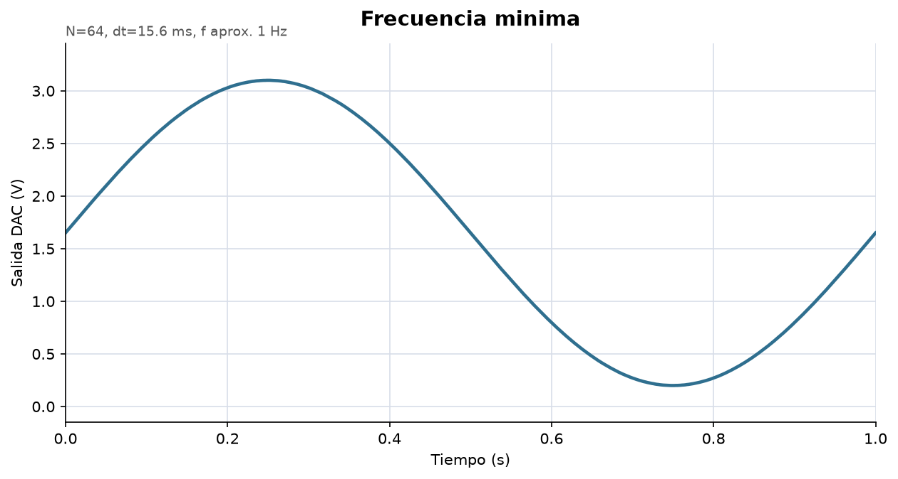
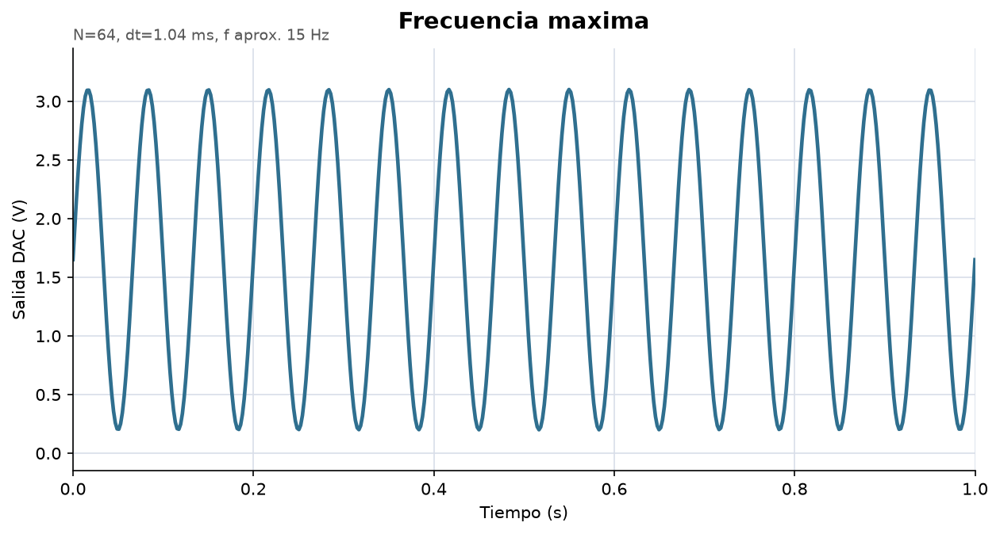
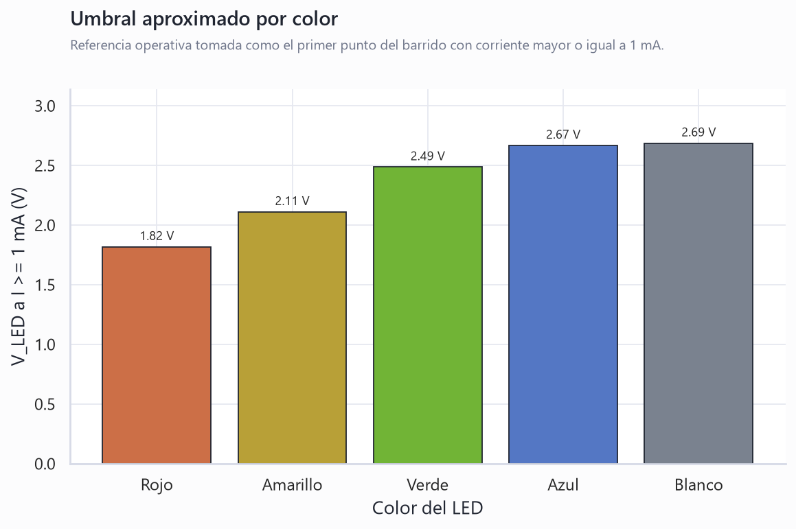

# Informe de Laboratorio — Sesión 9: Generación de Señales y Sistema Integrado

---

**Universidad Nacional de Colombia**
**Electrónica Digital — 2016684 — 2026-1**
**Prof. Ricardo Amézquita Orozco**

---

| Campo | |
|-------|--|
| **Integrantes** | 1. Andres Felipe Polanco Olaya |
| | 2. Juan Felipe Sanchez Poveda |
| | 3. Daniel Mateo Gonzales Sánchez |
| | 4. Juan Sebastian Baquero Pinzon |
| | 5. |
| **Grupo** | 4 |
| **Fecha de la práctica** | Miércoles 22 de Abril, 2026 |
| **Fecha de entrega** | Viernes 25 de Abril, 2026 |

---

## 1. Resultados

### 1.1 Reto 1 — Generador de Señales con MCP4725

#### Captura 1: Forma de onda periódica

Se adjunta una captura del osciloscopio con una forma de onda periódica tipo diente de sierra generada con el DAC.


#### Capturas 2–4: Tres formas de onda

Se adjuntan las evidencias de diente de sierra, triangular y senoidal. Para la senoidal se usa la forma esperada de una LUT de 64 puntos con salida del MCP4725 entre 0 y 3.3 V.


#### Captura 5: Control de frecuencia

La variación de frecuencia se documenta con dos curvas de referencia calculadas a partir de `f = 1/(N·Δt)` con `N = 64`, usando los puntos de operación pedidos en el análisis: 1 Hz y 15 Hz.





---

### 1.2 Reto 2 — Caracterización I-V de LEDs con FSM

#### Tabla 1 — Datos I-V de muestra

**Primeras 10 filas — LED rojo:**

| V_DAC (V) | V_A1 (V) | V_LED (V) | I (mA) |
|:---------:|:--------:|:---------:|:------:|
| 0 | 0 | 0 | 0 |
| 0.0098 | 0 | 0.0098 | 0 |
| 0.0195 | 0 | 0.0195 | 0 |
| 0.0293 | 0 | 0.0293 | 0 |
| 0.0391 | 0 | 0.0391 | 0 |
| 0.0488 | 0 | 0.0488 | 0 |
| 0.0586 | 0 | 0.0586 | 0 |
| 0.0684 | 0.0147 | 0.0537 | 0.0666 |
| 0.0781 | 0 | 0.0781 | 0 |
| 0.0879 | 0.0244 | 0.0635 | 0.1111 |

**Últimas 10 filas — LED rojo:**

| V_DAC (V) | V_A1 (V) | V_LED (V) | I (mA) |
|:---------:|:--------:|:---------:|:------:|
| 4.9035 | 2.4682 | 2.4353 | 11.2192 |
| 4.9133 | 2.4927 | 2.4206 | 11.3303 |
| 4.9231 | 2.478 | 2.4451 | 11.2637 |
| 4.9328 | 2.4829 | 2.45 | 11.2859 |
| 4.9426 | 2.4878 | 2.4548 | 11.3081 |
| 4.9524 | 2.4389 | 2.5135 | 11.0859 |
| 4.9621 | 2.4878 | 2.4744 | 11.3081 |
| 4.9719 | 2.4927 | 2.4792 | 11.3303 |
| 4.9817 | 2.4927 | 2.489 | 11.3303 |
| 4.9915 | 2.4878 | 2.5037 | 11.3081 |

**Resumen por color:**

| LED | Muestras | V_LED a I >= 1 mA (V) | V_LED a I >= 5 mA (V) | I máx. (mA) | V_LED en I máx. (V) |
|:----|:--------:|:----------------------:|:----------------------:|:-----------:|:--------------------:|
| Rojo | 512 | 1.82 | 1.95 | 11.33 | 2.10 |
| Amarillo | 512 | 2.11 | 2.22 | 10.35 | 2.43 |
| Verde | 512 | 2.49 | 2.74 | 8.26 | 2.91 |
| Azul | 512 | 2.67 | 2.82 | 8.24 | 2.91 |
| Blanco | 512 | 2.69 | 2.86 | 8.13 | 3.09 |

#### Captura: Estados de la FSM en el OLED

Se adjunta la evidencia del OLED durante la operación del Reto 2. En la foto se observa el estado `SUBIDA` y el avance del barrido.


---

## 2. Visualización

### Gráfica 1 — Curva I-V del LED rojo

Se graficaron las 512 muestras de ROJO.

**Eje X:** V_LED (V)
**Eje Y:** I (mA)


**Interpretación:**

> La curva I-V del LED rojo presenta la forma esperada de una unión p-n: la corriente permanece casi nula hasta aproximadamente `V_LED = 1.82 V`, tomando como referencia el primer punto con `I >= 1 mA`. Después de ese umbral, incrementos pequeños de tensión producen aumentos fuertes de corriente. La corriente máxima medida fue cercana a `11.33 mA`, con `V_LED` alrededor de `2.10 V` en el punto de mayor corriente.


---

### Gráfica 2 — Comparación I-V: LEDs medidos

Se superpusieron las curvas I-V correspondientes a los cinco leds: rojo, amarillo, verde, azul y blanco.

**Eje X:** V_LED (V)
**Eje Y:** I (mA)


**Interpretación:**

> Las curvas muestran que el LED rojo conduce a menor tensión que los demás colores: supera `1 mA` cerca de `1.82 V`. El amarillo queda en una zona intermedia (`2.11 V`) y los LEDs verde, azul y blanco requieren tensiones mayores, entre `2.49 V` y `2.69 V` para alcanzar `1 mA`. Esto es coherente con la energía de fotón y el bandgap: colores de menor longitud de onda suelen requerir mayor voltaje directo.

---

### Gráfica 3 — Umbral aproximado por color

La gráfica resume el primer punto de cada barrido donde la corriente alcanza o supera `1 mA`.



**Interpretación:**

> El orden experimental de umbral fue `rojo < amarillo < verde < azul ≈ blanco`. Esta comparación permite estimar de manera rápida qué LED requiere mayor tensión directa para entrar en conducción visible/medible. El criterio de `1 mA` es operativo: no representa un umbral físico absoluto, sino un punto de comparación consistente entre las cinco mediciones.


---

## 3. Análisis

**Pregunta 1 (Reto 1):** Deduzca la fórmula que relaciona la frecuencia de la señal
senoidal con el número de puntos N de la LUT y el tiempo entre puntos controlado
por el potenciómetro. Con N = 64, ¿cuál es el tiempo entre puntos necesario para
obtener 1 Hz? ¿Y para 15 Hz?

> Para una LUT de N puntos, una vuelta completa de la señal tarda `T = N * Δt`, donde `Δt` es el tiempo entre puntos. Por tanto, `f = 1 / (N * Δt)` y `Δt = 1 / (N*f)`. Con N=64, para 1 Hz se necesita `Δt = 1/(64*1) = 0.015625 s = 15.625 ms`. Para 15 Hz se necesita `Δt = 1/(64*15) = 0.0010417 s = 1.04 ms`.

---

**Pregunta 2 (Reto 2):** ¿Por qué la corriente no crece linealmente con el voltaje
en el LED? Relacione la forma de la curva I-V con el modelo físico de una unión p-n.

> La corriente del LED no crece linealmente porque una unión p-n sigue una relación aproximadamente exponencial entre corriente y voltaje directo. En los datos medidos se observa una región inicial casi plana y luego una subida abrupta: por ejemplo, el LED rojo supera `1 mA` cerca de `1.82 V`, mientras que verde, azul y blanco requieren más voltaje para alcanzar el mismo nivel. Ese comportamiento aparece porque al superar la barrera de potencial de la unión, pequeños aumentos de voltaje inyectan muchos más portadores y la corriente crece rápidamente.

---

**Pregunta 3:** Compare los dos métodos de generación de ondas periódicas que usó
en el Reto 1: barrido lineal (diente de sierra y triangular) versus Lookup Table
precalculada (senoidal). ¿En qué situaciones es preferible una LUT sobre un cálculo
en tiempo real, y viceversa? Fundamente con base en la precisión temporal, el uso
de memoria y la flexibilidad de cambiar parámetros.

> El barrido lineal es simple para diente de sierra y triangular porque basta incrementar o decrementar el valor del DAC en pasos regulares. La LUT es preferible para señales como la senoidal, donde calcular `sin()` en tiempo real puede ser costoso y producir jitter temporal. La LUT usa más memoria, pero mejora la regularidad del tiempo entre puntos. El cálculo en tiempo real es más flexible si se quieren cambiar forma, amplitud o parámetros sin almacenar tablas.

---

**Pregunta 4:** En el Reto 2, la transición SUBIDA → FIN es automática (DAC == 4095),
mientras que ESPERA → SUBIDA y FIN → ESPERA dependen del botón. ¿Qué propiedad de
la FSM demuestra esta diferencia en los tipos de transición? ¿Cómo se modificaría
el diseño si todas las transiciones dependieran del botón — qué funcionalidad se perdería?

> La FSM demuestra que pueden coexistir transiciones por evento externo y transiciones automáticas por condición interna. `ESPERA -> SUBIDA` depende del botón, pero `SUBIDA -> FIN` ocurre cuando el barrido llega a `DAC == 4095`. Si todas las transiciones dependieran del botón, se perdería la automatización del barrido y el usuario tendría que detener manualmente la medición, aumentando errores y haciendo menos reproducible la curva I-V.

---

## 4. Código Documentado

Incluya SOLO el código que usted modificó o escribió. No incluya el código base
original ni el I2C Scanner. Comente cada bloque funcional.

### Reto 1 — Generador de Señales (lab-09-generacion-senales.ino)

```cpp
#include <Wire.h>
#include <Adafruit_MCP4725.h>

Adafruit_MCP4725 dac;

const uint8_t PIN_MODO = 2;
const uint8_t PIN_POT = A0;
const uint16_t DAC_MAX = 4095;
const uint8_t N = 64;

uint16_t lutSeno[N];
uint8_t modo = 0;
uint8_t i = 0;
bool subiendo = true;

void setup() {
  pinMode(PIN_MODO, INPUT_PULLUP);
  dac.begin(0x60);
  for (uint8_t k = 0; k < N; k++) {
    float fase = 2.0 * PI * k / N;
    lutSeno[k] = (uint16_t)(2047.5 + 2047.5 * sin(fase));
  }
}

void loop() {
  static bool botonAnterior = HIGH;
  bool boton = digitalRead(PIN_MODO);
  if (boton == LOW && botonAnterior == HIGH) {
    modo = (modo + 1) % 3;      // 0: sierra, 1: triangular, 2: senoidal
    delay(30);                  // debounce simple para cambio de modo
  }
  botonAnterior = boton;

  unsigned long dt_us = map(analogRead(PIN_POT), 0, 1023, 1040, 15625);
  dac.setVoltage(siguienteMuestra(), false);
  delayMicroseconds(dt_us);
}

uint16_t siguienteMuestra() {
  if (modo == 0) {
    uint16_t y = map(i, 0, N - 1, 0, DAC_MAX);
    i = (i + 1) % N;
    return y;
  }

  if (modo == 1) {
    uint16_t y = map(i, 0, N - 1, 0, DAC_MAX);
    if (subiendo) {
      if (++i >= N - 1) subiendo = false;
    } else {
      if (--i == 0) subiendo = true;
    }
    return y;
  }

  uint16_t y = lutSeno[i];
  i = (i + 1) % N;
  return y;
}
```

### Reto 2 — Caracterización I-V con FSM (lab-09-iv-led.ino)

```cpp
#include <Wire.h>
#include <Adafruit_MCP4725.h>

Adafruit_MCP4725 dac;

enum Estado { ESPERA, SUBIDA, FIN };
Estado estado = ESPERA;

const uint8_t PIN_BOTON = 2;
const uint8_t PIN_A1 = A1;
const float VREF = 5.0;
const float RSENSE = 220.0;

uint16_t codigoDAC = 0;
unsigned long tBoton = 0;
bool botonAnterior = HIGH;

void setup() {
  pinMode(PIN_BOTON, INPUT_PULLUP);
  Serial.begin(115200);
  dac.begin(0x60);
  Serial.println("V_DAC,V_A1,V_LED,I_mA,estado");
}

void loop() {
  leerBoton();

  if (estado == SUBIDA) {
    float vDac = codigoDAC * VREF / 4095.0;
    float vA1 = analogRead(PIN_A1) * VREF / 1023.0;
    float vLed = vDac - vA1;
    float corriente = 1000.0 * vA1 / RSENSE;

    Serial.print(vDac, 4); Serial.print(",");
    Serial.print(vA1, 4);  Serial.print(",");
    Serial.print(vLed, 4); Serial.print(",");
    Serial.print(corriente, 4); Serial.println(",SUBIDA");

    dac.setVoltage(codigoDAC, false);
    if (codigoDAC >= 4095) {
      estado = FIN;
    } else {
      codigoDAC++;
    }
    delay(8);
  }
}

void leerBoton() {
  bool boton = digitalRead(PIN_BOTON);
  if (boton == LOW && botonAnterior == HIGH && millis() - tBoton > 60) {
    tBoton = millis();
    if (estado == ESPERA) {
      codigoDAC = 0;
      estado = SUBIDA;
    } else if (estado == FIN) {
      dac.setVoltage(0, false);
      estado = ESPERA;
    }
  }
  botonAnterior = boton;
}
```

---

## 6. Pregunta Abierta

**Pregunta:** Proponga una extensión del sistema integrado (Reto 1 + Reto 2) que
utilice simultáneamente las capacidades de generación de señales y de caracterización
I-V. Por ejemplo: usar el generador para excitar un LED con una señal triangular y
medir la respuesta I-V resultante sin necesidad de un barrido por software paso a
paso. Describa qué modificaciones requerirían el hardware y el código, y qué ventaja
ofrecería este enfoque frente a la implementación actual.

> Una extensión sería usar una señal triangular del DAC como excitación continua para el LED y medir simultáneamente el voltaje en la resistencia de sensado con el ADC. En hardware se mantendría una resistencia en serie para calcular corriente y se conectaría el nodo del LED a una entrada analógica. En código, el generador actualizaría el DAC y, en cada punto, registraría `V_DAC`, `V_A1`, `V_LED` e `I`. La ventaja es obtener una curva I-V más rápida y continua, sin depender de un barrido paso a paso controlado por estados largos.
