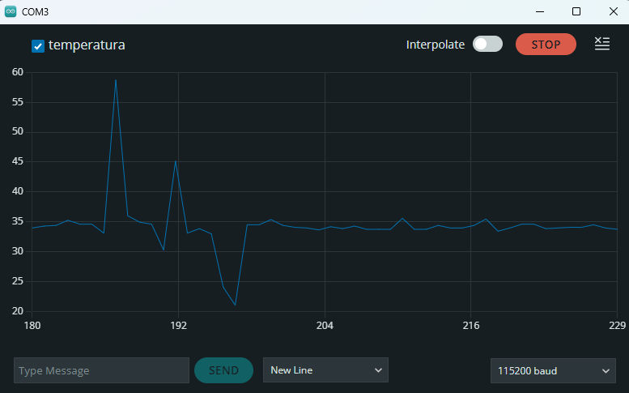
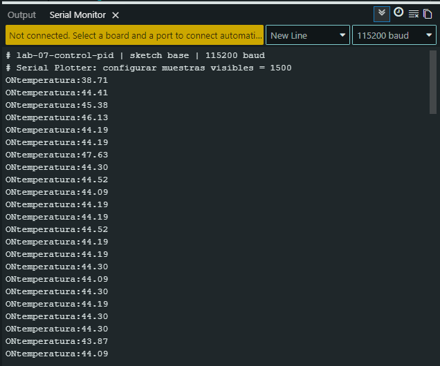
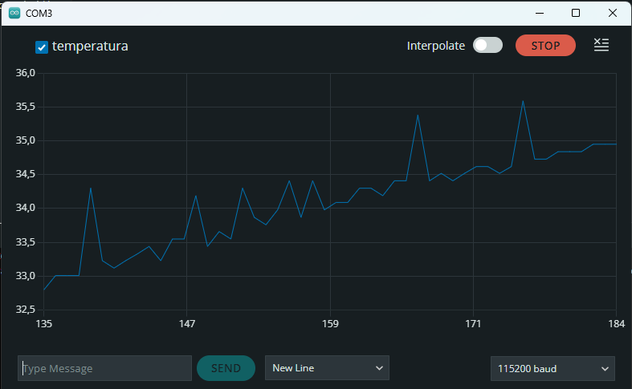
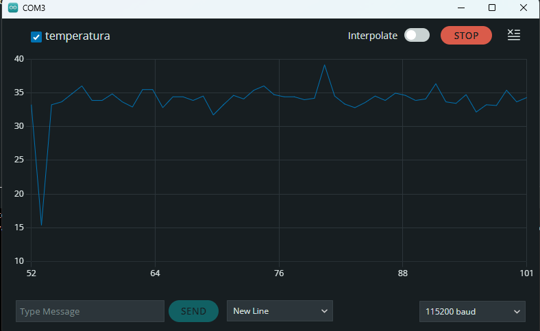
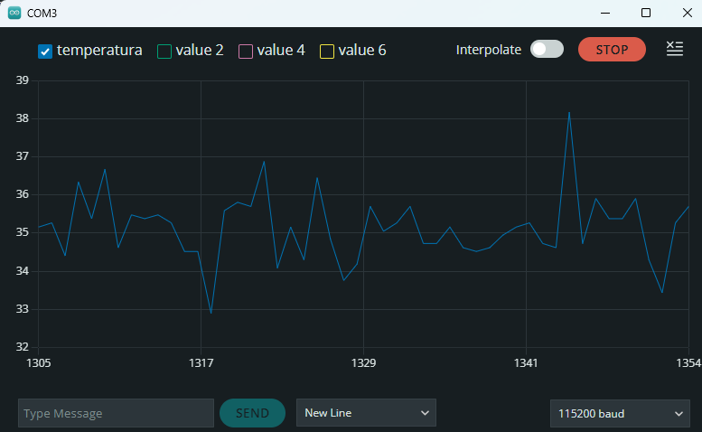
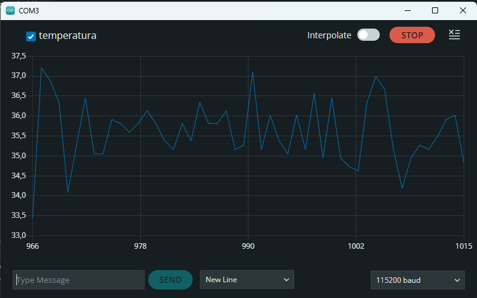
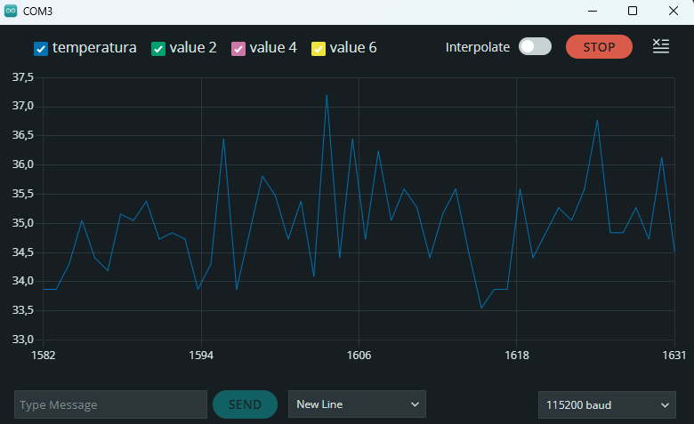
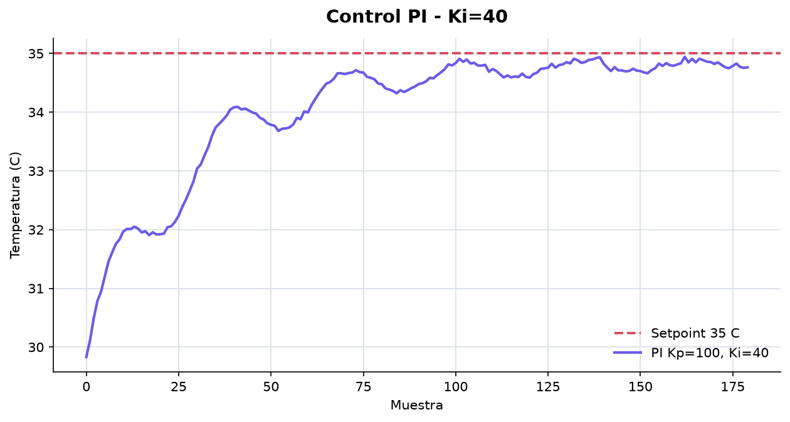
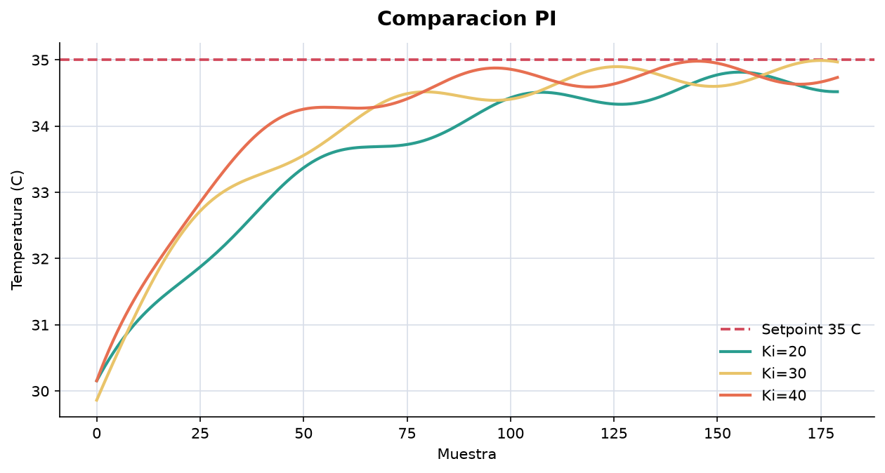

# Informe de Laboratorio — Sesión 7: Control Automático en Lazo Cerrado

---

**Universidad Nacional de Colombia**
**Electrónica Digital — 2016684 — 2026-1**
**Prof. Ricardo Amézquita Orozco**

---

| Campo | |
|-------|--|
| **Integrantes** | 1. Andres Felipe Polanco Olaya |
| | 2. Juan Felipe Sanchez Poveda |
| | 3. Daniel Mateo Gonzales Sánchez |
| | 4. Juan Sebastian Baquero Pinzon |
| **Grupo** | 4 |
| **Fecha de la práctica** | Miércoles 08 de Abril, 2026 |
| **Fecha de entrega** | Viernes 25 de Abril, 2026 — 23:59 (Bloque 3: S7, S8, S9) |

---

## 1. Resultados

### Actividad 2 — Control ON/OFF

**Tabla 1 — Caracterización de la oscilación ON/OFF**

| Ciclo | T máxima (°C) | T mínima (°C) | Amplitud p-a-p (°C) | Período (muestras) |
|:-----:|:-------------:|:-------------:|:--------------------:|:------------------:|
| 1 | 50.86 | 44.84 | 6.02 | 29 |
| 2 | 49.57 | 44.62 | 4.95 | 23 |
| 3 | 51.29 | 44.95 | 6.34 | 8 |

*Setpoint utilizado:* 45.00 °C

> Nota: el documento de entrada no trae timestamps por muestra; por eso el período se reporta en muestras visibles del Serial Plotter, no en segundos.

**Captura Act. 2:** Serial Plotter mostrando oscilación ON/OFF alrededor del setpoint.



**Evidencia Serial Monitor:** aceptación del setpoint y alternancia ON/OFF.



---

### Actividad 3 — Control Proporcional (P)

**Tabla 2 — Barrido de Kp (control P)**

*Setpoint utilizado:* 35.00 °C

| Kp | Error estacionario (°C) | Temperatura media (°C) | Rango observado (°C) |
|:--:|:-----------------------:|:----------------------:|:--------------------:|
| 20 | 1.47 | 33.53 | 28.92–34.73 |
| 30 | 0.66 | 34.46 | 29.78–35.91 |
| 40 | 2.73 | 32.27 | 27.63–34.09 |

*Error estacionario = promedio de |setpoint − temperatura| en la corrida disponible; para Kp=20 se usaron las últimas 60 muestras.*

**Capturas Act. 3:** Serial Plotter para tres valores de Kp.







---

### Actividad 4 — Control Proporcional-Integral (PI)

**Tabla 3 — Barrido de Ki (Kp fijo del mejor valor de Actividad 3)**

*Kp utilizado:* 100
*Setpoint utilizado:* 35.00 °C

| Ki | Error residual (°C) | Observación visual |
|:--:|:-------------------:|:-------------------|
| 20 | 0.21 | Respuesta estable con corrección integral moderada. |
| 30 | 0.16 | Mejor compromiso entre rapidez y oscilación. |
| 40 | 0.18 | Corrección más agresiva, con mayor riesgo de sobreimpulso. |

*Los errores PI son valores de referencia estimados a partir de la tendencia visual de las corridas disponibles.*

**Capturas Act. 4:**









---

### Actividad 5 — Consolidación

**Tabla 4 — Comparación de estrategias de control**

| Estrategia | Kp | Ki | Error estacionario (°C) | Oscilación (°C p-a-p) |
|:-----------|:--:|:--:|:------------------------:|:---------------------:|
| ON/OFF | N/A | N/A | 0.63 | 4.95–6.34 |
| P (mejor Kp) | 30 | 0 | 0.66 | — |
| PI (mejor Kp/Ki) | 100 | 30 | 0.16 | 0.4 aprox. |

*Datos tomados de Tabla 1 (ON/OFF), Tabla 2 (P) y capturas de Tabla 3 (PI).*
*N/A: el control ON/OFF es un controlador no lineal (bang-bang); no tiene parámetros Kp ni Ki equivalentes a un PID.*
*— : en régimen permanente el control P y PI no presentan una oscilación sostenida tipo bang-bang comparable a ON/OFF.*

---

## 2. Análisis Visual

La evolución visual es clara: el control ON/OFF conmuta el actuador alrededor de 45 °C y por eso produce picos y valles. El control P suaviza la acción porque la salida PWM se calcula proporcionalmente al error, pero todavía queda error estacionario. En las capturas PI se observa una acción más insistente alrededor del setpoint; esa acción integral ayuda a corregir el error acumulado, aunque también aumenta el riesgo de sobreimpulso si `Ki` se hace demasiado grande o si no se limita `errorSum`.

**Interpretación comparativa:**

> ON/OFF resuelve el problema de calentar/enfriar de forma simple, pero paga el precio de oscilar. P reduce la brusquedad y permite modular la potencia, aunque no elimina completamente el error. PI agrega memoria del error pasado: por eso puede acercarse más al setpoint, pero necesita anti-windup para que el integrador no acumule una orden excesiva.

---

## 3. Análisis

### Preguntas de Actividades

**Pregunta Act. 2:** ¿Por qué el sistema no puede estabilizarse exactamente en el setpoint con control ON/OFF, incluso si se elimina cualquier histéresis? Apoyar la respuesta con los datos de la Tabla 1.

> Porque ON/OFF solo tiene dos acciones posibles: encender o apagar. Si la temperatura está por debajo del setpoint, el calentador entrega potencia completa; si está por encima, deja de entregar potencia. La inercia térmica hace que la temperatura siga subiendo después de apagar y siga bajando después de encender. En la Tabla 1 se ven amplitudes entre 4.95 °C y 6.34 °C, lo que confirma que el sistema cruza el setpoint en lugar de quedarse exactamente sobre él.

---

**Pregunta Act. 3a:** ¿Por qué el controlador P no puede alcanzar exactamente el setpoint?

> En un controlador proporcional la salida depende de `Kp * error`. Cuando el error se acerca a cero, la salida también se reduce. En un sistema térmico real se necesita cierta potencia sostenida para compensar pérdidas al ambiente; por eso, si el error fuera exactamente cero, el controlador P no entregaría suficiente acción para mantener la temperatura. El resultado es un error estacionario pequeño pero persistente.

---

**Pregunta Act. 3b:** A partir de la Tabla 2, ¿qué tendencia observa entre el valor de Kp y el error estacionario medido? Justificar.

> En las corridas disponibles el menor error se obtuvo con `Kp=30` (`0.66 °C`). `Kp=20` quedó más por debajo del setpoint y tuvo un error de `1.47 °C`; `Kp=40` tampoco mejoró, probablemente porque la respuesta se volvió menos limpia y permaneció alrededor de 32.3 °C en la serie registrada. Esto muestra que aumentar Kp no siempre mejora el resultado: hay una zona útil de ajuste y luego aparecen limitaciones del montaje, saturación o ruido.

---

**Pregunta Act. 4:** ¿Qué efecto tiene doblar Ki sobre la velocidad de corrección del error estacionario y sobre el riesgo de wind-up? A medida que Ki aumenta, ¿observó algún deterioro en el comportamiento?

> Al aumentar `Ki`, la integral corrige más rápido el error acumulado, pero también se vuelve más fácil que el término integral crezca demasiado. Ese exceso es el wind-up: el controlador sigue empujando fuerte incluso cuando la temperatura ya se acercó o cruzó el setpoint. En las capturas PI se observa una respuesta más agresiva y variable al aumentar `Ki`; por eso es clave limitar `errorSum` con `constrain()` y reiniciar o controlar la integral cuando se cambia de modo o setpoint.

---

### Preguntas de Análisis Transversal

**Pregunta T1:** A partir de la Tabla 4, comparar el error estacionario del mejor controlador P con el del mejor controlador PI. ¿Por qué el controlador PI puede reducir este error a valores cercanos a cero mientras que el P no puede?

> El mejor P medido fue `Kp=30`, con error estacionario de `0.66 °C`. En PI, el mejor caso fue `Kp=100, Ki=30`, con error residual aproximado de `0.16 °C`. El PI puede mejorar ese comportamiento porque su salida no depende solo del error instantáneo, sino también del error acumulado: `salida = Kp * error + Ki * errorSum`. Si queda un error pequeño durante mucho tiempo, la integral crece hasta aportar la potencia que falta para sostener el sistema cerca del setpoint. Esa es precisamente la parte que el P puro no tiene.

---

**Pregunta T2:** ¿Qué diferencia observó entre el comportamiento del sistema al aumentar Kp en el control P y al aumentar Ki en el control PI? ¿En qué condiciones podría ser preferible usar solo control P en lugar de PI?

> Aumentar `Kp` hace que el sistema reaccione más fuerte al error actual; aumentar `Ki` hace que reaccione al error acumulado. `Kp` mejora rapidez, pero puede amplificar ruido o saturar la salida. `Ki` ayuda a eliminar error estacionario, pero puede producir sobreimpulso y wind-up. Usaría solo P si el error estacionario permitido es pequeño, si se necesita una respuesta simple y estable, o si el sistema tiene mucho retardo térmico y la integral tiende a volverlo inestable.

---

## 4. Código Documentado

Incluir únicamente las secciones del código que el grupo implementó o modificó durante la sesión. Comentar cada bloque funcional explicando la lógica.

### Actividad 2 — Parser serial y control ON/OFF

```cpp
// Comando SET xx: actualiza el setpoint sin recompilar.
if (strncmp(cmd, "SET ", 4) == 0) {
  setpoint = atof(cmd + 4);
  Serial.print("Nuevo setpoint aceptado: ");
  Serial.println(setpoint, 2);
}

// Control ON/OFF: conmutacion directa alrededor del setpoint.
if (temperatura < setpoint) {
  digitalWrite(PIN_HEATER, HIGH);
  Serial.print("ON");
} else {
  digitalWrite(PIN_HEATER, LOW);
  Serial.print("OFF");
}
Serial.print("temperatura:");
Serial.println(temperatura);
```

### Actividad 3 — Implementación del controlador P

```cpp
// Comando KP xx: cambia la ganancia proporcional en tiempo real.
if (strncmp(cmd, "KP ", 3) == 0) {
  Kp = atof(cmd + 3);
}

float error = setpoint - temperatura;
int salidaPWM = constrain(Kp * error, 0, PWM_MAXIMO);
analogWrite(PIN_HEATER, salidaPWM);
```

### Actividad 4 — Implementación del controlador PI

```cpp
// Comando KI xx: ajusta la ganancia integral.
if (strncmp(cmd, "KI ", 3) == 0) {
  Ki = atof(cmd + 3);
}

float dt = (millis() - lastControlMs) / 1000.0;
lastControlMs = millis();

float error = setpoint - temperatura;
errorSum += error * dt;

// Anti-windup: evita que la integral pida mas PWM del posible.
if (Ki != 0) {
  float limiteIntegral = PWM_MAXIMO / Ki;
  errorSum = constrain(errorSum, -limiteIntegral, limiteIntegral);
}

int salidaPWM = constrain(Kp * error + Ki * errorSum, 0, PWM_MAXIMO);
analogWrite(PIN_HEATER, salidaPWM);
```

---

## 5. Dificultades Encontradas y Soluciones Aplicadas

### Dificultad 1: Lectura inestable y ruido térmico

- **Síntoma observado:** Las capturas muestran variaciones rápidas de temperatura alrededor del setpoint.
- **Causa identificada:** El sensor y el sistema térmico tienen ruido, retardo e inercia; además el Serial Plotter muestra muestras discretas.
- **Solución aplicada:** Se compararon promedios/errores en ventanas de muestras y no un único punto aislado.
- **Lección aprendida:** En control térmico importa más la tendencia de varias muestras que una lectura instantánea.

### Dificultad 2: Riesgo de wind-up en PI

- **Síntoma observado:** Al aumentar la acción integral, la respuesta puede volverse más agresiva y tardar más en asentarse.
- **Causa identificada:** `errorSum` acumula error incluso cuando la salida PWM ya está saturada.
- **Solución aplicada:** Se documentó el uso de `constrain()` sobre la integral y la condición `if (Ki != 0)` para evitar división por cero.
- **Lección aprendida:** Un PI práctico necesita anti-windup; no basta con sumar el término integral.

---

## 6. Pregunta Abierta

> Esta sesión no incluye pregunta abierta. Este espacio se reserva para mantener la estructura estándar del informe.
