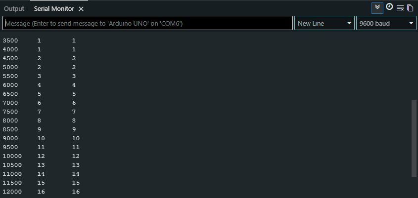
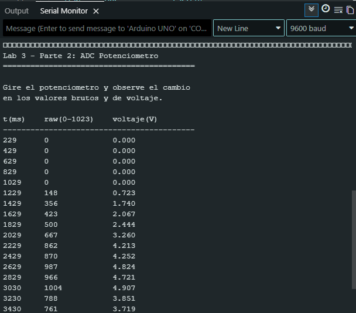
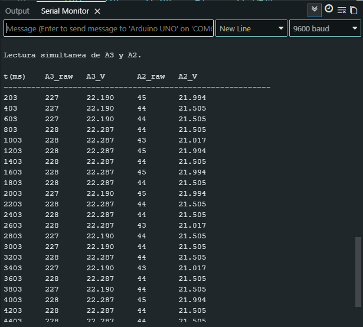
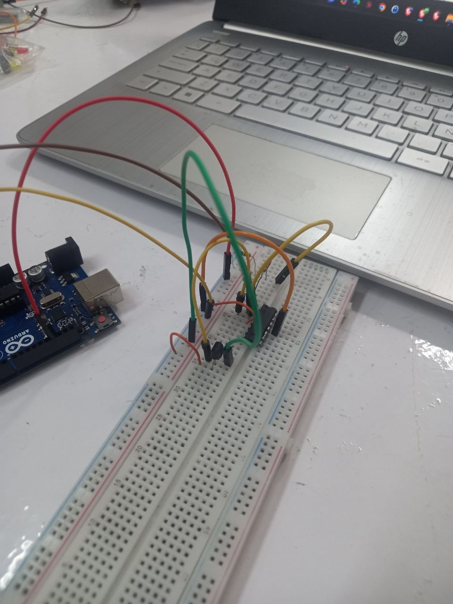

# Informe de Laboratorio — Sesión 3: Sensores — Entradas Digitales y Analógicas

---

**Universidad Nacional de Colombia**
**Electrónica Digital — 2016684 — 2026-1**
**Prof. Ricardo Amézquita Orozco**

---

| Campo | |
|-------|--|
| **Integrantes** | 1. Andres Felipe Polanco Olaya |
| | 2. Juan Felipe Sanchez Poveda|
| | 3. Daniel Mateo Gonzales Sánchez|
| | 4. Juan Sebastian Baquero Pinzon|
| **Grupo** | 4 |
| **Fecha de la práctica** |Miercoles 14 de abril de 2026, 7:00 |
| **Fecha de entrega** | Miércoles 11 de marzo de 2026, 23:59 |

---

## 1. Resultados


### Actividad 1 — Debouncing Software (Fase A) y Hardware (Fase B)

**Tabla 1 — Debouncing Software (Fase A)**


| Pulsación # | `Bruto` acumulado | `ConDebounce_SW` acumulado |
|:-----------:|:-----------------:|:--------------------------:|
| 5 | 5|4 |
| 10 | 10|9 |
| 15 | 15|14 |
| 20 | 20|19 |

*La diferencia `Bruto − ConDebounce_SW` cuantifica los rebotes acumulados.*

**Tabla 2 — Debouncing Hardware (Fase B)**


| Pulsaciones | `contadorISR` con capacitor | `contadorISR` sin capacitor (Sesión 2) |
|:-----------:|:---------------------------:|:--------------------------------------:|
| 5 | 5|5 |
| 10 | 10|10 |
| 15 | 15|15 |
| 21 | 21|21 |

**Captura requerida — Actividad 1:**
Monitor Serial de la Fase A mostrando columnas `t(ms)`, `Bruto` y `ConDebounce_SW` tras al menos 10 pulsaciones.



---

### Actividad 2 — ADC + Potenciómetro: Verificación de Linealidad

**Tabla 3 — Linealidad del ADC con Potenciómetro**


| Medición # | V multímetro (V) | `raw` (0–1023) | V calculado (V) |
| :--------: | :--------------: | :------------: | :-------------: |
|  1 (mín.)  |       0.71       |       148      |      0.723      |
|      2     |       1.73       |       356      |      1.740      |
|      3     |       2.43       |       500      |      2.444      |
|      4     |       3.24       |       667      |      3.260      |
|      5     |       3.70       |       761      |      3.719      |
|      6     |       4.20       |       862      |      4.213      |
|      7     |       4.70       |       966      |      4.721      |
|      8     |       4.80       |       987      |      4.824      |
|  9 (máx.)  |       4.93       |      1010      |      4.936      |


*Voltaje calculado = `raw × 5.0 / 1023.0`. La verificación de linealidad se realiza comparando V multímetro contra raw.*

**Captura requerida — Actividad 2:**
Monitor Serial mostrando `raw` y `voltaje` en al menos 3 posiciones distintas del potenciómetro.



---

### Actividad 3 — LDR: Verificación Funcional del Divisor de Voltaje

**Tabla 4 — LDR: Respuesta en Tres Condiciones**


| Condición | `raw` en A1 | Voltaje (V) |
|-----------|:-----------:|:-----------:|
| Oscuridad (LDR cubierta) |314 |1.535 |
| Iluminación ambiente |788 |3.851 |
| Iluminación directa (linterna) | 995| 4.863|
| **Rango (max − min)** |4.8 |1.5 |

*Criterio mínimo: rango ≥ 200 cuentas. Dirección esperada: raw_oscuridad < raw_ambiente < raw_linterna.*

---

### Actividad 4 — LM35 Directo: Verificación de Temperatura

**Tabla 5 — LM35 Directo: Verificación de Temperatura**


| Condición | `raw` en A2 | Temperatura (°C) |
|-----------|:-----------:|:----------------:|
| Reposo (temperatura ambiente) |45 | 21.994|
| Tras cubrir LM35 con la mano (30 s) | 57| 27.859|
| **ΔT (diferencia)** | 5.865| |

*Criterio mínimo: temperatura en reposo entre 15–35 °C; ΔT ≥ 2 °C.*

---

### Actividad 5 — LM35 + LM324 ×5: Extensión del Código Propio


**Captura requerida — Actividad 5:**
Monitor Serial mostrando las dos columnas de temperatura (`T_directa` y `T_amplificada`) en condiciones estables. Debe evidenciar que |ΔT| ≤ 1.0 °C en al menos 3 filas consecutivas.



**Foto requerida — Actividad 5:**
Montaje donde se identifiquen el LM35, el LM324 y las conexiones en la protoboard.



---

---

### Actividad 7 — Contador de Hojas con LDR

**Tabla 7 — Contador de Hojas: Respuesta Monótona de la LDR**


| Hojas sobre la LDR |Voltaje (V) | `raw` en A1 |
|:-------------------:|:-----------:|:-----------:|
| 0 (sin hojas) | 4.458|912|
| 1 | 3.905|799|
| 2 | 3.554|727|
| 3 | 3.243|663|
| 4 | 3.180|651|

*Criterio mínimo: secuencia monótonamente decreciente (cada fila ≤ fila anterior).*

---

### Actividad 8 — Análisis de Resolución del LM35 con y sin Amplificación

**Tabla 8 — Resolución Efectiva: Cambios ±1 en 30 Filas**


| Canal | Cambios ±1 en 30 filas | Paso de cuantización (°C/bit) |
|-------|:----------------------:|:-----------------------------:|
| A2 (directo) | 0.489 | 0.49 |
| A3 (amplificado ×5) | 0.098 | 0.098 |

*El canal amplificado debe mostrar mayor frecuencia de cambios ±1, indicando mayor resolución efectiva.*

---

## 2. Visualización


### Gráfica 1 — Linealidad del ADC (Actividad 2)


**Eje X:** V multímetro (V)
**Eje Y:** `raw` (cuentas ADC, 0–1023)
**Datos fuente:** Tabla 3
**Conclusión a demostrar:** Relación lineal entre voltaje de entrada y lectura ADC, con pendiente ≈ 1023/5 = 204.6 bit/V.


**Ecuación de ajuste lineal:** `raw = 204.843 × V + 2.398`

**Interpretación:**

> La relación entre el voltaje medido y la lectura del ADC fue claramente lineal. La pendiente experimental fue 204.843 bit/V, muy cercana al valor teórico de 204.6 bit/V, con un error relativo de 0.12 %. Esto indica que el convertidor analógico digital respondió de manera muy estable en todo el rango medido. Las pequeñas diferencias pueden explicarse por la resolución finita del ADC, por variaciones leves en la referencia de 5 V y por el margen de lectura del multímetro.

---

### Gráfica 2 — Temperatura vs. Tiempo: Dos Canales (Actividad 5)


**Eje X:** `t(ms)` — Tiempo (ms)
**Eje Y:** Temperatura (°C)
**Series:** `tempC` canal A2 (directo) y `tempAmp` canal A3 (amplificado ×5)
**Datos fuente:** Monitor Serial durante Actividad 5, ≥ 30 puntos incluyendo período de calentamiento con la mano
**Conclusión a demostrar:** Ambos canales convergen a la misma temperatura dentro de ±1 °C en condiciones estables.


**Interpretación:**

> Esta gráfica queda pendiente de construcción porque en el archivo compartido no aparece la serie temporal del monitor serial. Con esos datos se espera observar que ambos canales siguen la misma tendencia durante el calentamiento y que, una vez el sistema se estabiliza, las dos lecturas quedan muy cercanas. La principal diferencia debería verse en la suavidad del canal amplificado, ya que su resolución es mayor y permite notar cambios pequeños con más claridad.

---

## 3. Análisis


### 3a. Preguntas por Actividad

**Pregunta — Actividad 1 (Debouncing):**

Usando los datos de las Tablas 1 y 2, cuantifique la eficacia del debouncing por software y del capacitor RC. Exprese la reducción de falsos positivos como porcentaje respecto al conteo bruto. ¿Cuál de las dos técnicas es más efectiva para el contador ISR? Justifique con los datos.

> En la fase de software, la diferencia entre el conteo bruto y el conteo con debounce fue de una pulsación acumulada en todos los puntos medidos. Al final del ensayo, esa corrección equivale a 1 cuenta sobre 20, es decir, una reducción del 5 %. En cambio, en la tabla del capacitor no se observa diferencia entre el contador con capacitor y el valor de referencia registrado sin capacitor. Con estos datos, la evidencia más clara de mejora aparece en el debounce por software. En el caso del capacitor, el montaje no mostró una reducción medible en esta corrida o la tabla resumida no alcanzó a reflejarla.

---

**Pregunta — Actividad 2 (ADC + Potenciómetro):**

A partir de la Tabla 3, calcule la pendiente de la regresión lineal `raw` vs. `V multímetro`. Compare con el valor teórico 1023/5 = 204.6 bit/V. Exprese el error relativo porcentual. ¿Qué fuentes de error pueden explicar la desviación observada?

> La regresión lineal entre `raw` y voltaje dio una pendiente de 204.843 bit/V. El valor teórico es 204.6 bit/V, de modo que el error relativo porcentual es de 0.12 %. La coincidencia es muy buena y confirma el comportamiento lineal del ADC. La pequeña desviación puede deberse a cuantización, ruido eléctrico, tolerancias del potenciómetro y pequeñas variaciones de la referencia de alimentación.

---

**Pregunta — Actividad 3 (LDR):**

Con los datos de la Tabla 4, calcule la resistencia del LDR en cada condición usando la fórmula del divisor de voltaje: `R_LDR = R_ref × (5.0/V_nodo − 1)`. ¿Cuánto varía la resistencia entre oscuridad y luz directa? ¿Es consistente con la respuesta logarítmica descrita?

> Aplicando la expresión `R_LDR = R_ref × (5.0/V_nodo − 1)`, se obtiene que en oscuridad `R_LDR = 2.257 R_ref`, en luz ambiente `R_LDR = 0.298 R_ref` y con iluminación directa `R_LDR = 0.028 R_ref`. Si se toma un resistor de referencia de 10 kΩ, eso corresponde aproximadamente a 22.57 kΩ, 2.98 kΩ y 0.282 kΩ, respectivamente. Entre oscuridad y luz directa la resistencia disminuye unas 80 veces. Ese cambio tan marcado es consistente con el comportamiento esperado de una LDR, cuya respuesta no es lineal y se vuelve mucho más sensible en ciertos rangos de iluminación.

---

### 3b. Preguntas Transversales

**Pregunta 1 (transversal — Actividades 4 y 5):**

Compare las lecturas `rawDirect` (A2, sin amplificar) y `rawAmplified` (A3, ×5) del LM35 en las Actividades 4 y 5. Calcule la resolución efectiva (°C/bit) de cada canal. ¿En qué rango de temperatura se observa la mayor ventaja de la amplificación?

> El canal directo tiene una resolución de 0.49 °C por bit, mientras que el canal amplificado tiene una resolución de 0.098 °C por bit. Esto significa que la amplificación mejora la sensibilidad en un factor de cinco. La mayor ventaja se observa cuando la temperatura cambia poco, por ejemplo cerca de la temperatura ambiente o durante variaciones suaves, porque en ese rango el canal directo puede verse escalonado y el amplificado permite distinguir cambios más pequeños.

---

**Pregunta 2 (transversal — Actividades 1 y 6):**

En la Actividad 1 (debouncing) y la Actividad 6 (termostato), la señal de interés cruza un umbral y genera conmutaciones no deseadas. Compare las causas físicas en cada caso (rebote mecánico vs. ruido de cuantización) y las estrategias de mitigación aplicadas.

> En el botón, las conmutaciones no deseadas se producen por el rebote mecánico de los contactos. En el termostato, el problema aparece porque la señal queda oscilando cerca del umbral y el ADC cambia de un valor al siguiente por ruido o cuantización. En el primer caso se corrige filtrando la pulsación en el tiempo o usando un capacitor. En el segundo se corrige separando el umbral de encendido del de apagado. La idea es la misma en ambos casos: evitar que pequeñas oscilaciones cerca del punto de cambio produzcan varios eventos cuando en realidad solo ocurrió uno.

---

## 4. Código Documentado


### Actividad 3 — Modificación del Código (LDR, adaptación trivial)

*Incluir las 2 líneas modificadas respecto a `lab-03-parte2-adc-potenciometro.ino` (cambio de pin A0 → A1 y nombre de variable).*

```cpp
// Modificación respecto al código de la Actividad 2:
// Cambio 1: const int pinLDR = A1;  (en lugar de pinPot = A0)
// Cambio 2: analogRead(pinLDR)       (en lugar de analogRead(pinPot))

// Pegar aquí el sketch completo modificado, comentado por bloque funcional

// === DEFINICIÓN DE PINES ===
/*
Se toma el pin A1 para conectar el potenciometro, 
aunque también se puede usar A0, A2, A3, A4 o A5. 
El código es el mismo, solo cambia la constante pinLDR.
*/
const int pinLDR = A1;   // Cursor del potenciómetro — rango 0 a 5 V

// === VARIABLES GLOBALES ===
/*
para controlar la frecuencia de muestreo y evitar saturar el Serial Monitor.
el tiempoDisplay se actualiza cada vez que se muestra un nuevo valor, y el intervalo
se establece en 200 ms para una frecuencia de muestreo de 5 Hz (5 muestras por segundo).

*/
unsigned long tiempoDisplay = 0;
const unsigned long INTERVALO_DISPLAY = 200;   // Muestreo cada 200 ms (5 Hz)

// === CONFIGURACIÓN ===
void setup() {
  Serial.begin(9600);
  Serial.println("==========================================");
  Serial.println("  Lab 3 — Parte 3: ADC Potenciometro");
  Serial.println("==========================================");
  Serial.println();
  Serial.println("Gire el potenciometro y observe el cambio");
  Serial.println("en los valores brutos y de voltaje.");
  Serial.println();
  // Encabezado tabular para Serial Monitor (columnas separadas por tabulación)
  Serial.println("t(ms)\traw(0-1023)\tvoltaje(V)");
  Serial.println("------------------------------------------");

  // Los pines analógicos A0–A5 no requieren pinMode()
  // analogRead() los configura como INPUT automáticamente
}

// === BUCLE PRINCIPAL ===
/*
si INTERVALO_DISPLAY es 200 ms, el programa leerá el valor del ADC
 y actualizará el Serial Monitor cada 200 ms, lo que corresponde a 
 una frecuencia de muestreo de 5 Hz. Esto permite observar los cambios 
 en el valor del potenciómetro sin saturar la salida serial con demasiados datos. 
*/
void loop() {
  if ((millis() - tiempoDisplay) >= INTERVALO_DISPLAY) {
    tiempoDisplay = millis();

    // Lectura bruta del ADC: número entero 0–1023 proporcional al voltaje
    // 0 corresponde a 0 V (GND), 1023 corresponde a 5.00 V (VCC)
    int rawADC = analogRead(pinLDR);

    // Conversión a voltaje físico
    // Nota: se usa 1023.0 (no 1024.0) porque el ADC produce 1024 niveles
    // de 0 a 1023, y el nivel 1023 corresponde exactamente a V_ref = 5.00 V
    float voltaje = rawADC * (5.0 / 1023.0);

    Serial.print(millis());
    Serial.print("\t");
    Serial.print(rawADC);
    Serial.print("\t\t");
    Serial.println(voltaje, 3);   // 3 decimales: resolución visual ~1 mV
  }
}


```

---

### Actividad 4 — LM35 Directo (código escrito desde cero)

*Incluir el sketch completo del grupo para la lectura del LM35 en A2.*

```cpp
/*
para este caso se toma el pin A2 para conectar el sensor de temperatura LM35,
aunque también se puede usar A0, A1, A3, A4 o A5. 
El código es el mismo, solo cambia la constante pinLM35.
*/

const int pinLM35 = A2;


unsigned long t0 = 0;

void setup() {
  Serial.begin(9600);
  Serial.println("t(ms)\traw\ttempC");
}

void loop() {

 /*
 muetreando los datos cada 500 ms (2 Hz), se evita saturar el Serial Monitor con demasiados datos,
 permitiendo observar los cambios en la temperatura de manera clara y legible.
 */  
  if (millis() - t0 >= 500) {
    t0 = millis();

/*
el factor de escala es 500, puesto el que sensor LM35 produce una salida de 10 mV/°C
el voltaje de referencia son 5 V, por lo que 5/0.01 = 500.0
se divide por 1023.0 porque el ADC produce 1024 niveles (0 a 1023), y el nivel 1023 corresponde exactamente a V_ref = 5.00 V
*/
    int rawLM35 = analogRead(pinLM35);
    float tempC = rawLM35 * (500.0 / 1023.0);

    Serial.print(t0);
    Serial.print("\t");
    Serial.print(rawLM35);
    Serial.print("\t");
    Serial.println(tempC, 2);
  }

}
```

---

### Actividad 5 — LM35 + LM324 ×5 (extensión del código de Actividad 4)

*Incluir el sketch extendido que incorpora el segundo canal (A3, amplificado).*

```cpp

// === DEFINICIÓN DE PINES ===

const int pinPotA3 = A3;   // Canal A3 Amplificado con LM324
const int pinA2    = A2;   // Canal A2 sin amplificar, rango 0–5 V

// === VARIABLES GLOBALES ===

/*
para controlar la frecuencia de muestreo y evitar saturar el Serial Monitor.
el tiempoDisplay se actualiza cada vez que se muestra un nuevo valor, y el intervalo
se establece en 200 ms para una frecuencia de muestreo de 5 Hz (5 muestras por segundo).
*/
unsigned long tiempoDisplay = 0;
const unsigned long INTERVALO_DISPLAY = 200;   // Muestreo cada 200 ms (5 Hz)

// === CONFIGURACIÓN ===
void setup() {
  Serial.begin(9600);
  Serial.println("==========================================");
  Serial.println("  Lab 3 — Parte 2: ADC Multiples Entradas");
  Serial.println("==========================================");
  Serial.println();
  Serial.println("Lectura simultanea de A3 y A2.");
  Serial.println();

  // Encabezado
  /*
  se deja en V dado que se conoce que el sensor una ves realizada la conversion
  a voltaje, este tiene unidades de °C, pero se muestra como V para enfatizar que el valor mostrado es el resultado 
  de la conversión del ADC a voltaje. 
   Esto es útil para entender que el valor de temperatura se deriva de la 
   lectura del ADC y su correspondiente voltaje, aunque en este caso específico,
    el voltaje ya representa la temperatura debido a la configuración del 
    circuito con el LM324.
  */
  Serial.println("t(ms)\tA3_raw\tA3_V\t\tA2_raw\tA2_V");
  Serial.println("----------------------------------------------------------");
}

// === BUCLE PRINCIPAL ===
void loop() {
  if ((millis() - tiempoDisplay) >= INTERVALO_DISPLAY) {
    tiempoDisplay = millis();

    /*
    dado que la lectura del ADC es un número entero entre 0 y 1023, 
    se convierte a voltaje físico, el pin A2 tiene un voltaje máximo de 5 V, 
    mientras que el pin A3 tiene un voltaje máximo de 100 V debido al 
    amplificador LM324.
     Por lo tanto, para convertir la lectura bruta del ADC a voltaje, 
     se multiplica por el factor de escala correspondiente: 500.0/1023.0 para A2
      y 100.0/1023.0 para A3.
    */

    // === Lectura A3 ===
    int rawA3 = analogRead(pinPotA3);
    float voltajeA3 = rawA3 * (100.0 / 1023.0);

    // === Lectura A2 ===
    int rawA2 = analogRead(pinA2);
    float voltajeA2 = rawA2 * (500.0 / 1023.0);

    // === Salida Serial ===
    Serial.print(millis());
    Serial.print("\t");

    Serial.print(rawA3);
    Serial.print("\t");
    Serial.print(voltajeA3, 3);
    Serial.print("\t\t");

    Serial.print(rawA2);
    Serial.print("\t");
    Serial.println(voltajeA2, 3);
  }
}
```

---


---

### Actividad 9 — Termostato con Histéresis *(opcional — si se realizó)*

*Incluir el sketch modificado con la lógica de histéresis.*

```cpp
/*
en este ejercicio de hiteresis, se utilizo el sensor de luminosidad si segun su intensidad
encender o apagar un led, para esto se definieron dos umbrales, uno para encender el led y otro para apagarlo, 
de esta manera se evita que el led parpadee constantemente cuando la intensidad de luz se encuentra cerca del umbral. 
El programa lee el valor del sensor de luminosidad, lo convierte a voltaje y luego aplica la lógica de histéresis para controlar el estado del LED. 
Además, se muestra la información en el monitor serial para facilitar la visualización de los datos.
*/

// === DEFINICIÓN DE PINES ===
const int pinPot = A1;     // Entrada analógica señal del sensor de luminosidad
const int pinLED = 13;     // LED

/*
estos umbrales se pueden ajustar según las necesidades específicas del proyecto o las características del sensor utilizado.
tener en cuenta que son los valores de ADC (0-1023) que corresponden a los niveles de luz que se desean para encender o apagar el LED.
*/
// === UMBRALES DE HISTÉRESIS ===
const int UMBRAL_ALTO = 600;  // Encender LED
const int UMBRAL_BAJO = 500;  // Apagar LED

/*
dejando un tiempo de muestra de 200ms para evitar saturar el monitor serial con demasiada información, y para que el cambio de estado del LED sea perceptible.
*/
// === VARIABLES GLOBALES ===
unsigned long tiempoDisplay = 0;
const unsigned long INTERVALO_DISPLAY = 200;

// Estado del LED (memoria de histéresis)
bool estadoLED = false;

// === CONFIGURACIÓN ===
void setup() {
  Serial.begin(9600);
  pinMode(pinLED, OUTPUT);

  Serial.println("==========================================");
  Serial.println(" ADC con Histeresis (Control LED)");
  Serial.println("==========================================");
  Serial.println("t(ms)\traw\tvoltaje\tLED");
  Serial.println("------------------------------------------");
}

// === BUCLE PRINCIPAL ===
void loop() {
  if ((millis() - tiempoDisplay) >= INTERVALO_DISPLAY) {
    tiempoDisplay = millis();

    int rawADC = analogRead(pinPot);
    float voltaje = rawADC * (5.0 / 1023.0);

    /*
    si el LED está apagado y el valor del ADC es mayor o igual al umbral alto, se enciende el LED.
    si el LED está encendido y el valor del ADC es menor o igual al umbral bajo, se apaga el LED.
    */
    // === LÓGICA DE HISTÉRESIS ===
    if (!estadoLED && rawADC >= UMBRAL_ALTO) {
      estadoLED = true;   // Encender
    } 
    else if (estadoLED && rawADC <= UMBRAL_BAJO) {
      estadoLED = false;  // Apagar
    }

    digitalWrite(pinLED, estadoLED);

    // === SALIDA SERIAL ===
    Serial.print(millis());
    Serial.print("\t");
    Serial.print(rawADC);
    Serial.print("\t");
    Serial.print(voltaje, 3);
    Serial.print("\t");

    Serial.println(estadoLED ? "ON" : "OFF");
  }
}

```

---

## 5. Dificultades Encontradas y Soluciones Aplicadas


### Dificultad 1: Variación de la lectura por ruido y por movimiento del montaje

- **Síntoma observado:** Las lecturas cambiaban ligeramente aun cuando el montaje parecía estar en reposo.
- **Causa identificada:** Había pequeñas variaciones en la iluminación, en el contacto de los cables y en la propia cuantización del ADC.
- **Solución aplicada:** Se estabilizó el montaje, se revisaron conexiones y se tomaron varias lecturas antes de registrar el valor final.
- **Lección aprendida:** En sensores analógicos conviene no quedarse con una sola lectura, sino observar la tendencia y registrar valores cuando el sistema ya está estable.

---

### Dificultad 2: Comparación entre el canal directo y el canal amplificado *(si aplica)*

- **Síntoma observado:** Al comparar ambos canales, uno parecía cambiar de forma más brusca que el otro.
- **Causa identificada:** El canal directo tiene una resolución más baja, por lo que sus cambios se ven en saltos más grandes.
- **Solución aplicada:** Se interpretaron los datos teniendo en cuenta la resolución de cada canal y no solo el valor instantáneo.
- **Lección aprendida:** Una señal amplificada no solo aumenta el tamaño de la lectura, también facilita el seguimiento de cambios pequeños con mayor claridad.

---

## 6. Pregunta Abierta


**Pregunta:**

El termostato de la Actividad 6 exhibe chattering (parpadeo del LED) cuando la temperatura está próxima al umbral. Este comportamiento es equivalente al bouncing del botón (Actividad 1): en ambos casos, una señal que oscila cerca de un umbral genera conmutaciones no deseadas. Proponga una estrategia basada en histéresis para eliminar el chattering del termostato. ¿Cuál debería ser el valor de histéresis mínimo en raw (y en °C) para que el LED no parpadee con el ruido de cuantización del ADC? Justifique cuantitativamente.

> Para evitar el parpadeo del LED, la estrategia más clara es usar dos umbrales distintos: uno para encender y otro un poco menor para apagar. Así el sistema no cambia de estado cada vez que la lectura sube o baja un solo bit cerca del valor crítico. Si el ruido de cuantización es de alrededor de ±1 cuenta, una histéresis mínima razonable es de 2 cuentas `raw` entre ambos umbrales. En un canal directo del LM35, eso equivale aproximadamente a 0.98 °C, porque cada bit representa cerca de 0.49 °C. En la práctica, una banda un poco mayor da todavía más estabilidad, pero 2 cuentas ya reduce de forma importante el chattering.
